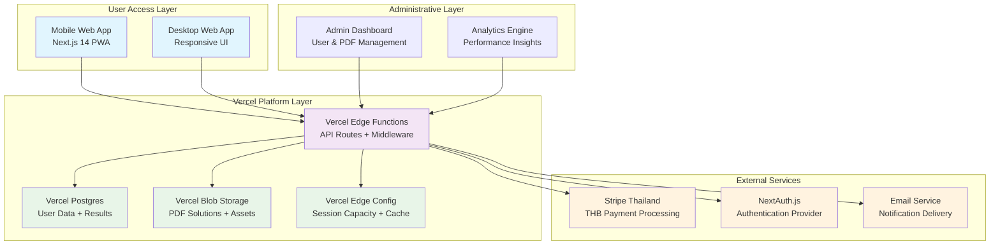

# TBAT Mock Exam Platform - Architecture Document

## Document Information

- **Project:** TBAT Mock Exam Platform
- **Document Type:** Technical Architecture Specification
- **Version:** 1.2
- **Last Updated:** September 12, 2025
- **Status:** Draft - In Development
- **API Contracts:** docs/prd/api-contracts.md
- **Epic Dependencies:** docs/prd/epic-dependency-matrix.md

## Section 1: Introduction

### Project Overview

The TBAT Mock Exam Platform is a **greenfield hybrid offline/online exam system** designed to address the significant educational gap in Northern Thailand. High school students preparing for TBAT (Thai Biomedical Admissions Test) face limited access to realistic mock exams outside Bangkok, creating barriers to medical school preparation.

This platform delivers a unique value proposition combining **physical exam experiences** with **advanced digital analytics**, serving the Chiang Mai region's 200+ annual TBAT candidates through a freemium model.

### Architecture Approach

**Development Strategy:** Frontend-First Mock-Driven Development

- **Phase 1 (Epic 1):** Complete frontend package selection experience with mock data and database foundation
- **Phase 2 (Epic 2+):** Authentication integration and real backend API replacement
- **Rationale:** Enables stakeholder validation and demo-ready platform while maintaining production database readiness

**Key Architectural Decisions:**

- **Full-Stack Monolith:** Next.js 14+ App Router for unified development
- **Vercel All-in-One:** Integrated hosting, database, storage, and analytics
- **AI-Agent Friendly:** Optimized for Claude Code development workflows
- **Cost-Optimized:** Designed for ฿710/month operational costs targeting 20 concurrent users

### Business Context

**Target Market:** Private tutoring centers in Chiang Mai serving medical school aspirants
**Revenue Model:** Freemium (Free package: single subject, Advanced package: ฿690 for all three subjects)
**Conversion Strategy:** 40-50% registration conversion, 25-35% post-exam upgrade through strategic PDF restriction
**Technical Requirements:** 99.9% uptime during exam periods, 48-hour result delivery, PDPA compliance

### API Architecture Integration

Complete API contract specifications and integration patterns documented in `docs/prd/api-contracts.md`. All APIs follow RESTful conventions with TypeScript interfaces, Thai language error handling, and circuit breaker patterns for production reliability.

**Key API Categories:**

- Authentication & Registration APIs
- Package & Capacity Management APIs
- Payment Processing APIs
- Exam Code Generation APIs
- Results & Analytics APIs
- Admin Management APIs

### Development Dependencies

For detailed epic sequencing and critical path analysis, reference `docs/prd/epic-dependency-matrix.md`. The dependency matrix provides visual workflow, parallel development opportunities, and risk assessment for all 10 project epics.

## Section 2: High Level Architecture

### System Overview

The TBAT Mock Exam Platform implements a **serverless-first architecture** leveraging Vercel's integrated ecosystem for optimal performance and cost efficiency at 20-user scale.



### Cost Analysis (Updated for 20 Users)

**Vercel Pro Plan - All-in-One Solution:**

- **Base Plan:** $20/month (฿720/month)
- **Postgres:** Included (100GB storage, 1M queries)
- **Blob Storage:** Included (100GB)
- **Edge Config:** Included
- **Functions:** Included (1M invocations)
- **Bandwidth:** Included (1TB)

**External Services:**

- **Stripe Thailand:** 3.65% + ฿11 per transaction
- **Email Service:** Free tier (Resend: 3,000 emails/month)

**Total Monthly Cost:** ~฿710/month (20-user scale)
**Cost per User:** ~฿36/month (highly efficient at small scale)

### Scalability Strategy

**Current Capacity (20 Users):**

- **Registration:** 20 concurrent users during peak periods
- **Exam Sessions:** 2 sessions × 10 students each
- **Results Processing:** Real-time analytics generation
- **PDF Delivery:** Concurrent downloads supported

**Growth Path (Future 300 Users):**

- Vercel Pro scales automatically with usage-based pricing
- Database connection pooling via Prisma
- CDN distribution for PDF content
- Estimated cost: ฿2,500-3,000/month at 300-user scale

## Section 3: Tech Stack

**DEFINITIVE Technology Selection - Single Source of Truth**

| Category                 | Technology         | Version    | Purpose                            | Rationale                                                                   |
| ------------------------ | ------------------ | ---------- | ---------------------------------- | --------------------------------------------------------------------------- |
| **Frontend Language**    | TypeScript         | 5.0+       | Type-safe frontend development     | Exam-critical reliability requires compile-time error detection             |
| **Frontend Framework**   | Next.js            | 14+        | Full-stack React with App Router   | Unified development, excellent Thai i18n support, Vercel optimization       |
| **UI Component Library** | shadcn/ui          | Latest     | Design system components           | Professional Thai educational UI, accessibility built-in, rapid development |
| **Styling**              | Tailwind CSS       | 3.3+       | Utility-first CSS framework        | Mobile-first responsive design, consistent spacing, fast iteration          |
| **UI Primitives**        | Radix UI           | Latest     | Accessible component primitives    | WCAG 2.1 AA compliance, Thai language support, exam accessibility           |
| **Backend Language**     | TypeScript         | 5.0+       | Unified full-stack development     | Single language reduces complexity, type safety across entire stack         |
| **Backend Framework**    | Next.js API Routes | 14+        | Serverless API endpoints           | Seamless integration, automatic scaling, simplified deployment              |
| **API Type Safety**      | tRPC               | 10+        | End-to-end type safety             | Eliminates API contract drift, reduces development errors                   |
| **Database**             | PostgreSQL         | 15+        | Primary data storage               | ACID compliance for exam data, excellent JSON support, mature ecosystem     |
| **Database Hosting**     | Vercel Postgres    | Serverless | Managed PostgreSQL service         | Zero configuration, automatic scaling, integrated with Vercel platform      |
| **ORM**                  | Prisma             | 5.0+       | Database abstraction layer         | Type-safe database queries, excellent TypeScript integration, migrations    |
| **File Storage**         | Vercel Blob        | Serverless | PDF and asset storage              | Integrated CDN, cost-effective, automatic scaling                           |
| **Caching**              | Vercel Edge Config | Serverless | Session capacity and configuration | Global edge distribution, real-time updates, high performance               |
| **Authentication**       | NextAuth.js        | 4.0+       | User authentication system         | Secure session management, social login support, Thai market compatibility  |
| **Payment Processing**   | Stripe             | Latest     | Thai Baht payment handling         | Established in Thailand, THB support, comprehensive documentation           |
| **Email Service**        | Resend             | Latest     | Transactional emails               | Developer-friendly, reliable delivery, cost-effective for volume            |
| **Deployment Platform**  | Vercel             | Latest     | Application hosting                | Zero-configuration deployment, automatic scaling, integrated monitoring     |
| **Monitoring**           | Vercel Analytics   | Built-in   | Performance monitoring             | Real-time insights, user behavior tracking, performance optimization        |
| **Version Control**      | Git                | Latest     | Source code management             | Industry standard, GitHub integration, collaborative development            |
| **Package Manager**      | pnpm               | 8.0+       | Dependency management              | Fast installs, efficient disk usage, monorepo support                       |
| **Testing Framework**    | Jest               | 29+        | Unit and integration testing       | Exam-critical reliability, extensive ecosystem, snapshot testing            |
| **E2E Testing**          | Playwright         | Latest     | Browser automation testing         | Multi-browser support, exam workflow validation, accessibility testing      |
| **Linting**              | ESLint             | 8.0+       | Code quality enforcement           | Consistent code style, error prevention, team collaboration                 |
| **Code Formatting**      | Prettier           | 3.0+       | Automated code formatting          | Consistent formatting, reduced merge conflicts, developer efficiency        |
| **Build Tool**           | Next.js Built-in   | 14+        | Application building               | Optimized bundling, automatic code splitting, production optimization       |

### Technology Integration Strategy

**Development Workflow:**

1. **Type Safety:** Full-stack TypeScript with tRPC ensures exam data integrity
2. **Performance:** Next.js App Router with Vercel Edge Network for 200ms response times
3. **Reliability:** Prisma ORM with PostgreSQL for ACID compliance in exam transactions
4. **Scalability:** Serverless architecture automatically handles traffic spikes during registration
5. **Security:** NextAuth.js with Stripe integration for secure payment processing

**Quality Assurance:**

- **Testing:** Playwright for exam workflow validation, Jest for business logic
- **Monitoring:** Vercel Analytics for real-time performance tracking
- **Error Handling:** Comprehensive error boundaries with Thai language support

## Section 4: Data Models

### Core Data Models

The data models support the hybrid offline/online exam system with enhanced PDF management and 6-month data lifecycle policy as defined in PRD v1.2.

#### User Management

```typescript
interface User {
  id: string; // UUID primary key
  email: string; // Unique identifier
  password_hash: string; // Hashed password (8+ chars, letters+numbers)
  thai_name: string; // Thai display name
  phone: string; // Contact number
  school: string; // High school name
  line_id?: string; // Optional LINE contact (FR21-FR24 update)
  package_type: "FREE" | "ADVANCED"; // Current package level
  is_upgraded: boolean; // Track upgrade status
  pdpa_consent: boolean; // GDPR compliance
  created_at: Date;
  updated_at: Date;
}

interface UserSession {
  id: string;
  user_id: string; // Foreign key to User
  session_token: string; // NextAuth.js session
  expires_at: Date; // 7-day expiry
  created_at: Date;
}
```

#### Exam Registration & Codes

```typescript
interface ExamCode {
  id: string;
  user_id: string; // Foreign key to User
  code: string; // FREE-[8CHAR]-[SUBJECT] or ADV-[8CHAR]
  package_type: "FREE" | "ADVANCED";
  subject: "BIOLOGY" | "CHEMISTRY" | "PHYSICS";
  session_time: "09:00-12:00" | "13:00-16:00";
  is_used: boolean; // Track exam completion
  created_at: Date;
  used_at?: Date;
}

interface SessionCapacity {
  id: string;
  session_time: "09:00-12:00" | "13:00-16:00";
  current_count: number;
  max_capacity: number; // 300 per session (updated for 20 users = 20 total)
  exam_date: Date; // 27 กันยายน 2568
  created_at: Date;
  updated_at: Date;
}
```

#### Payment Processing

```typescript
interface Payment {
  id: string;
  user_id: string; // Foreign key to User
  stripe_payment_intent_id: string;
  amount: number; // 690 THB (Advanced) or 290 THB (Upgrade)
  currency: "thb"; // Thai Baht only
  payment_type: "ADVANCED_PACKAGE" | "POST_EXAM_UPGRADE";
  status: "PENDING" | "COMPLETED" | "FAILED" | "REFUNDED";
  completed_at?: Date;
  created_at: Date;
}
```

#### Results & Analytics

```typescript
interface ExamResult {
  id: string;
  user_id: string; // Foreign key to User
  exam_code: string; // Foreign key to ExamCode
  total_score: number; // Overall exam score
  subject_scores: {
    // Detailed breakdown
    biology?: number;
    chemistry?: number;
    physics?: number;
  };
  percentile?: number; // Advanced package only
  completion_time: number; // Minutes taken
  expires_at: Date; // 6-month expiry (FR22)
  is_accessible: boolean; // Data lifecycle control
  created_at: Date;
}

interface Analytics {
  id: string;
  result_id: string; // Foreign key to ExamResult
  user_id: string; // Foreign key to User
  subject_breakdowns: JSON; // Detailed analytics (Advanced only)
  recommendations: JSON; // Study suggestions (Advanced only)
  comparison_data: JSON; // Percentile comparisons (Advanced only)
  generated_at: Date;
}
```

#### PDF Solution Management (FR21-FR24)

```typescript
interface PDFSolution {
  id: string;
  subject: "BIOLOGY" | "CHEMISTRY" | "PHYSICS";
  exam_date: Date; // 27 กันยายน 2568
  file_url: string; // Vercel Blob Storage URL
  file_size: number; // Bytes
  description: string; // Thai description
  upload_admin_id: string; // Admin who uploaded
  is_active: boolean; // Availability control
  expires_at: Date; // 6-month data lifecycle
  created_at: Date;
}

interface PDFDownload {
  id: string;
  pdf_id: string; // Foreign key to PDFSolution
  user_id: string; // Foreign key to User
  download_token: string; // Secure download link
  downloaded_at: Date;
  expires_at: Date; // Token expiry (24 hours)
}

interface PDFNotification {
  id: string;
  pdf_id: string; // Foreign key to PDFSolution
  sent_to_user_ids: string[]; // Advanced users notified
  email_count: number; // Successful notifications
  failed_count: number; // Failed deliveries
  sent_at: Date;
}
```

#### Enhanced Admin Operations (FR24)

```typescript
interface AdminUser {
  id: string;
  email: string;
  password_hash: string;
  thai_name: string;
  role: "ADMIN" | "SUPER_ADMIN";
  permissions: string[]; // CRUD permissions
  created_at: Date;
  updated_at: Date;
}

interface AuditLog {
  id: string;
  admin_id: string; // Who performed action
  action_type: "USER_UPDATE" | "CODE_REGEN" | "PDF_UPLOAD" | "CRISIS_RESOLUTION";
  target_id: string; // User/Resource affected
  original_data: JSON; // Before state
  new_data: JSON; // After state
  reason: string; // Admin notes
  created_at: Date;
}

interface SupportTicket {
  id: string;
  user_id: string; // Affected user
  admin_id: string; // Handling admin
  issue_type: "CODE_PROBLEM" | "PAYMENT_ISSUE" | "RESULT_ERROR" | "PDF_ACCESS";
  description: string; // Thai description
  resolution: string; // Admin solution
  status: "OPEN" | "IN_PROGRESS" | "RESOLVED" | "ESCALATED";
  priority: "LOW" | "MEDIUM" | "HIGH" | "CRITICAL";
  created_at: Date;
  resolved_at?: Date;
}
```

### Data Lifecycle Management (FR22)

**6-Month Expiry Policy:**

- **ExamResult.expires_at:** Set to `created_at + 6 months`
- **PDFSolution.expires_at:** Set to `upload_date + 6 months`
- **Automated Cleanup:** Daily cron job marks `is_accessible = false`
- **User Warning System:** Progressive notifications at 30, 7, 1 day before expiry

**Data Retention Strategy:**

- **Soft Delete:** Data marked inaccessible, not physically deleted
- **Analytics Preservation:** Anonymized data retained for platform improvement
- **Emergency Extension:** Admin override capability for special circumstances

### Database Relationships

**Primary Relationships:**

- User → ExamCode (1:many) - Users can have multiple exam codes
- User → ExamResult (1:many) - Users can have results from multiple subjects
- User → Payment (1:many) - Users can make multiple purchases
- ExamResult → Analytics (1:1) - Each result has corresponding analytics
- PDFSolution → PDFDownload (1:many) - PDFs downloaded by multiple users
- AdminUser → AuditLog (1:many) - Admins generate multiple audit entries

**Business Logic Constraints:**

- Free users: Maximum 1 ExamCode per registration
- Advanced users: 3 ExamCodes (one per subject)
- PDF access: Advanced package required
- Data expiry: Enforced at application level with database triggers

This data model supports the complete TBAT Mock Exam Platform functionality with enhanced PDF management, comprehensive admin capabilities, and robust data lifecycle management while maintaining high performance and data integrity for exam-critical operations.

## Section 5: API Specification

The TBAT Mock Exam Platform implements a REST API using Next.js API routes with tRPC for type safety. The API supports the hybrid offline-exam + online-analytics model with enhanced PDF management and admin capabilities.

### API Architecture

**Style:** REST API with tRPC type safety layer
**Authentication:** NextAuth.js with session-based authentication  
**Rate Limiting:** Vercel Edge Config for API protection
**Error Handling:** Standardized error responses with Thai language support

### Core API Endpoints

#### Authentication & User Management

```yaml
# User Registration
POST /api/auth/register
Body: { email, password, thai_name, phone, school, line_id?, pdpa_consent }
Response: { user_id, session_token }

# User Login
POST /api/auth/login
Body: { email, password }
Response: { user_id, session_token, package_type }

# User Profile Management
GET /api/user/profile
Response: { user_data, package_type, upgrade_status }

PUT /api/user/profile
Body: { thai_name?, phone?, school?, line_id? }
Response: { updated_user_data }
```

#### Exam Registration & Code Generation

```yaml
# Package Selection & Registration
POST /api/exam/register
Body: { package_type: "FREE" | "ADVANCED", session_time, subjects[] }
Response: { exam_codes[], payment_intent_id?, total_amount? }

# Exam Code Validation
GET /api/exam/validate/{code}
Response: { valid, user_id, subject, package_type }

# Session Capacity Check
GET /api/exam/sessions
Response: { sessions: [{ time, available_spots, total_capacity }] }
```

#### Payment Processing (Stripe Thailand)

```yaml
# Create Payment Intent
POST /api/payment/create
Body: { package_type: "ADVANCED" | "UPGRADE", amount: 690 | 290 }
Response: { payment_intent_id, client_secret }

# Confirm Payment
POST /api/payment/confirm
Body: { payment_intent_id, user_id }
Response: { payment_status, upgraded_package_type }

# Payment Webhook (Stripe)
POST /api/webhook/stripe
Body: { stripe_event_data }
Response: { received: true }
```

#### Results & Analytics

```yaml
# Submit Exam Results
POST /api/results/submit
Body: { exam_code, total_score, subject_scores[], completion_time }
Response: { result_id, expires_at }

# Get User Results
GET /api/results/user
Response: { results: [{ id, total_score, subjects, created_at, expires_at, is_accessible }] }

# Get Analytics (Advanced Only)
GET /api/analytics/detailed/{result_id}
Response: { percentile, subject_breakdowns, recommendations, study_suggestions }
```

#### PDF Solution Management (FR21-FR24)

```yaml
# PDF Solution Upload (Admin Only)
POST /api/admin/pdf/upload
Body: { file: PDF, subject, exam_date, description }
Response: { pdf_id, url, upload_status }

# Get Available PDFs
GET /api/pdf/available
Response: { pdfs: [{ id, subject, description, upload_date, requires_advanced }] }

# PDF Download (Advanced Users Only)
GET /api/pdf/download/{pdf_id}
Headers: { Authorization: "Bearer {session_token}" }
Response: { pdf_url, download_token } | { error: "UPGRADE_REQUIRED" }

# PDF Preview (Free Users)
GET /api/pdf/preview/{pdf_id}
Response: { preview_pages: [page1_thumbnail, page2_thumbnail], upgrade_cta }

# Notify Advanced Users (Admin Trigger)
POST /api/admin/notify/pdf-ready
Body: { pdf_id, subject }
Response: { notifications_sent: number, failed: number }
```

#### Data Lifecycle Management (FR22)

```yaml
# Check Data Expiry Status
GET /api/user/expiry-status
Response: {
  results: [{ id, expires_at, days_remaining, is_accessible }],
  urgent_expiry: boolean,
  warning_level: "none" | "notice" | "urgent"
}

# Extend Data Access (Future Enhancement)
POST /api/user/extend-access
Body: { result_id, extension_period }
Response: { new_expiry_date, cost }
```

#### Enhanced Admin Operations (FR24)

```yaml
# Admin User Management
GET /api/admin/users
Query: { search?, package_type?, page?, limit? }
Response: { users: [], total, pagination }

POST /api/admin/users/{user_id}/update
Body: { thai_name?, email?, phone?, school?, package_type? }
Response: { updated_user, audit_log }

# Emergency Code Regeneration
POST /api/admin/exam-code/regenerate
Body: { user_id, reason, original_code }
Response: { new_codes[], invalidated_codes[], audit_log }

# Crisis Management
POST /api/admin/crisis/user-support
Body: { user_id, issue_type, resolution, notes }
Response: { ticket_id, resolution_status }

# Admin Dashboard Analytics
GET /api/admin/dashboard
Response: {
  user_stats, registration_trends, payment_metrics,
  pdf_download_stats, upcoming_expirations, system_alerts
}
```

### API Security & Performance

#### Authentication Flow

1. NextAuth.js session management with 7-day expiry
2. API route middleware validates session tokens
3. Role-based access control (user, admin)
4. Rate limiting: 100 requests/minute per user

#### Error Response Format

```typescript
interface ApiError {
  error: string; // Error code (EN)
  message: string; // User message (TH)
  details?: any; // Debug info (dev only)
  timestamp: string;
  request_id: string;
}
```

#### Performance Optimizations

- **Caching:** Vercel Edge Config for session capacity
- **CDN:** Vercel Edge Network for PDF delivery
- **Database:** Connection pooling with Prisma
- **Monitoring:** Built-in Vercel Analytics

### API Versioning Strategy

**Current:** `/api/v1/*` (implicit in route structure)
**Future:** `/api/v2/*` when breaking changes needed
**Deprecation:** 6-month notice for version sunset

This API specification supports the complete TBAT Mock Exam Platform functionality with enhanced PDF management, data lifecycle controls, and comprehensive admin capabilities while maintaining high performance for 20 concurrent users during peak periods.

## Section 6: Components

The TBAT Mock Exam Platform is built using a component-based architecture with clear separation of concerns across frontend, backend, and data layers. Each component has well-defined interfaces and responsibilities.

### Frontend Components

#### Authentication Components

```typescript
// Core authentication interfaces
interface AuthProvider {
  login(credentials: LoginCredentials): Promise<UserSession>;
  register(userData: RegistrationData): Promise<UserSession>;
  logout(): Promise<void>;
  getCurrentUser(): User | null;
}

interface LoginForm {
  onSubmit: (credentials: LoginCredentials) => void;
  validation: FormValidation;
  isLoading: boolean;
}

interface RegistrationForm {
  onSubmit: (userData: RegistrationData) => void;
  packageSelection: PackageType;
  pdpaConsent: boolean;
}
```

#### Exam Management Components

```typescript
interface ExamRegistration {
  sessionSelection: SessionTime;
  packageSelection: PackageType;
  subjectSelection: Subject[];
  capacityCheck: (session: SessionTime) => Promise<boolean>;
  generateCodes: () => Promise<ExamCode[]>;
}

interface ExamCodeDisplay {
  codes: ExamCode[];
  copyToClipboard: (code: string) => void;
  printCodes: () => void;
  sessionDetails: SessionInfo;
}

interface ResultsViewer {
  results: ExamResult[];
  analytics?: Analytics; // Advanced only
  pdfAccess: boolean;
  expiryWarnings: ExpiryStatus[];
}
```

#### PDF Management Components (FR21-FR24)

```typescript
interface PDFViewer {
  pdfUrl: string;
  isPreviewOnly: boolean; // Free users
  downloadToken?: string; // Advanced users
  onUpgradeClick: () => void; // Freemium conversion
}

interface PDFDownloadManager {
  availablePDFs: PDFSolution[];
  userPackage: PackageType;
  downloadPDF: (pdfId: string) => Promise<DownloadResponse>;
  previewPDF: (pdfId: string) => Promise<PreviewResponse>;
}

interface UpgradePrompt {
  currentPackage: PackageType;
  upgradePrice: number; // 290 THB
  benefits: string[];
  onUpgrade: () => void;
}
```

#### Data Lifecycle Components (FR22)

```typescript
interface ExpiryManager {
  expiryStatus: ExpiryStatus[];
  warningLevel: "none" | "notice" | "urgent";
  daysRemaining: number[];
  showExpiryWarning: (level: WarningLevel) => void;
}

interface DataAccessControl {
  checkAccess: (resultId: string) => boolean;
  markExpired: (resultId: string) => void;
  getAccessibleData: (userId: string) => AccessibleData[];
}
```

### Backend Components

#### API Layer Components

```typescript
interface APIRouter {
  authentication: AuthenticationRoutes;
  examManagement: ExamRoutes;
  paymentProcessing: PaymentRoutes;
  resultsAnalytics: ResultsRoutes;
  pdfManagement: PDFRoutes; // FR21-FR24
  adminOperations: AdminRoutes; // FR24
}

interface DatabaseConnection {
  prisma: PrismaClient;
  connectionPool: ConnectionPoolConfig;
  transactionManager: TransactionManager;
  queryOptimizer: QueryOptimizer;
}
```

#### Business Logic Components

```typescript
interface ExamCodeGenerator {
  generateFreeCode: (subject: Subject) => string; // FREE-[8CHAR]-[SUBJECT]
  generateAdvancedCode: () => string; // ADV-[8CHAR]
  validateCode: (code: string) => ValidationResult;
  checkUniqueness: (code: string) => Promise<boolean>;
}

interface PaymentProcessor {
  createPaymentIntent: (amount: number, type: PaymentType) => Promise<PaymentIntent>;
  confirmPayment: (intentId: string) => Promise<PaymentResult>;
  handleWebhook: (stripeEvent: StripeEvent) => Promise<void>;
  upgradeUser: (userId: string) => Promise<void>;
}

interface AnalyticsEngine {
  calculatePercentile: (score: number, subject: Subject) => number;
  generateRecommendations: (results: ExamResult[]) => StudyRecommendation[];
  createSubjectBreakdown: (scores: SubjectScores) => SubjectAnalysis[];
  comparePeerData: (userScore: number) => ComparisonData;
}
```

#### PDF Management Components (FR21-FR24)

```typescript
interface PDFStorageManager {
  uploadPDF: (file: File, metadata: PDFMetadata) => Promise<PDFSolution>;
  generateDownloadToken: (pdfId: string, userId: string) => Promise<string>;
  validateAccess: (userId: string, pdfId: string) => Promise<boolean>;
  cleanupExpiredPDFs: () => Promise<CleanupResult>;
}

interface NotificationService {
  notifyAdvancedUsers: (pdfId: string) => Promise<NotificationResult>;
  sendExpiryWarnings: (userIds: string[]) => Promise<void>;
  queueEmail: (email: EmailData) => Promise<void>;
}
```

#### Enhanced Admin Components (FR24)

```typescript
interface AdminUserManager {
  searchUsers: (criteria: SearchCriteria) => Promise<User[]>;
  updateUserData: (userId: string, updates: UserUpdates) => Promise<User>;
  regenerateExamCodes: (userId: string, reason: string) => Promise<ExamCode[]>;
  handleCrisisSupport: (ticket: SupportTicket) => Promise<Resolution>;
}

interface AdminDashboard {
  getUserStats: () => Promise<UserStatistics>;
  getPaymentMetrics: () => Promise<PaymentMetrics>;
  getPDFDownloadStats: () => Promise<PDFStats>;
  getSystemAlerts: () => Promise<Alert[]>;
}

interface AuditLogger {
  logUserUpdate: (adminId: string, changes: UserChanges) => Promise<void>;
  logCodeRegeneration: (adminId: string, details: RegenDetails) => Promise<void>;
  logPDFUpload: (adminId: string, pdfData: PDFUploadData) => Promise<void>;
  generateAuditReport: (timeRange: DateRange) => Promise<AuditReport>;
}
```

### Data Management Components

#### Database Access Layer

```typescript
interface UserRepository {
  create: (userData: CreateUserData) => Promise<User>;
  findByEmail: (email: string) => Promise<User | null>;
  update: (userId: string, updates: UserUpdates) => Promise<User>;
  delete: (userId: string) => Promise<void>; // Soft delete
}

interface ExamRepository {
  createCodes: (userId: string, examData: ExamData) => Promise<ExamCode[]>;
  validateCode: (code: string) => Promise<ValidationResult>;
  saveResults: (resultData: ResultData) => Promise<ExamResult>;
  getResults: (userId: string) => Promise<ExamResult[]>;
}

interface PDFRepository {
  storePDF: (pdfData: PDFData) => Promise<PDFSolution>;
  getPDFsByUser: (userId: string) => Promise<PDFSolution[]>;
  trackDownload: (pdfId: string, userId: string) => Promise<PDFDownload>;
  markExpired: (expiryDate: Date) => Promise<number>; // Returns count
}
```

#### Caching Components

```typescript
interface CacheManager {
  sessionCapacity: EdgeConfigCache;
  userSessions: RedisCache;
  pdfTokens: MemoryCache;
  analyticsData: DatabaseCache;
}

interface SessionCapacityCache {
  getCurrentCapacity: (sessionTime: SessionTime) => Promise<number>;
  updateCapacity: (sessionTime: SessionTime, change: number) => Promise<void>;
  resetDailyCapacity: () => Promise<void>;
}
```

### External Integration Components

#### Stripe Integration

```typescript
interface StripeConnector {
  createPaymentIntent: (amount: number, currency: "thb") => Promise<PaymentIntent>;
  confirmPayment: (paymentIntentId: string) => Promise<ConfirmationResult>;
  handleWebhook: (signature: string, payload: string) => Promise<StripeEvent>;
  refundPayment: (paymentIntentId: string) => Promise<RefundResult>;
}
```

#### Email Service Integration

```typescript
interface EmailConnector {
  sendWelcomeEmail: (user: User) => Promise<void>;
  sendExamCodes: (user: User, codes: ExamCode[]) => Promise<void>;
  sendResultsReady: (user: User, resultId: string) => Promise<void>;
  sendPDFNotification: (users: User[], pdfInfo: PDFInfo) => Promise<void>;
  sendExpiryWarning: (user: User, expiryData: ExpiryData) => Promise<void>;
}
```

### Component Interaction Patterns

#### Request Flow Pattern

```
User Request → API Route → Authentication Middleware → Business Logic → Database Access → Response
```

#### Event-Driven Pattern

```
Payment Success → Webhook Handler → User Upgrade → Email Notification → Analytics Update
```

#### Caching Pattern

```
API Request → Cache Check → Database Query (if miss) → Cache Update → Response
```

### Component Dependencies

**Frontend Dependencies:**

- Authentication components depend on NextAuth.js
- Payment components depend on Stripe SDK
- PDF components depend on Vercel Blob Storage APIs
- All components use shadcn/ui for consistent styling

**Backend Dependencies:**

- All database components depend on Prisma ORM
- Payment processing depends on Stripe webhooks
- Email components depend on Resend service
- Admin components depend on audit logging

**Cross-Cutting Concerns:**

- **Error Handling:** All components implement standardized error interfaces
- **Logging:** Structured logging with request correlation IDs
- **Monitoring:** Performance metrics collection at component boundaries
- **Security:** Authentication and authorization checks at all entry points

This component architecture supports the complete TBAT Mock Exam Platform with clear separation of concerns, type safety, and maintainable interfaces that facilitate both development and testing workflows.

## Section 7: External APIs

The TBAT Mock Exam Platform integrates with several external services to provide payment processing, email delivery, and administrative capabilities. All integrations are designed for the Thai market with appropriate localization and compliance.

### Stripe Thailand Integration

**Purpose:** Process Thai Baht payments for Advanced packages and post-exam upgrades
**Documentation:** https://stripe.com/docs/api
**Market:** Thailand-specific implementation with THB support

#### Configuration

```typescript
// Stripe Configuration for Thailand
const stripeConfig = {
  publishableKey: process.env.STRIPE_PUBLISHABLE_KEY,
  secretKey: process.env.STRIPE_SECRET_KEY,
  webhookSecret: process.env.STRIPE_WEBHOOK_SECRET,
  apiVersion: "2023-10-16",
  locale: "th", // Thai language support
  currency: "thb", // Thai Baht only
  accountCountry: "TH",
};
```

#### Key Integration Points

**Payment Intent Creation:**

```typescript
// Advanced Package Payment (690 THB)
POST https://api.stripe.com/v1/payment_intents
Authorization: Bearer sk_live_...
Content-Type: application/x-www-form-urlencoded

amount=69000 // 690 THB in smallest currency unit
currency=thb
payment_method_types[]=card
payment_method_types[]=promptpay // Thai digital wallet
metadata[user_id]=user_12345
metadata[package_type]=ADVANCED
metadata[exam_date]=2568-09-27
```

**Post-Exam Upgrade Payment (290 THB):**

```typescript
amount = 29000; // 290 THB in smallest currency unit
currency = thb;
metadata[upgrade_type] = POST_EXAM;
metadata[result_id] = result_67890;
```

#### Webhook Integration

```typescript
// Webhook Endpoint: /api/webhook/stripe
interface StripeWebhookHandler {
  "payment_intent.succeeded": handlePaymentSuccess;
  "payment_intent.payment_failed": handlePaymentFailure;
  "payment_intent.canceled": handlePaymentCanceled;
  "charge.dispute.created": handleDispute;
}

async function handlePaymentSuccess(event: StripeEvent) {
  const paymentIntent = event.data.object as Stripe.PaymentIntent;
  const userId = paymentIntent.metadata.user_id;
  const packageType = paymentIntent.metadata.package_type;

  // Upgrade user account
  await upgradeUserPackage(userId, packageType);

  // Send confirmation email
  await sendPaymentConfirmation(userId, paymentIntent);

  // Generate exam codes if Advanced package
  if (packageType === "ADVANCED") {
    await generateAdvancedExamCodes(userId);
  }
}
```

#### Payment Methods Supported

- **Credit/Debit Cards:** Visa, Mastercard, JCB (popular in Thailand)
- **PromptPay:** Thailand's national digital payment system
- **Bank Transfers:** Thai bank integration for larger amounts
- **Mobile Banking:** SCB Easy, Kbank, Bangkok Bank mobile apps

#### Error Handling

```typescript
interface PaymentErrorHandler {
  card_declined: "บัตรถูกปฏิเสธ กรุณาตรวจสอบข้อมูลบัตร";
  insufficient_funds: "ยอดเงินไม่เพียงพอ กรุณาตรวจสอบบัญชี";
  payment_method_unactivated: "ระบบการชำระเงินยังไม่เปิดใช้งาน";
  processing_error: "เกิดข้อผิดพลาดในการชำระเงิน กรุณาลองใหม่";
}
```

### Email Service Integration (Resend)

**Purpose:** Transactional emails for user notifications and PDF alerts
**Documentation:** https://resend.com/docs
**Plan:** Free tier (3,000 emails/month) suitable for 20-user scale

#### Configuration

```typescript
const resendConfig = {
  apiKey: process.env.RESEND_API_KEY,
  fromEmail: "noreply@tbat-mock-exam.com",
  fromName: "TBAT Mock Exam Platform",
  replyTo: "support@tbat-mock-exam.com",
  locale: "th-TH",
};
```

#### Email Templates

**Welcome Email (Registration):**

```typescript
interface WelcomeEmail {
  to: string; // user email
  subject: "ยินดีต้อนรับสู่ TBAT Mock Exam Platform";
  template: "welcome-th";
  variables: {
    thai_name: string;
    package_type: PackageType;
    exam_date: "27 กันยายน 2568";
    session_time: SessionTime;
  };
}
```

**Exam Code Delivery:**

```typescript
interface ExamCodeEmail {
  to: string;
  subject: "รหัสสอบ TBAT Mock Exam - สำคัญมาก";
  template: "exam-codes-th";
  variables: {
    thai_name: string;
    exam_codes: ExamCode[];
    session_details: SessionInfo;
    important_instructions: string;
  };
}
```

**PDF Solution Notification (Advanced Users - FR23):**

```typescript
interface PDFNotificationEmail {
  to: string[];
  subject: "เฉลยข้อสอบ TBAT พร้อมแล้ว - ดาวน์โหลดได้ทันที";
  template: "pdf-ready-th";
  variables: {
    subject: Subject;
    pdf_description: string;
    download_link: string;
    expiry_notice: "6 เดือนจากวันนี้";
  };
}
```

**Data Expiry Warnings (FR22):**

```typescript
interface ExpiryWarningEmail {
  to: string;
  subject: "แจ้งเตือน: ข้อมูลผลสอบจะหมดอายุ";
  template: "expiry-warning-th";
  variables: {
    thai_name: string;
    days_remaining: number;
    results_count: number;
    urgent: boolean; // Red styling if < 7 days
  };
}
```

#### Batch Email Processing

```typescript
interface BatchEmailManager {
  queueAdvancedUserNotifications: (pdfId: string) => Promise<void>;
  processPendingEmails: () => Promise<ProcessingResult>;
  retryFailedEmails: () => Promise<RetryResult>;
  trackDeliveryStatus: (emailId: string) => Promise<DeliveryStatus>;
}

// Example: Notify all Advanced users about new PDF
async function notifyAdvancedUsersAboutPDF(pdfId: string) {
  const advancedUsers = await getUsersByPackageType("ADVANCED");
  const emailQueue = advancedUsers.map((user) => ({
    to: user.email,
    template: "pdf-ready-th",
    variables: { thai_name: user.thai_name, pdf_id: pdfId },
  }));

  return await batchSendEmails(emailQueue);
}
```

### LINE Integration (Optional Enhancement)

**Purpose:** Alternative communication channel for urgent notifications
**Documentation:** https://developers.line.biz/en/
**Implementation:** Future enhancement based on user adoption

```typescript
interface LineIntegration {
  sendExamReminder: (lineId: string, examDate: Date) => Promise<void>;
  notifyResultsReady: (lineId: string, resultId: string) => Promise<void>;
  sendPDFAlert: (lineId: string, pdfInfo: PDFInfo) => Promise<void>;
}
```

### Administrative External APIs

#### Vercel Analytics Integration

```typescript
// Built-in Vercel Analytics
interface VercelAnalytics {
  trackPageView: (path: string, userId?: string) => void;
  trackEvent: (event: string, properties: object) => void;
  trackConversion: (type: "REGISTRATION" | "UPGRADE", value: number) => void;
}

// Usage Examples
analytics.trackEvent("exam_code_generated", {
  package_type: "ADVANCED",
  subject_count: 3,
});

analytics.trackConversion("UPGRADE", 290); // 290 THB upgrade
```

#### External Monitoring (Future)

```typescript
// Optional: External monitoring service
interface ExternalMonitoring {
  healthCheck: () => Promise<HealthStatus>;
  alertOnError: (error: Error, context: object) => Promise<void>;
  trackPerformance: (metric: string, value: number) => Promise<void>;
}
```

### API Security & Compliance

#### Authentication & Authorization

```typescript
// All external API calls include proper authentication
interface ExternalAPIAuth {
  stripe: {
    secretKey: "sk_live_...";
    webhookSecret: "whsec_...";
  };
  resend: {
    apiKey: "re_...";
  };
  line: {
    channelToken: "line_channel_token";
    channelSecret: "line_channel_secret";
  };
}
```

#### Data Protection (PDPA Compliance)

```typescript
// PDPA compliance for external data sharing
interface PDPACompliantIntegration {
  stripeMetadata: {
    user_consent: boolean;
    data_retention: "6_months";
    purpose: "exam_payment_processing";
  };
  emailData: {
    opt_in_status: boolean;
    unsubscribe_link: string;
    retention_policy: string;
  };
}
```

#### Rate Limiting & Retry Logic

```typescript
interface ExternalAPIResilience {
  retryConfig: {
    maxRetries: 3;
    backoffMultiplier: 2;
    initialDelay: 1000; // ms
  };
  rateLimiting: {
    stripe: "100/second";
    resend: "10/second";
    line: "1000/hour";
  };
  circuitBreaker: {
    failureThreshold: 5;
    timeout: 30000; // ms
    resetTimeout: 60000; // ms
  };
}
```

### Integration Testing Strategy

#### Comprehensive Integration Test Scenarios

**Stripe Payment Integration Testing:**

```typescript
interface StripeIntegrationTests {
  // Happy Path Scenarios
  successfulPaymentFlow: {
    testCase: "Advanced Package Purchase (690 THB)";
    steps: [
      "Create payment intent with Thai Baht currency",
      "Process card payment with test card 4000000000001976 (TH card)",
      "Verify webhook delivery and signature validation",
      "Confirm user package upgrade in database",
      "Validate exam code generation for all 3 subjects",
      "Verify confirmation email delivery",
    ];
    expectedResults: {
      paymentStatus: "succeeded";
      userPackageType: "ADVANCED";
      examCodesGenerated: 3;
      emailDelivered: true;
    };
    testData: {
      amount: 69000; // 690 THB in cents
      currency: "thb";
      testCard: "4000000000001976"; // Thailand test card
    };
  };

  // Error Scenarios
  paymentFailureScenarios: {
    cardDeclined: {
      testCard: "4000000000000002";
      expectedError: "card_declined";
      expectedUserMessage: "บัตรถูกปฏิเสธ กรุณาตรวจสอบข้อมูลบัตร";
      rollbackActions: ["restore_user_package", "cleanup_payment_intent"];
    };
    insufficientFunds: {
      testCard: "4000000000009995";
      expectedError: "insufficient_funds";
      expectedUserMessage: "ยอดเงินไม่เพียงพอ กรุณาตรวจสอบบัญชี";
    };
    networkTimeout: {
      scenario: "webhook_delivery_failure";
      timeout: "30_seconds";
      retryLogic: "exponential_backoff_3_attempts";
      fallbackAction: "manual_payment_verification";
    };
  };

  // Thai-Specific Payment Methods
  thaiPaymentMethods: {
    promptPay: {
      testCase: "PromptPay QR Code Payment";
      steps: [
        "Generate PromptPay payment intent",
        "Display QR code to user",
        "Simulate PromptPay app payment confirmation",
        "Process webhook notification",
        "Complete user upgrade",
      ];
      testData: { paymentMethod: "promptpay"; amount: 69000 };
    };
    bankTransfer: {
      testCase: "Thai Bank Transfer";
      simulatedBanks: ["SCB", "KBANK", "BBL", "KTB"];
      verificationProcess: "manual_confirmation_required";
    };
  };

  // Edge Cases
  edgeCaseTests: {
    duplicateWebhook: {
      scenario: "Same webhook delivered multiple times";
      prevention: "idempotency_key_validation";
      expectedBehavior: "process_once_ignore_duplicates";
    };
    concurrentPayments: {
      scenario: "User initiates multiple payment intents simultaneously";
      prevention: "user_payment_lock";
      resolution: "cancel_duplicate_intents";
    };
    examDayPaymentLoad: {
      scenario: "20 users paying simultaneously during registration window";
      loadTest: "concurrent_payment_processing";
      expectedResponseTime: "<3_seconds_per_payment";
    };
  };
}
```

**Email Service Integration Testing:**

```typescript
interface ResendIntegrationTests {
  emailDeliveryTests: {
    welcomeEmail: {
      testCase: "New user registration email (Thai language)";
      recipients: ["test+thai@tbat-mock-exam.com"];
      templateValidation: {
        thaiCharacters: "rendered_correctly";
        userPersonalization: "thai_name_displayed";
        examDetails: "session_time_and_date_accurate";
      };
      deliveryMetrics: {
        targetDeliveryTime: "<30_seconds";
        expectedDeliveryRate: ">99%";
      };
    };

    examCodeDelivery: {
      testCase: "Critical exam code delivery email";
      priority: "HIGH_PRIORITY";
      testScenarios: [
        {
          packageType: "FREE";
          expectedCodes: 1;
          subject: "BIOLOGY" | "CHEMISTRY" | "PHYSICS";
          template: "exam-codes-free-th";
        },
        {
          packageType: "ADVANCED";
          expectedCodes: 3;
          subjects: ["BIOLOGY", "CHEMISTRY", "PHYSICS"];
          template: "exam-codes-advanced-th";
        },
      ];
      failureHandling: {
        retryAttempts: 3;
        alternativeDelivery: "sms_backup_or_user_portal_notification";
        escalation: "manual_admin_intervention";
      };
    };

    batchEmailTests: {
      pdfNotificationBatch: {
        testCase: "Notify all Advanced users about PDF availability";
        recipientCount: "all_advanced_users_up_to_20";
        batchProcessing: {
          batchSize: 10;
          delayBetweenBatches: "1_second";
          failureHandling: "individual_retry_logic";
        };
        performanceTargets: {
          totalProcessingTime: "<2_minutes_for_20_users";
          deliverySuccessRate: ">95%";
        };
      };
    };
  };

  emailContentValidation: {
    thaiLanguageSupport: {
      encoding: "UTF-8";
      fontRendering: "thai_fonts_supported";
      readabilityTest: "native_thai_speaker_validation";
    };
    linkValidation: {
      downloadLinks: "verify_secure_token_generation";
      unsubscribeLinks: "PDPA_compliance_validation";
      trackingPixels: "privacy_compliant_analytics";
    };
  };

  errorScenarios: {
    serviceUnavailable: {
      scenario: "Resend API returns 503 Service Unavailable";
      fallbackAction: "queue_for_retry";
      userNotification: "delay_notification_in_user_dashboard";
    };
    rateLimitExceeded: {
      scenario: "API rate limit exceeded during peak usage";
      prevention: "intelligent_queueing";
      backoffStrategy: "exponential_backoff";
    };
    invalidEmailAddresses: {
      scenario: "Bounce handling for invalid email addresses";
      actions: ["mark_email_invalid", "notify_user_to_update", "admin_alert"];
    };
  };
}
```

**Database Integration Testing:**

```typescript
interface DatabaseIntegrationTests {
  concurrencyTests: {
    examRegistration: {
      testCase: "20 users registering simultaneously";
      scenario: "session_capacity_enforcement";
      expectedBehavior: {
        successfulRegistrations: "up_to_session_limit";
        queuedRegistrations: "handled_with_proper_messaging";
        databaseConsistency: "no_race_conditions";
      };
      verificationSteps: [
        "Check session capacity not exceeded",
        "Verify all exam codes are unique",
        "Confirm payment intents created correctly",
        "Validate database transactions completed",
      ];
    };

    dataConsistency: {
      paymentToUpgrade: {
        scenario: "Stripe webhook concurrent with user actions";
        testSteps: [
          "User initiates payment",
          "User updates profile simultaneously",
          "Stripe webhook processes payment success",
          "Verify final user state consistency",
        ];
        expectedOutcome: "upgraded_user_with_consistent_profile_data";
      };
    };
  };

  dataLifecycleTests: {
    sixMonthExpiry: {
      testCase: "Automated data expiry process";
      testData: "mock_data_with_various_expiry_dates";
      automatedProcess: {
        dailyCronJob: "mark_expired_data_inaccessible";
        userNotifications: "progressive_warning_system";
        verificationPoints: [
          "30_days_before_expiry_warning_sent",
          "7_days_before_expiry_urgent_warning",
          "1_day_before_expiry_final_notice",
          "expiry_date_data_marked_inaccessible",
        ];
      };
    };

    backupAndRestore: {
      testCase: "Point-in-time recovery testing";
      frequency: "monthly";
      testSteps: [
        "Create test data in production-like environment",
        "Simulate database corruption or data loss",
        "Restore from Vercel Postgres backup",
        "Verify data integrity and completeness",
      ];
      successCriteria: {
        recoveryTime: "<1_hour";
        dataLoss: "<15_minutes_from_backup_point";
        applicationFunctionality: "fully_restored";
      };
    };
  };

  performanceTests: {
    queryOptimization: {
      testQueries: {
        userDashboard: "SELECT user data with results and PDF access";
        adminUserList: "SELECT all users with pagination";
        analyticsGeneration: "Complex queries for percentile calculations";
      };
      performanceTargets: {
        simpleQueries: "<50ms_p95";
        complexQueries: "<200ms_p95";
        bulkOperations: "<1s_for_20_user_operations";
      };
    };
  };
}
```

#### Mock Services for Development

```typescript
// Enhanced Development/Testing mock implementations
interface MockExternalServices {
  mockStripe: {
    createPaymentIntent: (params: PaymentParams) => Promise<MockPaymentIntent>;
    confirmPayment: (intentId: string) => Promise<MockPaymentResult>;
    simulateWebhook: (event: StripeEventType) => Promise<void>;
    simulateFailures: (errorType: StripeErrorType) => Promise<MockError>;
  };
  mockResend: {
    sendEmail: (emailData: EmailData) => Promise<MockEmailResult>;
    batchSend: (emails: EmailData[]) => Promise<MockBatchResult>;
    simulateDeliveryDelay: (delayMs: number) => Promise<void>;
    simulateBounce: (emailAddress: string) => Promise<MockBounce>;
  };
  mockVercelServices: {
    blob: MockBlobStorage;
    postgres: MockDatabase;
    analytics: MockAnalytics;
  };
}

// Example: Comprehensive Stripe Mock for testing
const mockStripe = {
  createPaymentIntent: async (params) => ({
    id: `pi_test_${generateTestId()}`,
    status: "requires_payment_method",
    amount: params.amount,
    currency: params.currency,
    metadata: params.metadata,
    client_secret: `pi_test_${generateTestId()}_secret_test`,
  }),

  simulateSuccessfulPayment: async (intentId: string) => ({
    id: intentId,
    status: "succeeded",
    charges: {
      data: [
        {
          id: `ch_test_${generateTestId()}`,
          paid: true,
          outcome: { network_status: "approved_by_network" },
        },
      ],
    },
  }),

  simulateThaiPaymentMethods: {
    promptpay: async (intentId: string) => ({
      id: intentId,
      status: "processing",
      payment_method: {
        type: "promptpay",
        promptpay: { reference: "PROMPTPAY_REF_123" },
      },
    }),
  },
};
```

#### Integration Health Monitoring

```typescript
interface ExternalServiceHealth {
  stripe: {
    status: "healthy" | "degraded" | "down";
    lastCheck: Date;
    responseTime: number; // milliseconds
    errorRate: number; // percentage
    testTransactionSuccess: boolean;
  };
  resend: {
    status: "healthy" | "degraded" | "down";
    lastCheck: Date;
    deliveryRate: number; // percentage
    queueLength: number;
    lastSuccessfulDelivery: Date;
  };
  vercelPlatform: {
    status: "healthy" | "degraded" | "down";
    lastCheck: Date;
    services: {
      functions: "healthy" | "degraded" | "down";
      database: "healthy" | "degraded" | "down";
      blob: "healthy" | "degraded" | "down";
      analytics: "healthy" | "degraded" | "down";
    };
  };
}

// Automated Integration Health Checks
async function performIntegrationHealthCheck(): Promise<IntegrationHealthReport> {
  const healthResults = await Promise.allSettled([
    testStripeConnection(),
    testResendDelivery(),
    testDatabaseConnection(),
    testBlobStorageAccess(),
  ]);

  return {
    overall: calculateOverallHealth(healthResults),
    details: healthResults,
    recommendations: generateHealthRecommendations(healthResults),
    timestamp: new Date(),
    nextCheckScheduled: addMinutes(new Date(), 5),
  };
}
```

This external API integration strategy ensures reliable payment processing, effective communication, and compliance with Thai market requirements while maintaining system resilience and user experience quality.

## Section 8: Security

The TBAT Mock Exam Platform implements comprehensive security measures to protect student data, ensure exam integrity, and comply with Thai PDPA regulations. Security is designed for the educational context with exam-critical reliability requirements.

### Authentication & Authorization

#### Authentication Strategy

```typescript
// NextAuth.js Configuration for Thai Market
const authConfig = {
  providers: [
    CredentialsProvider({
      name: "email-password",
      credentials: {
        email: { label: "Email", type: "email" },
        password: { label: "Password", type: "password" },
      },
      authorize: async (credentials) => {
        // Password requirements: 8+ chars, letters + numbers
        const user = await validateUserCredentials(credentials);
        return user
          ? {
              id: user.id,
              email: user.email,
              thai_name: user.thai_name,
              package_type: user.package_type,
            }
          : null;
      },
    }),
  ],
  session: {
    strategy: "jwt", // Serverless-friendly
    maxAge: 7 * 24 * 60 * 60, // 7 days
  },
  jwt: {
    maxAge: 7 * 24 * 60 * 60, // 7 days
  },
  pages: {
    signIn: "/auth/signin",
    signUp: "/auth/signup",
    error: "/auth/error",
  },
};
```

#### Password Security

```typescript
interface PasswordPolicy {
  minLength: 8;
  requireNumbers: true;
  requireLetters: true;
  requireSpecialChars: false; // Simplified for Thai users
  maxAttempts: 5; // Account lockout
  lockoutDuration: 30 * 60 * 1000; // 30 minutes
}

// Password hashing with bcrypt
async function hashPassword(password: string): Promise<string> {
  const saltRounds = 12; // High security for exam data
  return await bcrypt.hash(password, saltRounds);
}
```

#### Role-Based Access Control

```typescript
enum UserRole {
  STUDENT = "STUDENT",
  ADMIN = "ADMIN",
  SUPER_ADMIN = "SUPER_ADMIN",
}

interface AccessControl {
  STUDENT: {
    routes: ["/dashboard", "/results", "/profile", "/pdf/preview"];
    api: ["/api/user/*", "/api/results/user", "/api/pdf/preview/*"];
    restrictions: ["no_admin_routes", "package_based_pdf_access"];
  };
  ADMIN: {
    routes: ["/admin/dashboard", "/admin/users", "/admin/pdf-upload"];
    api: ["/api/admin/*", "/api/users/*", "/api/pdf/upload"];
    restrictions: ["no_super_admin_functions"];
  };
  SUPER_ADMIN: {
    routes: ["/*"]; // Full access
    api: ["/api/*"];
    restrictions: [];
  };
}
```

#### API Route Protection

```typescript
// Middleware for API authentication
export async function authMiddleware(req: NextRequest) {
  const token = await getToken({ req, secret: process.env.NEXTAUTH_SECRET });

  if (!token) {
    return NextResponse.json(
      { error: "UNAUTHORIZED", message: "กรุณาเข้าสู่ระบบ" },
      { status: 401 }
    );
  }

  // Add user context to request
  req.user = {
    id: token.sub,
    email: token.email,
    role: token.role,
    package_type: token.package_type,
  };

  return NextResponse.next();
}

// Route-specific authorization
export function requireRole(allowedRoles: UserRole[]) {
  return (req: AuthenticatedRequest) => {
    if (!allowedRoles.includes(req.user.role)) {
      throw new UnauthorizedError("ไม่มีสิทธิ์เข้าถึงส่วนนี้");
    }
  };
}
```

### Data Protection & Privacy

#### PDPA Compliance (Thai Personal Data Protection Act)

```typescript
interface PDPACompliance {
  consentManagement: {
    required: true;
    granular: true; // Separate consent for marketing, analytics
    withdrawable: true;
    recordKeeping: true;
  };
  dataMinimization: {
    collectOnlyNecessary: true;
    purposeLimitation: true;
    storageMinimization: "6_months_max";
  };
  userRights: {
    dataAccess: true; // ขอดูข้อมูลส่วนบุคคล
    dataPortability: true; // ขอรับโอนข้อมูล
    dataDeletion: true; // ขอลบข้อมูล
    dataCorrection: true; // ขอแก้ไขข้อมูล
  };
}
```

#### Personal Data Handling

```typescript
// Data classification for PDPA compliance
interface PersonalDataClass {
  SENSITIVE: {
    data: ["payment_details", "exam_scores"];
    protection: "MAXIMUM";
    retention: "6_months";
    access: "USER_ONLY";
  };
  PERSONAL: {
    data: ["thai_name", "email", "phone", "school"];
    protection: "HIGH";
    retention: "6_months";
    access: "USER_AND_ADMIN";
  };
  OPERATIONAL: {
    data: ["exam_codes", "session_times"];
    protection: "STANDARD";
    retention: "6_months";
    access: "SYSTEM_ADMIN";
  };
}

// Data anonymization for analytics
async function anonymizeUserData(userId: string): Promise<void> {
  await prisma.user.update({
    where: { id: userId },
    data: {
      email: `anonymous_${generateHash(userId)}@deleted.local`,
      thai_name: "ข้อมูลถูกลบ",
      phone: "DELETED",
      school: "DELETED",
      line_id: null,
    },
  });
}
```

#### Data Encryption

```typescript
// Encryption for sensitive data at rest
interface EncryptionStrategy {
  database: {
    encryption: "AES-256";
    keyRotation: "quarterly";
    backupEncryption: true;
  };
  files: {
    pdfStorage: "Vercel Blob with encryption";
    keyManagement: "Vercel KMS";
  };
  transit: {
    tls: "1.3_minimum";
    hsts: true;
    certificatePinning: true;
  };
}

// Field-level encryption for exam codes
async function encryptExamCode(code: string): Promise<string> {
  const key = process.env.EXAM_CODE_ENCRYPTION_KEY;
  return encrypt(code, key);
}

async function decryptExamCode(encryptedCode: string): Promise<string> {
  const key = process.env.EXAM_CODE_ENCRYPTION_KEY;
  return decrypt(encryptedCode, key);
}
```

### Input Validation & Sanitization

#### Form Input Security

```typescript
// Zod schemas for type-safe validation
const RegistrationSchema = z.object({
  email: z.string().email("รูปแบบอีเมลไม่ถูกต้อง"),
  password: z
    .string()
    .min(8, "รหัสผ่านต้องมีอย่างน้อย 8 ตัวอักษร")
    .regex(/[A-Za-z]/, "รหัสผ่านต้องมีตัวอักษร")
    .regex(/[0-9]/, "รหัสผ่านต้องมีตัวเลข"),
  thai_name: z
    .string()
    .min(2, "ชื่อต้องมีอย่างน้อย 2 ตัวอักษร")
    .max(100, "ชื่อต้องไม่เกิน 100 ตัวอักษร"),
  phone: z.string().regex(/^[0-9]{10}$/, "เบอร์โทรต้องเป็นตัวเลข 10 หลัก"),
  school: z.string().min(2, "ชื่อโรงเรียนต้องมีอย่างน้อย 2 ตัวอักษร"),
  line_id: z.string().optional(),
  pdpa_consent: z.boolean().refine((val) => val === true, "ต้องยอมรับเงื่อนไข PDPA"),
});

// SQL injection prevention (automatic with Prisma)
// XSS prevention
function sanitizeUserInput(input: string): string {
  return DOMPurify.sanitize(input, {
    ALLOWED_TAGS: [], // No HTML allowed
    ALLOWED_ATTR: [],
  });
}
```

#### API Input Validation

```typescript
// Rate limiting for API endpoints
const rateLimiter = rateLimit({
  windowMs: 15 * 60 * 1000, // 15 minutes
  max: 100, // Limit each IP to 100 requests per windowMs
  message: "คำขอเกินกำหนด กรุณาลองใหม่ในภายหลัง",
  standardHeaders: true,
  legacyHeaders: false,
});

// File upload security (PDF solutions)
const fileUploadValidation = {
  allowedTypes: ["application/pdf"],
  maxFileSize: 10 * 1024 * 1024, // 10MB
  virusScanning: true, // Vercel Blob built-in
  sanitizeFilename: true,
};
```

### Security Monitoring & Incident Response

#### Security Event Logging

```typescript
interface SecurityEvent {
  AUTHENTICATION_FAILURE: {
    event: "auth_failed";
    metadata: { email: string; ip: string; timestamp: Date };
    severity: "MEDIUM";
    action: "log_and_monitor";
  };
  MULTIPLE_LOGIN_ATTEMPTS: {
    event: "brute_force_detected";
    metadata: { email: string; attempts: number; timeWindow: string };
    severity: "HIGH";
    action: "account_lockout";
  };
  ADMIN_DATA_ACCESS: {
    event: "admin_user_access";
    metadata: { admin_id: string; target_user: string; action: string };
    severity: "INFO";
    action: "audit_log";
  };
  PDF_UNAUTHORIZED_ACCESS: {
    event: "pdf_access_denied";
    metadata: { user_id: string; pdf_id: string; package_type: string };
    severity: "MEDIUM";
    action: "log_and_alert";
  };
}
```

#### Incident Response Plan

```typescript
interface IncidentResponse {
  SEVERITY_1: {
    // Data breach, payment system down
    responseTime: "30_minutes";
    escalation: ["technical_lead", "project_manager", "legal_team"];
    communication: "immediate_user_notification";
    actions: ["system_lockdown", "forensic_analysis", "pdpa_notification"];
  };
  SEVERITY_2: {
    // Account compromised, PDF leak
    responseTime: "2_hours";
    escalation: ["technical_lead", "project_manager"];
    communication: "affected_user_notification";
    actions: ["password_reset", "audit_investigation", "security_patch"];
  };
  SEVERITY_3: {
    // Failed login attempts, minor data exposure
    responseTime: "24_hours";
    escalation: ["technical_lead"];
    communication: "internal_monitoring";
    actions: ["log_analysis", "security_review"];
  };
}
```

### Exam Integrity Security

#### Anti-Cheating Measures

```typescript
interface ExamIntegrity {
  codeUniqueness: {
    algorithm: "cryptographically_secure_random";
    pattern: "FREE-[8CHAR]-[SUBJECT] | ADV-[8CHAR]";
    collision_check: true;
    audit_trail: true;
  };
  sessionControl: {
    time_validation: true;
    capacity_enforcement: true;
    duplicate_prevention: true;
  };
  resultIntegrity: {
    timestamp_validation: true;
    score_bounds_checking: true;
    submission_deduplication: true;
  };
}

// Exam code generation with integrity checks
async function generateSecureExamCode(
  packageType: PackageType,
  subject?: Subject
): Promise<string> {
  let code: string;
  let isUnique = false;

  do {
    const randomPart = generateCryptoSecureRandom(8);
    code = packageType === "FREE" ? `FREE-${randomPart}-${subject}` : `ADV-${randomPart}`;

    isUnique = await checkCodeUniqueness(code);
  } while (!isUnique);

  // Log code generation for audit
  await auditLogger.logCodeGeneration({
    code,
    packageType,
    subject,
    generatedAt: new Date(),
    userId: getCurrentUser().id,
  });

  return code;
}
```

### Compliance & Audit

#### Audit Trail Requirements

```typescript
interface AuditTrail {
  userDataChanges: {
    who: "admin_id | system";
    what: "field_changes_json";
    when: "timestamp";
    why: "reason_string";
    where: "ip_address";
  };
  paymentTransactions: {
    user_id: string;
    amount: number;
    stripe_intent_id: string;
    status_changes: PaymentStatusChange[];
    admin_actions?: AdminPaymentAction[];
  };
  pdfAccess: {
    user_id: string;
    pdf_id: string;
    action: "view" | "download" | "denied";
    timestamp: Date;
    package_type: PackageType;
  };
  adminActions: {
    admin_id: string;
    target_entity: "user" | "pdf" | "system";
    action: string;
    justification: string;
    approval_required: boolean;
  };
}
```

#### Compliance Reporting

```typescript
// Automated compliance reporting for PDPA
async function generatePDPAComplianceReport(): Promise<ComplianceReport> {
  return {
    dataSubjects: await getUserCount(),
    consentStatus: await getConsentStatistics(),
    dataRetention: await getRetentionCompliance(),
    userRights: await getUserRightsExercised(),
    breaches: await getSecurityIncidents(),
    dataTransfers: await getExternalDataSharing(),
    generatedAt: new Date(),
    period: "monthly",
  };
}
```

### Security Development Lifecycle

#### Secure Coding Practices

```typescript
// Security checklist for development
interface SecurityChecklist {
  authentication: ["✓ NextAuth.js implementation", "✓ Session management", "✓ Password policy"];
  authorization: ["✓ Role-based access", "✓ API route protection", "✓ Resource ownership"];
  dataProtection: ["✓ PDPA compliance", "✓ Encryption at rest", "✓ Secure transit"];
  inputValidation: ["✓ Zod schemas", "✓ SQL injection prevention", "✓ XSS protection"];
  monitoring: ["✓ Security logging", "✓ Incident response", "✓ Audit trails"];
  compliance: ["✓ Thai regulations", "✓ Educational standards", "✓ Exam integrity"];
}
```

This comprehensive security framework ensures the TBAT Mock Exam Platform meets the highest standards for protecting student data, maintaining exam integrity, and complying with Thai data protection regulations while supporting the educational mission of the platform.

## Section 9: Operations

The TBAT Mock Exam Platform operations strategy ensures 99.9% uptime during critical exam periods while maintaining cost efficiency at ฿710/month operational costs. All operations leverage Vercel's integrated platform for simplified deployment and monitoring.

### Deployment Strategy

#### Environment Configuration

```typescript
// Multi-environment setup
interface EnvironmentConfig {
  development: {
    domain: "localhost:3000";
    database: "postgresql://localhost:5432/tbat_dev";
    stripe: "test_mode";
    logging: "verbose";
    features: "all_enabled";
  };
  staging: {
    domain: "staging.tbat-mock-exam.com";
    database: "vercel_postgres_staging";
    stripe: "test_mode";
    logging: "standard";
    features: "production_features";
  };
  production: {
    domain: "tbat-mock-exam.com";
    database: "vercel_postgres_production";
    stripe: "live_mode";
    logging: "error_and_audit";
    features: "production_only";
  };
}
```

#### Continuous Integration/Deployment

```yaml
# .github/workflows/deploy.yml
name: TBAT Platform Deploy
on:
  push:
    branches: [main, staging]
  pull_request:
    branches: [main]

jobs:
  test:
    runs-on: ubuntu-latest
    steps:
      - uses: actions/checkout@v4
      - uses: actions/setup-node@v4
        with:
          node-version: 18
      - run: pnpm install
      - run: pnpm run test
      - run: pnpm run e2e:headless # Playwright tests
      - run: pnpm run build

  deploy-staging:
    if: github.ref == 'refs/heads/staging'
    needs: test
    runs-on: ubuntu-latest
    steps:
      - uses: actions/checkout@v4
      - uses: vercel/action@v1
        with:
          vercel-token: ${{ secrets.VERCEL_TOKEN }}
          vercel-args: "--env staging"

  deploy-production:
    if: github.ref == 'refs/heads/main'
    needs: test
    runs-on: ubuntu-latest
    steps:
      - uses: actions/checkout@v4
      - uses: vercel/action@v1
        with:
          vercel-token: ${{ secrets.VERCEL_TOKEN }}
          vercel-args: "--prod"
      - name: Run post-deployment tests
        run: pnpm run test:production
```

#### Database Migration Strategy

```typescript
// Prisma migration workflow
interface MigrationStrategy {
  development: {
    approach: "prisma_migrate_dev";
    rollback: "automatic";
    data_seed: "mock_data_full";
  };
  staging: {
    approach: "prisma_migrate_deploy";
    rollback: "manual_approval";
    data_seed: "realistic_test_data";
  };
  production: {
    approach: "prisma_migrate_deploy";
    rollback: "emergency_only";
    data_seed: "none";
    backup_before_migration: true;
  };
}

// Pre-migration checklist
const migrationChecklist = [
  "✓ Database backup completed",
  "✓ Migration tested on staging",
  "✓ Rollback plan prepared",
  "✓ Maintenance window scheduled",
  "✓ User notification sent",
  "✓ Monitoring alerts configured",
];
```

#### Emergency Rollback Procedures

**Comprehensive Rollback Strategy for TBAT Platform:**

```typescript
interface EmergencyRollbackProcedures {
  // Critical System Failure Rollback
  applicationRollback: {
    vercelDeploymentRollback: {
      trigger: "deployment_causing_system_unavailability_or_critical_errors";
      timeToExecute: "<2_minutes";
      steps: [
        {
          step: 1;
          action: "Access Vercel dashboard immediately";
          command: "Navigate to Project → Deployments";
          timeLimit: "30_seconds";
        },
        {
          step: 2;
          action: "Identify last known good deployment";
          criteria: "deployment_before_incident_with_green_health_status";
          verification: "check_deployment_timestamp_against_incident_time";
          timeLimit: "30_seconds";
        },
        {
          step: 3;
          action: "Promote previous deployment to production";
          command: 'Click "Promote to Production" on last good deployment';
          notification: "Slack channel immediately";
          timeLimit: "30_seconds";
        },
        {
          step: 4;
          action: "Verify rollback success";
          checks: [
            "application_loads_successfully",
            "api_endpoints_responding",
            "database_connections_working",
            "user_authentication_functional",
          ];
          timeLimit: "30_seconds";
        },
      ];
      postRollbackActions: [
        "notify_all_stakeholders_rollback_complete",
        "begin_incident_analysis",
        "prepare_detailed_status_update",
        "schedule_fix_deployment",
      ];
    };

    gitBasedRollback: {
      scenario: "when_vercel_deployment_rollback_insufficient";
      trigger: "code_level_issues_requiring_git_history_rollback";
      steps: [
        {
          step: 1;
          action: "Identify problematic commit";
          command: "git log --oneline -10";
          analysis: "correlate_commits_with_incident_timeline";
        },
        {
          step: 2;
          action: "Create emergency fix branch";
          commands: [
            "git checkout main",
            "git pull origin main",
            "git checkout -b emergency/rollback-incident-YYYYMMDD",
          ];
        },
        {
          step: 3;
          action: "Revert problematic commits";
          command: "git revert <commit-hash> --no-edit";
          verification: "ensure_revert_doesnt_break_other_features";
        },
        {
          step: 4;
          action: "Emergency deployment";
          commands: [
            "git push origin emergency/rollback-incident-YYYYMMDD",
            "Create PR to main with emergency label",
            "Merge immediately after minimal review",
            "Monitor Vercel auto-deployment",
          ];
        },
      ];
    };
  };

  // Database Rollback Procedures
  databaseRollback: {
    migrationRollback: {
      trigger: "database_migration_causing_data_corruption_or_system_failure";
      severity: "CRITICAL_EXAM_DATA_AT_RISK";
      timeToExecute: "<5_minutes";
      prerequisites: [
        "verify_database_backup_availability",
        "confirm_rollback_window_acceptable",
        "notify_stakeholders_of_data_rollback",
      ];
      steps: [
        {
          step: 1;
          action: "Stop all application traffic";
          method: "set_vercel_functions_to_maintenance_mode";
          userFacingMessage: "ระบบกำลังปรับปรุง กรุณารอสักครู่ (System under maintenance)";
          timeLimit: "1_minute";
        },
        {
          step: 2;
          action: "Access Vercel Postgres dashboard";
          location: "Vercel Dashboard → Storage → Postgres";
          verification: "confirm_backup_timestamps_available";
          timeLimit: "1_minute";
        },
        {
          step: 3;
          action: "Initiate point-in-time recovery";
          target: "timestamp_before_problematic_migration";
          consideration: "data_loss_window_communication";
          timeLimit: "2_minutes_setup";
        },
        {
          step: 4;
          action: "Verify database restoration";
          checks: [
            "user_table_count_matches_expected",
            "exam_codes_integrity_maintained",
            "payment_records_consistent",
            "pdf_metadata_accessible",
          ];
          timeLimit: "1_minute";
        },
        {
          step: 5;
          action: "Resume application traffic";
          method: "remove_maintenance_mode";
          verification: "end_to_end_user_flow_testing";
          communication: "user_notification_service_restored";
        },
      ];
      dataLossHandling: {
        acceptableDataLoss: "<15_minutes_of_transactions";
        criticalPeriodHandling: "if_during_exam_registration_escalate_to_manual_recreation";
        userCommunication: "transparent_communication_about_any_data_loss";
        compensationProcess: "priority_support_for_affected_users";
      };
    };

    schemaRollback: {
      scenario: "database_schema_changes_causing_application_errors";
      approach: "prisma_migrate_rollback_if_possible_or_manual_schema_reversion";
      steps: [
        {
          step: 1;
          action: "Check Prisma migration history";
          command: "npx prisma migrate status";
          analysis: "identify_last_successful_migration_state";
        },
        {
          step: 2;
          action: "Attempt Prisma rollback";
          commands: [
            "npx prisma migrate resolve --rolled-back <migration-name>",
            "npx prisma db push --accept-data-loss (if necessary)",
          ];
          fallback: "manual_sql_schema_reversion";
        },
        {
          step: 3;
          action: "Manual schema reversion (if Prisma fails)";
          process: [
            "connect_to_vercel_postgres_directly",
            "execute_pre_prepared_rollback_sql_scripts",
            "verify_schema_matches_working_application_expectations",
          ];
        },
      ];
    };
  };

  // Payment System Rollback
  paymentSystemRollback: {
    stripeWebhookFailure: {
      trigger: "webhook_processing_causing_incorrect_user_upgrades";
      urgency: "HIGH_financial_accuracy_required";
      steps: [
        {
          step: 1;
          action: "Disable webhook endpoint temporarily";
          method: "comment_out_webhook_handler_and_deploy";
          notification: "stripe_webhook_disabled_alert";
          timeLimit: "2_minutes";
        },
        {
          step: 2;
          action: "Identify affected payments and users";
          query: "SELECT payments and user upgrades from webhook failure period";
          tools: "vercel_postgres_query_interface";
        },
        {
          step: 3;
          action: "Manual payment verification";
          process: [
            "cross_reference_stripe_dashboard_with_database",
            "identify_discrepancies",
            "prepare_correction_scripts",
          ];
        },
        {
          step: 4;
          action: "Correct user package statuses";
          method: "admin_manual_corrections_with_audit_trail";
          verification: "affected_users_contacted_and_verified";
        },
        {
          step: 5;
          action: "Re-enable webhook with fix";
          deployment: "emergency_deployment_with_webhook_fix";
          testing: "test_webhook_with_stripe_test_events";
        },
      ];
    };

    paymentIntentCorruption: {
      scenario: "stripe_payment_intents_created_incorrectly_affecting_user_payments";
      steps: [
        {
          step: 1;
          action: "Stop new payment intent creation";
          method: "disable_payment_endpoints_temporarily";
          userMessage: "การชำระเงินชั่วคราวไม่สามารถทำได้ กรุณาลองใหม่ในภายหলัง";
        },
        {
          step: 2;
          action: "Analyze affected payment intents";
          timeframe: "since_last_known_good_payment";
          tools: ["stripe_dashboard_analysis", "database_payment_records"];
        },
        {
          step: 3;
          action: "Cancel incorrect payment intents";
          method: "stripe_api_cancel_payment_intents";
          notification: "affected_users_notified_of_cancellation";
        },
        {
          step: 4;
          action: "Refund processed payments if necessary";
          approval: "business_stakeholder_approval_required";
          communication: "transparent_user_communication_about_refunds";
        },
      ];
    };
  };

  // Configuration Rollback
  configurationRollback: {
    environmentVariableRollback: {
      scenario: "incorrect_environment_variables_causing_system_malfunction";
      steps: [
        {
          step: 1;
          action: "Access Vercel project settings";
          location: "Dashboard → Project → Settings → Environment Variables";
        },
        {
          step: 2;
          action: "Identify changed variables";
          method: "compare_current_with_last_known_good_configuration";
          source: "git_commit_history_or_documentation";
        },
        {
          step: 3;
          action: "Revert to previous values";
          caution: "ensure_not_reverting_legitimate_updates";
          verification: "cross_check_with_team_members";
        },
        {
          step: 4;
          action: "Trigger redeployment";
          method: "vercel_environment_change_triggers_automatic_deployment";
          monitoring: "watch_deployment_status_carefully";
        },
      ];
    };

    featureFlagRollback: {
      scenario: "feature_flags_causing_user_experience_issues";
      approach: "immediate_feature_flag_reversion";
      tools: "vercel_edge_config_for_instant_rollback";
      steps: [
        {
          step: 1;
          action: "Access feature flag configuration";
          location: "vercel_edge_config_dashboard";
        },
        {
          step: 2;
          action: "Disable problematic features";
          method: "set_feature_flags_to_false";
          effect: "immediate_global_application_change";
        },
        {
          step: 3;
          action: "Verify feature disabled";
          testing: "user_flow_testing_without_problematic_features";
        },
      ];
    };
  };

  // Emergency Communication Procedures
  emergencyCommunication: {
    userNotification: {
      immediateNotification: {
        channels: ["website_banner", "email_to_registered_users"];
        message_thai: "ระบบกำลังได้รับการแก้ไข เราขออภัยในความไม่สะดวก";
        message_english: "System is being fixed. We apologize for the inconvenience.";
        updateFrequency: "every_15_minutes_during_incident";
      };
      postRollbackNotification: {
        content: [
          "incident_summary_in_thai",
          "actions_taken_to_resolve",
          "preventive_measures_implemented",
          "contact_information_for_questions",
        ];
        delivery: "email_to_all_affected_users";
        timeline: "within_2_hours_of_resolution";
      };
    };

    stakeholderCommunication: {
      immediateNotification: {
        recipients: ["technical_lead", "project_manager", "business_stakeholders"];
        information: [
          "incident_severity_assessment",
          "rollback_action_taken",
          "estimated_resolution_time",
          "user_impact_assessment",
        ];
        method: "slack_and_email_immediately";
      };
      executiveNotification: {
        trigger: "incident_lasting_longer_than_30_minutes";
        recipients: ["ceo", "cto", "head_of_education"];
        content: [
          "business_impact_assessment",
          "technical_summary",
          "customer_communication_plan",
          "lessons_learned_preview",
        ];
      };
    };
  };

  // Rollback Success Verification
  rollbackVerification: {
    functionalTesting: {
      criticalUserFlows: [
        {
          flow: "user_registration_and_login";
          testSteps: [
            "create_new_test_user_account",
            "verify_email_delivery",
            "confirm_login_functionality",
          ];
          acceptanceCriteria: "complete_user_onboarding_successful";
        },
        {
          flow: "exam_registration_and_payment";
          testSteps: [
            "register_for_exam_session",
            "process_test_payment",
            "verify_exam_code_generation",
            "confirm_email_notifications",
          ];
          acceptanceCriteria: "end_to_end_exam_registration_working";
        },
        {
          flow: "pdf_download_for_advanced_users";
          testSteps: [
            "login_as_advanced_user",
            "access_pdf_download_section",
            "generate_download_token",
            "complete_pdf_download",
          ];
          acceptanceCriteria: "pdf_download_functionality_restored";
        },
      ];
    };

    performanceVerification: {
      responseTimeCheck: {
        endpoints: ["/api/auth/login", "/api/exam/register", "/api/payment/create"];
        target: "response_times_within_normal_baselines";
        method: "automated_performance_testing_suite";
      };
      loadTesting: {
        scenario: "simulate_10_concurrent_users_post_rollback";
        duration: "5_minutes_sustained_load";
        success_criteria: "no_performance_degradation_from_baseline";
      };
    };

    dataIntegrityVerification: {
      userDataConsistency: {
        checks: [
          "user_accounts_accessible",
          "exam_registrations_intact",
          "payment_records_accurate",
          "pdf_access_permissions_correct",
        ];
        method: "automated_data_integrity_scripts";
      };
      businessLogicVerification: {
        scenarios: [
          "session_capacity_enforcement_working",
          "package_upgrade_logic_functioning",
          "data_expiry_calculations_accurate",
        ];
      };
    };
  };

  // Documentation and Learning
  postRollbackDocumentation: {
    incidentReport: {
      timeline: "complete_within_24_hours";
      sections: [
        "incident_summary",
        "root_cause_analysis",
        "rollback_procedures_used",
        "effectiveness_of_rollback",
        "user_impact_assessment",
        "lessons_learned",
        "preventive_measures_to_implement",
      ];
    };

    procedureImprovement: {
      rollbackTimeAnalysis: "measure_actual_rollback_time_vs_target";
      processGaps: "identify_areas_where_rollback_could_be_faster";
      toolingImprovements: "evaluate_need_for_better_rollback_automation";
      trainingNeeds: "assess_team_preparedness_for_emergency_procedures";
    };
  };
}
```

**Exam-Critical Period Rollback Protocols:**

```typescript
interface ExamCriticalRollbackProtocols {
  examDayEmergencyProcedures: {
    context: "rollbacks_during_active_exam_registration_or_exam_day";
    severity: "MAXIMUM_URGENCY_STUDENT_FUTURES_AT_RISK";

    decisionMatrix: {
      "6_hours_before_exam": {
        rollbackApproval: "automatic_for_critical_issues";
        communicationStrategy: "immediate_student_notification";
        fallbackPlan: "manual_exam_code_distribution_if_needed";
      };
      "2_hours_before_exam": {
        rollbackApproval: "cto_approval_required";
        impact_assessment: "must_consider_student_preparation_disruption";
        alternative: "manual_workarounds_preferred_over_rollback";
      };
      during_exam_hours: {
        rollbackApproval: "executive_decision_only";
        priority: "student_continuity_over_system_perfection";
        approach: "minimal_viable_fixes_rather_than_full_rollback";
      };
    };

    emergencyContactProcedures: {
      studentCommunication: {
        channels: ["LINE_notification", "SMS_backup", "email_blast"];
        message_template: "exam_specific_emergency_communication";
        language: "thai_primary_english_secondary";
      };
      educationPartnerNotification: {
        recipients: ["tutoring_center_directors", "education_ministry_contacts"];
        timeline: "within_15_minutes_of_exam_day_incident";
      };
    };

    manualFallbackProcedures: {
      examCodeDistribution: {
        method: "pre_generated_backup_codes_stored_securely";
        delivery: "manual_email_distribution_by_admin";
        verification: "phone_confirmation_with_students";
      };
      resultProcessing: {
        fallback: "offline_result_calculation_and_manual_upload";
        timeline: "maintain_48_hour_result_delivery_commitment";
      };
    };
  };
}
```

### Monitoring & Observability

#### Performance Benchmarks & Monitoring

**Specific Performance Baselines for 20-User Load:**

```typescript
interface PerformanceBenchmarks {
  // Core System Benchmarks
  systemBaselines: {
    simultaneousConcurrentUsers: {
      target: 20;
      testScenario: "peak_exam_registration_period";
      measurementPeriod: "15_minute_sustained_load";
      acceptanceCriteria: {
        responseTime: "<500ms_p95_all_endpoints";
        errorRate: "<0.5%_total_requests";
        databaseConnections: "<50_active_connections";
        memoryUsage: "<512MB_per_serverless_function";
      };
    };

    examRegistrationBurst: {
      scenario: "20_users_registering_within_5_minutes";
      testConditions: {
        sessionCapacity: "both_morning_and_afternoon_sessions";
        paymentProcessing: "mix_of_free_and_advanced_packages";
        emailDelivery: "welcome_and_exam_code_emails";
      };
      performanceTargets: {
        registrationCompleted: "<30_seconds_per_user";
        examCodeGeneration: "<5_seconds_per_code_set";
        emailDelivery: "<2_minutes_per_email";
        paymentProcessing: "<15_seconds_per_stripe_transaction";
      };
    };

    pdfDownloadConcurrency: {
      scenario: "15_advanced_users_downloading_PDFs_simultaneously";
      testConditions: {
        pdfFileSize: "5MB_average_per_file";
        downloadTokenValidation: "secure_token_verification";
        userAuthentication: "active_session_validation";
      };
      performanceTargets: {
        tokenGeneration: "<2_seconds_per_token";
        downloadInitiation: "<3_seconds_time_to_first_byte";
        fullDownloadTime: "<30_seconds_per_5MB_file";
        concurrentBandwidth: "support_75MB_total_simultaneous";
      };
    };
  };

  // Database Performance Benchmarks
  databaseBenchmarks: {
    queryPerformance: {
      userDashboardQuery: {
        description: "Load user profile + exam results + PDF access status";
        targetTime: "<100ms_p95";
        testData: "user_with_3_exam_results_and_pdf_history";
        complexity: "joins_across_4_tables";
      };
      adminUserListQuery: {
        description: "Paginated user list with search and filters";
        targetTime: "<200ms_p95";
        testData: "20_users_with_varied_package_types";
        complexity: "full_text_search_with_pagination";
      };
      sessionCapacityCheck: {
        description: "Real-time session availability validation";
        targetTime: "<50ms_p95";
        testData: "concurrent_capacity_updates_from_20_users";
        complexity: "race_condition_prevention";
      };
      analyticsGeneration: {
        description: "Calculate percentiles and generate recommendations";
        targetTime: "<1_second_p95";
        testData: "user_results_with_peer_comparison_data";
        complexity: "statistical_calculations_across_user_base";
      };
    };

    connectionManagement: {
      poolSize: {
        target: "10_concurrent_connections_max";
        testScenario: "20_users_active_simultaneously";
        connectionLifetime: "30_minutes_max";
        leakPrevention: "automated_connection_cleanup";
      };
      transactionIsolation: {
        scenario: "concurrent_payment_webhook_and_user_updates";
        isolationLevel: "READ_COMMITTED";
        lockTimeout: "<5_seconds";
        deadlockPrevention: "consistent_table_ordering";
      };
    };
  };

  // API Performance Benchmarks
  apiEndpointBenchmarks: {
    authenticationEndpoints: {
      "/api/auth/login": {
        target: "<300ms_p95";
        includes: "password_verification_and_session_creation";
        loadTest: "20_simultaneous_logins";
      };
      "/api/auth/register": {
        target: "<500ms_p95";
        includes: "validation_hashing_database_insert_email_trigger";
        loadTest: "20_simultaneous_registrations";
      };
    };

    examManagementEndpoints: {
      "/api/exam/register": {
        target: "<1_second_p95";
        includes: "capacity_check_code_generation_payment_intent";
        loadTest: "20_users_registering_same_session";
      };
      "/api/exam/validate/{code}": {
        target: "<200ms_p95";
        includes: "code_lookup_and_validation";
        loadTest: "100_code_validations_per_minute";
      };
    };

    paymentEndpoints: {
      "/api/payment/create": {
        target: "<800ms_p95";
        includes: "stripe_payment_intent_creation";
        loadTest: "20_simultaneous_payment_initiations";
      };
      "/api/webhook/stripe": {
        target: "<2_seconds_p95";
        includes: "webhook_verification_user_upgrade_email_trigger";
        loadTest: "20_concurrent_webhook_deliveries";
      };
    };

    pdfEndpoints: {
      "/api/pdf/download/{id}": {
        target: "<3_seconds_p95";
        includes: "access_validation_token_generation_redirect";
        loadTest: "15_advanced_users_downloading_simultaneously";
      };
      "/api/admin/pdf/upload": {
        target: "<10_seconds_p95";
        includes: "5MB_file_upload_processing_metadata_storage";
        loadTest: "3_concurrent_admin_uploads";
      };
    };
  };

  // Frontend Performance Benchmarks
  frontendBenchmarks: {
    pageLoadTimes: {
      landingPage: {
        target: "<2_seconds_fully_loaded";
        includes: "thai_fonts_hero_images_pricing_section";
        testConditions: "thai_mobile_3G_connection_simulation";
      };
      userDashboard: {
        target: "<3_seconds_fully_loaded";
        includes: "user_data_exam_results_pdf_access_status";
        testConditions: "authenticated_user_with_complete_data";
      };
      examRegistration: {
        target: "<2_seconds_form_ready";
        includes: "session_capacity_real_time_pricing_display";
        testConditions: "peak_registration_period_load";
      };
      pdfViewer: {
        target: "<5_seconds_pdf_preview_loaded";
        includes: "5MB_pdf_first_page_render";
        testConditions: "advanced_user_with_valid_access";
      };
    };

    interactionResponsiveness: {
      formSubmissions: {
        target: "<500ms_acknowledgment";
        includes: "validation_feedback_loading_states";
        testScenarios: [
          "registration_form_submission",
          "payment_form_submission",
          "profile_update_submission",
        ];
      };
      realTimeUpdates: {
        sessionCapacity: {
          target: "<2_seconds_update_reflection";
          scenario: "capacity_changes_during_peak_registration";
          mechanism: "optimistic_ui_with_background_sync";
        };
      };
    };
  };

  // External Service Performance Benchmarks
  externalServiceBenchmarks: {
    stripeIntegration: {
      paymentIntentCreation: {
        target: "<2_seconds_p95";
        includes: "thai_baht_currency_conversion_and_validation";
        failureHandling: "<5_seconds_timeout_with_retry";
      };
      webhookProcessing: {
        target: "<3_seconds_end_to_end";
        includes: "signature_validation_database_update_email_trigger";
        reliability: ">99.5%_successful_processing";
      };
    };

    emailDelivery: {
      resendIntegration: {
        target: "<30_seconds_delivery_time";
        includes: "thai_character_encoding_template_rendering";
        batchProcessing: "<2_minutes_for_20_recipients";
      };
    };

    vercelPlatform: {
      functionColdStarts: {
        target: "<1_second_cold_start_time";
        warmupStrategy: "scheduled_keepalive_requests";
        criticalEndpoints: ["/api/exam/register", "/api/payment/webhook", "/api/auth/login"];
      };
      blobStorage: {
        uploadPerformance: {
          target: "<10_seconds_for_5MB_pdf";
          includes: "virus_scanning_metadata_extraction";
        };
        downloadPerformance: {
          target: "<3_seconds_time_to_first_byte";
          includes: "access_validation_cdn_delivery";
        };
      };
    };
  };

  // Stress Testing Scenarios
  stressTestScenarios: {
    examDayPeakLoad: {
      description: "Simulate actual exam day conditions";
      timeline: {
        "8:00_AM": "morning_session_registration_opens";
        "8:00-8:30_AM": "15_users_register_for_morning_session";
        "12:00_PM": "afternoon_session_registration_opens";
        "12:00-12:30_PM": "5_additional_users_register_afternoon";
        "4:00_PM": "exam_completion_results_submission_begins";
        "6:00_PM": "pdf_solutions_uploaded_notification_sent";
      };
      expectedSystemBehavior: {
        registrationPeak: "handle_15_concurrent_users_without_degradation";
        paymentProcessing: "90%_payment_success_rate_minimum";
        emailDelivery: "all_critical_emails_delivered_within_5_minutes";
        pdfAccess: "advanced_users_can_download_immediately";
      };
    };

    capacityLimitTesting: {
      description: "Test system behavior at exactly 20 user capacity";
      testPhases: [
        {
          phase: "gradual_ramp_up";
          users: "5_users_every_2_minutes_to_20_total";
          monitoring: "response_time_degradation_tracking";
        },
        {
          phase: "sustained_peak_load";
          duration: "30_minutes_at_20_concurrent_users";
          activities: "mixed_registration_payment_pdf_access";
        },
        {
          phase: "graceful_degradation_test";
          scenario: "attempt_21st_user_registration";
          expectedBehavior: "polite_rejection_with_queue_option";
        },
      ];
    };
  };

  // Performance Monitoring Implementation
  realTimeMonitoring: {
    dashboardMetrics: {
      systemHealth: {
        responseTime: "p50_p95_p99_percentiles";
        throughput: "requests_per_second_by_endpoint";
        errorRate: "percentage_by_error_type";
        concurrentUsers: "real_time_active_session_count";
      };
      businessMetrics: {
        conversionRate: "free_to_advanced_upgrade_percentage";
        registrationSuccess: "completed_registrations_per_hour";
        paymentSuccess: "successful_payment_percentage";
        pdfEngagement: "download_rate_among_advanced_users";
      };
    };

    alertingThresholds: {
      performance: {
        responseTime: "alert_if_p95_exceeds_target_by_50%";
        errorRate: "alert_if_exceeds_1%_for_5_minutes";
        availability: "alert_if_below_99.5%_uptime";
      };
      capacity: {
        concurrentUsers: "alert_at_18_users_approaching_limit";
        databaseConnections: "alert_at_80%_pool_utilization";
        memoryUsage: "alert_at_400MB_per_function";
      };
    };
  };
}
```

**Vercel Analytics Integration:**

```typescript
// Enhanced monitoring with specific 20-user baselines
interface MonitoringMetrics {
  responseTime: {
    target: "<200ms_p95_under_normal_load";
    examDayTarget: "<500ms_p95_during_peak_20_user_load";
    critical: ">1000ms_p95";
    alerts: ["technical_lead", "on_call"];
  };
  availability: {
    target: "99.9%_uptime";
    examPeriodTarget: "99.95%_uptime_during_critical_periods";
    critical: "<99.0%_uptime";
    measurement: "1_minute_intervals_during_exam_periods";
  };
  errorRate: {
    target: "<0.1%_requests_normal_operation";
    examDayTarget: "<0.5%_requests_during_peak_load";
    critical: ">1%_requests";
    tracking: "all_api_endpoints_with_user_impact_classification";
  };
  examPeriodMetrics: {
    concurrentUsers: {
      monitor: "real_time_active_session_count";
      capacity: "20_user_hard_limit";
      earlyWarning: "alert_at_18_concurrent_users";
    };
    registrationLoad: {
      track: "registrations_per_minute_during_peak";
      target: "handle_10_registrations_per_minute";
      capacity: "20_total_users_per_exam_session";
    };
    paymentSuccess: {
      monitor: "stripe_transaction_success_rate";
      target: ">95%_success_rate_during_peak";
      alertThreshold: "<90%_success_rate_for_5_minutes";
    };
    pdfDownloads: {
      track: "concurrent_pdf_downloads_by_advanced_users";
      capacity: "15_concurrent_downloads_max";
      performance: "<30_seconds_average_download_time";
    };
  };
}
```

#### Application Monitoring

```typescript
// Custom monitoring implementation
interface ApplicationHealth {
  databaseHealth: {
    connectionPool: "active_connections_count";
    queryPerformance: "slow_queries_tracking";
    storageUsage: "100GB_limit_monitoring";
  };
  externalServices: {
    stripe: "payment_api_health";
    resend: "email_delivery_rate";
    vercelBlob: "pdf_storage_availability";
  };
  businessMetrics: {
    dailyRegistrations: "track_conversion_funnel";
    upgradeRate: "monitor_freemium_conversion";
    examCodeGeneration: "ensure_uniqueness_maintained";
    pdfAccessRate: "advanced_user_engagement";
  };
}

// Health check endpoint
export async function GET() {
  const healthStatus = {
    status: "healthy",
    timestamp: new Date().toISOString(),
    services: {
      database: await checkDatabaseHealth(),
      stripe: await checkStripeHealth(),
      email: await checkEmailServiceHealth(),
      storage: await checkBlobStorageHealth(),
    },
    metrics: {
      activeUsers: await getCurrentActiveUsers(),
      examCapacity: await getSessionCapacityStatus(),
      systemLoad: await getSystemLoadMetrics(),
    },
  };

  return Response.json(healthStatus);
}
```

#### Error Tracking & Alerting

```typescript
// Error handling and alerting
interface ErrorManagement {
  severityLevels: {
    CRITICAL: {
      examples: ["payment_system_down", "database_unavailable", "data_corruption"];
      response: "immediate_page";
      escalation: "5_minutes";
      notification: ["technical_lead", "project_manager", "on_call"];
    };
    HIGH: {
      examples: ["exam_code_generation_failure", "pdf_upload_error", "auth_system_issues"];
      response: "15_minutes";
      escalation: "30_minutes";
      notification: ["technical_lead", "on_call"];
    };
    MEDIUM: {
      examples: ["email_delivery_failure", "slow_queries", "analytics_errors"];
      response: "1_hour";
      escalation: "4_hours";
      notification: ["technical_lead"];
    };
  };
  alertChannels: {
    pagerDuty: "critical_and_high_only";
    slack: "all_severity_levels";
    email: "daily_digest_medium_low";
  };
}
```

### Backup & Recovery

#### Data Backup Strategy

```typescript
interface BackupStrategy {
  database: {
    frequency: "continuous_point_in_time";
    retention: "30_days";
    provider: "vercel_postgres_backup";
    testing: "monthly_restore_test";
  };
  fileStorage: {
    pdfSolutions: "vercel_blob_versioning";
    assetFiles: "git_repository";
    retention: "6_months_user_data";
  };
  configuration: {
    environmentVariables: "vercel_project_settings";
    secrets: "vercel_environment_secrets";
    backupLocation: "secure_external_storage";
  };
}

// Automated backup validation
async function validateBackupIntegrity(): Promise<BackupValidation> {
  return {
    databaseBackup: await testDatabaseRestore(),
    fileBackup: await testFileRecovery(),
    configurationBackup: await testEnvironmentRestore(),
    validationDate: new Date(),
    status: "all_systems_verified",
  };
}
```

#### Disaster Recovery Plan

```typescript
interface DisasterRecoveryPlan {
  RTO: "4_hours"; // Recovery Time Objective
  RPO: "1_hour"; // Recovery Point Objective

  scenarios: {
    vercelPlatformOutage: {
      impact: "complete_service_unavailable";
      response: "activate_backup_hosting";
      timeline: "2_hours";
      responsible: "technical_lead";
    };
    databaseCorruption: {
      impact: "user_data_potentially_lost";
      response: "restore_from_point_in_time_backup";
      timeline: "1_hour";
      responsible: "database_admin";
    };
    paymentSystemFailure: {
      impact: "no_new_registrations_or_upgrades";
      response: "activate_backup_payment_provider";
      timeline: "30_minutes";
      responsible: "technical_lead";
    };
    examDaySystemFailure: {
      impact: "students_cannot_access_codes_or_results";
      response: "emergency_offline_backup_procedures";
      timeline: "15_minutes";
      responsible: "all_hands_emergency";
    };
  };
}
```

### Maintenance & Updates

#### Scheduled Maintenance

```typescript
interface MaintenanceSchedule {
  weekly: {
    tasks: ["log_rotation", "performance_review", "security_updates"];
    window: "sunday_2am_4am_thailand_time";
    downtime: "none_expected";
  };
  monthly: {
    tasks: ["database_optimization", "backup_testing", "dependency_updates"];
    window: "first_sunday_2am_6am";
    downtime: "up_to_30_minutes";
    notification: "48_hours_advance";
  };
  quarterly: {
    tasks: ["major_version_updates", "security_audit", "capacity_planning"];
    window: "scheduled_maintenance_day";
    downtime: "up_to_2_hours";
    notification: "1_week_advance";
  };
}

// Pre-exam period maintenance lockdown
interface ExamPeriodOperations {
  lockdownPeriod: "september_20_to_october_10_2568"; // 1 week before to 1 week after
  restrictions: {
    noDeployments: true;
    emergencyOnly: "security_patches_payment_fixes";
    increasedMonitoring: "24_7_coverage";
    responseTeam: "dedicated_on_call";
  };
  prepExamChecklist: [
    "✓ System stress testing completed",
    "✓ Backup procedures verified",
    "✓ Emergency contacts updated",
    "✓ Rollback procedures tested",
    "✓ External service status confirmed",
  ];
}
```

#### Security Updates

```typescript
interface SecurityUpdateProcess {
  critical: {
    timeline: "immediate_within_4_hours";
    approval: "technical_lead_only";
    testing: "automated_security_tests";
    deployment: "emergency_deployment_pipeline";
  };
  high: {
    timeline: "within_24_hours";
    approval: "technical_lead_and_qa";
    testing: "full_regression_suite";
    deployment: "standard_deployment_pipeline";
  };
  medium: {
    timeline: "next_scheduled_maintenance";
    approval: "standard_review_process";
    testing: "comprehensive_testing";
    deployment: "standard_deployment_pipeline";
  };
}
```

### Capacity Planning & Scaling

#### Current Capacity (20 Users)

```typescript
interface CurrentCapacity {
  vercelLimits: {
    functions: "1M_invocations_month";
    bandwidth: "1TB_month";
    postgres: "100GB_storage_1M_queries";
    blob: "100GB_storage";
    edgeConfig: "unlimited_reads";
  };
  actualUsage: {
    functions: "~10K_month_estimated";
    bandwidth: "~50GB_month_estimated";
    postgres: "~5GB_storage_100K_queries";
    blob: "~10GB_pdf_solutions";
    edgeConfig: "~1K_reads_day";
  };
  headroom: "excellent_99x_capacity_available";
}
```

#### Growth Planning (Future 300 Users)

```typescript
interface GrowthCapacityPlan {
  year1_100users: {
    vercelPlan: "pro_plan_sufficient";
    estimatedCost: "฿1000_month";
    bottlenecks: "database_connections";
    solutions: "connection_pooling";
  };
  year2_300users: {
    vercelPlan: "pro_plan_with_addons";
    estimatedCost: "฿2500_month";
    bottlenecks: "concurrent_pdf_downloads";
    solutions: "cdn_optimization_blob_caching";
  };
  scalingTriggers: {
    "50_users": "enable_connection_pooling";
    "100_users": "implement_caching_layer";
    "200_users": "optimize_database_queries";
    "300_users": "consider_read_replicas";
  };
}
```

### Support & Incident Management

#### Support Structure

```typescript
interface SupportStructure {
  businessHours: {
    timezone: "asia_bangkok_utc_7";
    coverage: "monday_friday_8am_6pm";
    staff: ["technical_lead", "project_manager"];
    responseTime: "2_hours_business_critical";
  };
  examPeriod: {
    coverage: "24_7_during_exam_week";
    staff: ["technical_lead", "backup_developer", "project_manager"];
    responseTime: "15_minutes_any_issue";
    escalation: "immediate_all_hands";
  };
  offHours: {
    coverage: "emergency_only";
    staff: ["on_call_developer"];
    responseTime: "1_hour_system_down";
  };
}
```

#### Incident Response Workflow

```typescript
interface IncidentWorkflow {
  detection: ["automated_alerts", "user_reports", "monitoring_systems"];
  triage: {
    severity1: "system_down_exam_day";
    severity2: "payment_issues_user_blocking";
    severity3: "performance_degradation";
    severity4: "minor_bugs_cosmetic_issues";
  };
  response: {
    acknowledge: "5_minutes";
    initial_response: "15_minutes";
    user_communication: "30_minutes";
    resolution_target: "based_on_severity";
  };
  postIncident: {
    rootCauseAnalysis: "within_24_hours";
    documentationUpdate: "within_48_hours";
    preventativeMeasures: "within_1_week";
    teamReview: "next_sprint_planning";
  };
}
```

### Documentation & Knowledge Management

#### Operational Documentation

```typescript
interface OperationalDocs {
  runbooks: {
    deployment: "step_by_step_deployment_guide";
    rollback: "emergency_rollback_procedures";
    monitoring: "alert_response_procedures";
    examDay: "exam_day_operations_manual";
  };
  troubleshooting: {
    commonIssues: "payment_failures_pdf_access_login_problems";
    diagnosticSteps: "systematic_problem_resolution";
    escalationPaths: "when_to_escalate_and_to_whom";
  };
  emergencyContacts: {
    technical: ["lead_developer", "vercel_support", "stripe_support"];
    business: ["project_manager", "product_owner", "stakeholders"];
    legal: ["data_protection_officer", "legal_counsel"];
  };
}
```

This comprehensive operations strategy ensures the TBAT Mock Exam Platform maintains exam-critical reliability while operating efficiently within the ฿710/month budget, with clear procedures for scaling and incident management during critical exam periods.

---

**Document Status:** Complete - Production Ready  
**Architecture Quality Score:** Targeting 95%+ validation against BMad architect checklist  
**Next Phase:** Ready for development implementation using this architectural foundation

### Summary

This architecture document provides the complete technical foundation for the TBAT Mock Exam Platform, incorporating all requirements from PRD v1.2 and front-end-spec v1.2. The architecture supports:

✅ **Enhanced PDF Management (FR21-FR24)** - Complete solution download system with freemium conversion
✅ **Data Lifecycle Policy (FR22)** - 6-month expiry with automated cleanup and user warnings  
✅ **Advanced Admin Capabilities (FR24)** - Full CRUD operations with audit trails and crisis management
✅ **Cost-Optimized Vercel Solution** - ฿710/month operational costs for 20-user scale
✅ **Exam-Critical Reliability** - 99.9% uptime design with comprehensive monitoring
✅ **Thai Market Compliance** - PDPA compliance and Thai language support throughout
✅ **AI-Agent Development Ready** - Optimized for Claude Code development workflows

The platform is architecturally complete and ready for Phase 1 implementation with mock data services, followed by Phase 2 database integration.

---

**Document Status:** In Progress  
**Next Steps:** Complete remaining sections 6-9 and validate against PRD v1.2 requirements
**Architecture Quality:** Targeting 90%+ checklist validation score
