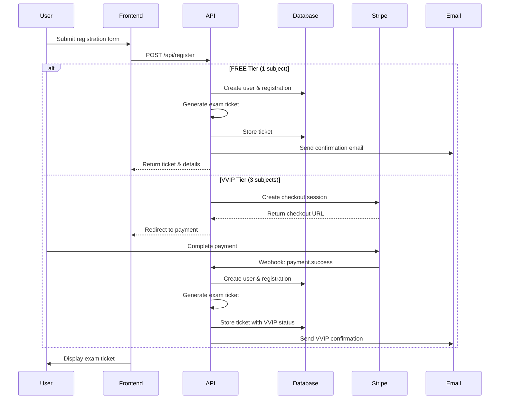
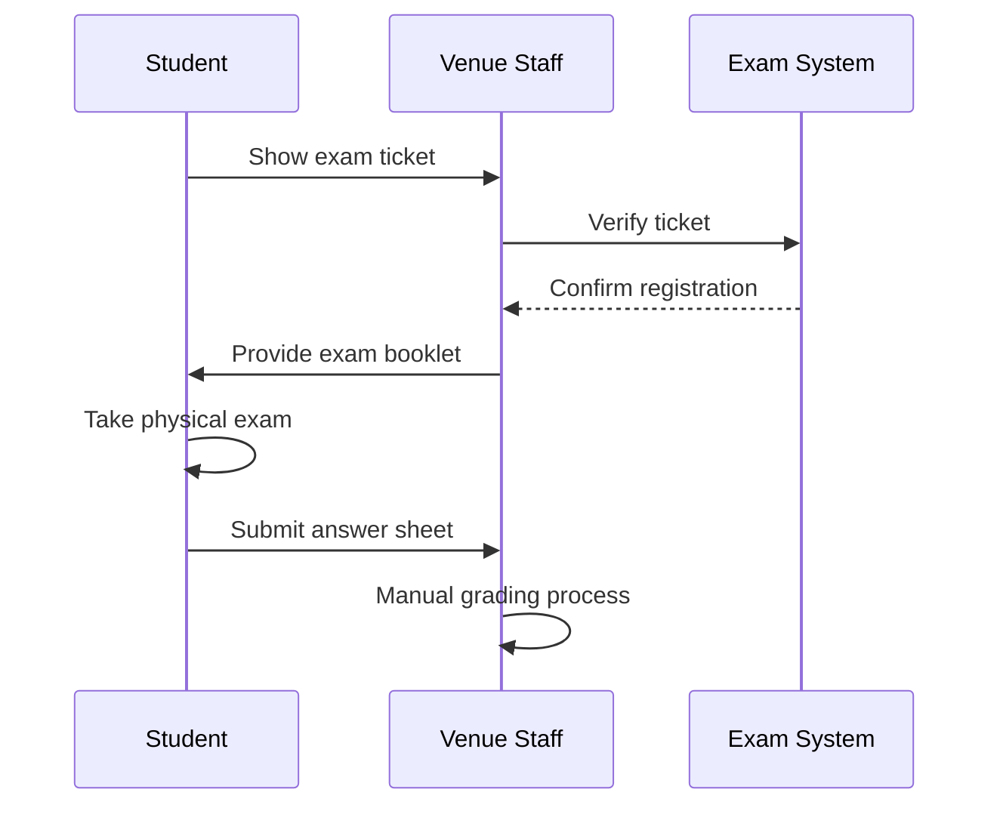
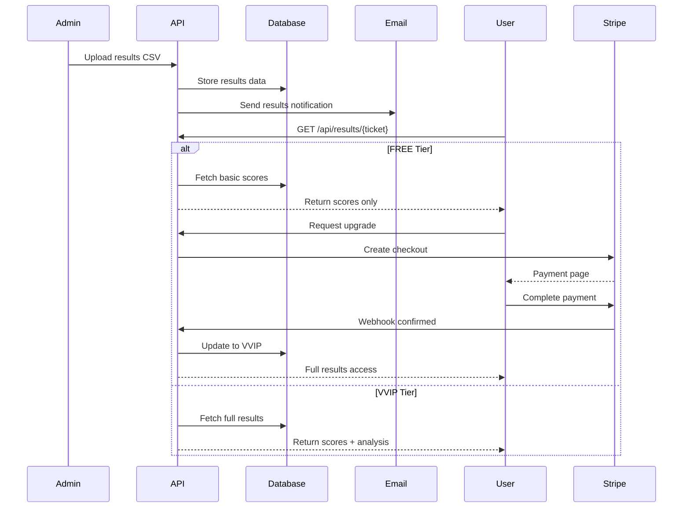

# ADR-002: Freemium Model Architecture for TBAT Platform

## Status
✅ **APPROVED** - 2025-01-03

## Context

Sprint Change Proposal v4.0 fundamentally clarifies that TBAT is a **registration and results portal** for **physical, paper-based exams** - NOT an online exam platform. This pivot from BoxSet model to Freemium requires significant architectural changes to support tier-based access while maintaining exam-critical quality.

### Key Business Drivers
- **Market Expansion:** Zero-friction free tier for maximum user acquisition
- **Revenue Model:** Freemium with ฿690 VVIP upgrade for detailed analytics
- **Physical Exam Support:** Registration portal for venue-based exams in Chiang Mai
- **Scalability:** Support 200+ concurrent users during registration periods

### Scope Clarification (v4.0)
**IN SCOPE:**
- Online registration for physical exam
- Exam ticket generation
- Payment processing for VVIP tier
- Results viewing portal (tier-based)
- Admin CSV upload for graded results

**OUT OF SCOPE:**
- ❌ Online exam interface
- ❌ Question management system
- ❌ Real-time scoring
- ❌ Timer functionality
- ❌ Practice tests

## Decision

We will implement a **two-tier Freemium architecture** with the following specifications:

### 1. Tier Architecture

#### FREE Tier
- **Registration:** 1 subject selection for physical exam
- **Exam Access:** Full access to physical exam at venue
- **Results:** Basic scores only
- **Analytics:** None
- **Upgrade Path:** Post-exam upgrade to see detailed analysis

#### VVIP Tier (฿690)
- **Registration:** 3 subjects for physical exam
- **Exam Access:** Full access to physical exam at venue
- **Results:** Complete scores with percentiles
- **Analytics:** Detailed performance analysis, answer keys, weak points
- **Export:** PDF reports, CSV data

### 2. System Architecture

```
┌─────────────────────────────────────────────────────────┐
│                    Frontend (Next.js)                    │
├─────────────────────────────────────────────────────────┤
│  Registration  │  Dashboard  │  Results  │   Payment    │
│     Module     │    Module   │   Module  │   Module     │
└────────┬───────────────┬────────────┬──────────┬───────┘
         │               │            │          │
         ▼               ▼            ▼          ▼
┌─────────────────────────────────────────────────────────┐
│                   API Layer (Next.js)                    │
├─────────────────────────────────────────────────────────┤
│  /api/register │ /api/dashboard │ /api/results │ /api/payment │
└────────┬───────────────┬────────────┬──────────┬───────┘
         │               │            │          │
         ▼               ▼            ▼          ▼
┌─────────────────────────────────────────────────────────┐
│                  Service Layer                           │
├─────────────────────────────────────────────────────────┤
│ Registration │  Ticket   │  Results  │  Payment  │ Email │
│   Service    │  Service  │  Service  │  Service  │Service│
└────────┬───────────────┬────────────┬──────────┬───────┘
         │               │            │          │
         ▼               ▼            ▼          ▼
┌─────────────────────────────────────────────────────────┐
│                 Database (PostgreSQL)                    │
├─────────────────────────────────────────────────────────┤
│  users  │ registrations │  results  │ payments │ sessions│
└─────────────────────────────────────────────────────────┘
         │                                        │
         ▼                                        ▼
┌──────────────┐                        ┌─────────────────┐
│  Stripe API  │                        │  Resend Email   │
└──────────────┘                        └─────────────────┘
```

### 3. Data Flow Architecture

#### Registration Flow (Pre-Exam)


#### Physical Exam Day


#### Results Flow (Post-Exam)


## Implementation Details

### Database Schema Updates

```prisma
model User {
  id           String   @id @default(cuid())
  email        String   @unique
  passwordHash String
  name         String
  school       String
  grade        String
  lineId       String
  tier         Tier     @default(FREE)
  freeSubject  Subject? // Only for FREE tier
  
  // Parent information (required for minors)
  parentName     String?
  parentRelation String?
  parentPhone    String?
  parentEmail    String?
  
  // Relations
  registrations Registration[]
  payments      Payment[]
  
  createdAt DateTime @default(now())
  updatedAt DateTime @updatedAt
  
  @@index([email])
  @@index([tier])
}

model Registration {
  id           String      @id @default(cuid())
  userId       String
  examSessionId String
  examTicket   String      @unique
  tier         Tier
  subjects     Subject[]
  status       RegStatus   @default(REGISTERED)
  
  // Relations
  user         User        @relation(fields: [userId], references: [id])
  examSession  ExamSession @relation(fields: [examSessionId], references: [id])
  results      Result[]
  
  createdAt    DateTime    @default(now())
  
  @@index([examTicket])
  @@index([userId])
}

model Result {
  id             String       @id @default(cuid())
  registrationId String
  subject        Subject
  score          Float
  maxScore       Float
  percentile     Int?         // VVIP only
  answers        Json?        // VVIP only: detailed answer data
  analysis       Json?        // VVIP only: weak points, recommendations
  
  registration   Registration @relation(fields: [registrationId], references: [id])
  
  gradedAt       DateTime?
  publishedAt    DateTime?
  createdAt      DateTime     @default(now())
  
  @@unique([registrationId, subject])
  @@index([registrationId])
}

model Payment {
  id                  String        @id @default(cuid())
  userId              String
  stripePaymentIntentId String?     @unique
  amount              Float         // 690.00
  currency            String        @default("THB")
  status              PaymentStatus @default(PENDING)
  upgradeType         UpgradeType   // PRE_EXAM or POST_RESULTS
  metadata            Json?         // Store additional payment context
  
  user                User          @relation(fields: [userId], references: [id])
  
  createdAt           DateTime      @default(now())
  updatedAt           DateTime      @updatedAt
  
  @@index([userId])
  @@index([status])
}

enum Tier {
  FREE
  VVIP
}

enum Subject {
  PHYSICS
  CHEMISTRY
  BIOLOGY
}

enum RegStatus {
  REGISTERED
  ATTENDED
  ABSENT
  CANCELLED
}

enum PaymentStatus {
  PENDING
  PROCESSING
  SUCCESS
  FAILED
  REFUNDED
}

enum UpgradeType {
  PRE_EXAM     // Upgrade during registration
  POST_RESULTS // Upgrade after seeing basic results
}
```

### API Endpoints

```typescript
// Registration API
POST   /api/register          // Free registration (1 subject)
POST   /api/register/vvip     // VVIP registration with payment
GET    /api/register/verify   // Verify exam ticket

// Dashboard API  
GET    /api/dashboard         // User dashboard (tier-aware)
GET    /api/exam-info         // Exam venue, date, time details

// Results API
GET    /api/results/:ticket   // Get results (tier-aware content)
GET    /api/results/export    // Export results (VVIP only)

// Payment API
POST   /api/payment/upgrade   // Create upgrade checkout session
POST   /api/payment/webhook   // Stripe webhook handler
GET    /api/payment/status    // Check payment status

// Admin API
POST   /api/admin/upload      // Upload results CSV
GET    /api/admin/sessions    // Manage exam sessions
POST   /api/admin/notify      // Send bulk notifications
```

### Security Architecture

#### Payment Security
- **PCI Compliance:** Use Stripe Checkout (SAQ-A compliance)
- **Webhook Security:** Validate Stripe signatures
- **Rate Limiting:** 5 requests per minute per IP
- **Session Security:** Secure, httpOnly cookies
- **HTTPS Only:** Enforce TLS 1.2+

#### Data Protection
- **Encryption at Rest:** Database encryption
- **Encryption in Transit:** TLS for all connections
- **PII Handling:** Minimal data collection, PDPA compliance
- **Audit Logging:** All payment and result access logged
- **Backup Strategy:** Daily automated backups with point-in-time recovery

### Performance Optimization

#### Frontend Optimization
- **Code Splitting:** Lazy load tier-specific components
- **Bundle Size:** < 200KB initial load
- **Image Optimization:** Next.js Image component
- **Caching:** SWR for data fetching
- **CDN:** Static assets via Vercel Edge Network

#### Backend Optimization
- **Database Indexes:** On frequently queried fields
- **Query Optimization:** Prisma query batching
- **Caching Layer:** Redis for session data (future)
- **Rate Limiting:** Prevent abuse
- **Auto-scaling:** Vercel serverless functions

### Monitoring & Analytics

#### Technical Monitoring
- **Uptime Monitoring:** 99.9% target
- **Error Tracking:** Sentry integration
- **Performance Monitoring:** Core Web Vitals
- **Database Monitoring:** Query performance
- **Payment Monitoring:** Transaction success rates

#### Business Analytics
- **Conversion Funnel:** Free → VVIP conversion tracking
- **User Behavior:** GA4 event tracking
- **A/B Testing:** Feature flag system
- **Revenue Analytics:** Stripe Dashboard + custom metrics
- **Exam Analytics:** Attendance rates, subject distribution

## Consequences

### Positive
- ✅ **Simplified Scope:** 70% simpler than online exam platform
- ✅ **Faster Development:** 14 days vs 21 days timeline
- ✅ **Lower Risk:** No complex exam-taking logic
- ✅ **Better UX:** Clear tier differentiation
- ✅ **Scalable Revenue:** Predictable upgrade path
- ✅ **Market Fit:** Aligns with physical exam reality

### Negative
- ⚠️ **Manual Process:** Results require CSV upload
- ⚠️ **Conversion Risk:** 15% target unproven
- ⚠️ **Support Load:** Free tier may increase support
- ⚠️ **Payment Complexity:** Stripe integration required

### Mitigation Strategies
1. **Admin Tools:** Streamlined CSV upload interface
2. **Conversion Optimization:** A/B testing CTAs and messaging
3. **Self-Service:** Comprehensive FAQ and help docs
4. **Payment Reliability:** Use Stripe's proven checkout

## References

- Sprint Change Proposal v4.0 (2025-01-03)
- PRD Section 12: Freemium Technical Architecture
- ADR-001: Secure Code Generation (superseded for Freemium)
- Stripe API Documentation
- Next.js App Router Documentation

## Approval

| Role | Name | Date | Status |
|------|------|------|--------|
| Architect | Winston | 2025-01-03 | ✅ Approved |
| Product Owner | Sarah | 2025-01-03 | Pending Review |
| Technical Lead | TBD | - | Pending |

---

**Next Steps:**
1. Review and approve this ADR
2. Update implementation stories with Freemium requirements
3. Set up Stripe test account
4. Begin Phase 1 mock implementation