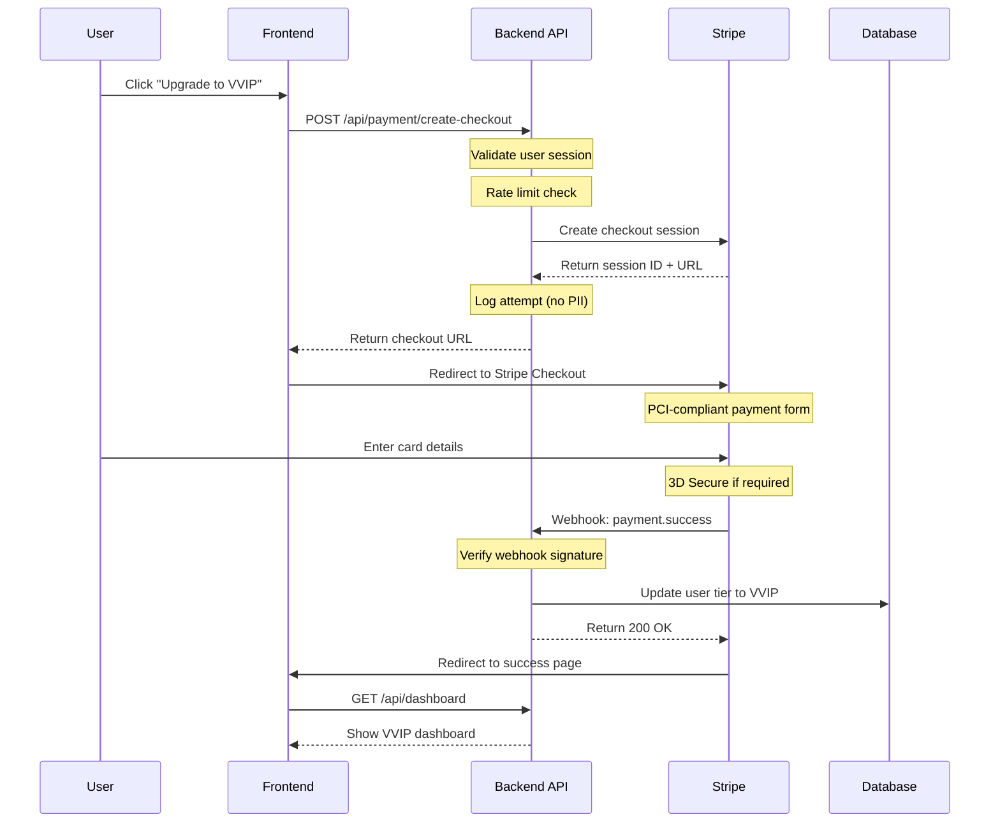

# Payment Security Architecture

## Executive Summary

This document outlines the comprehensive security architecture for payment processing in the TBAT Freemium platform. We implement defense-in-depth strategies using Stripe as our payment processor to ensure PCI DSS compliance and protect user financial data.

**Compliance Level:** PCI DSS SAQ-A (Stripe Checkout)  
**Security Standard:** OWASP Top 10 compliant  
**Data Protection:** PDPA (Thai Personal Data Protection Act) compliant

## Security Principles

### 1. Zero Trust Architecture
- Never trust, always verify
- Assume breach mindset
- Principle of least privilege
- Defense in depth

### 2. Data Minimization
- No card data stored on our servers
- Only store Stripe customer/payment IDs
- Tokenization for all sensitive data
- Automatic PII purging after retention period

## Payment Flow Security

### Secure Checkout Flow


## Security Layers

### Layer 1: Network Security

#### TLS/HTTPS Configuration
```nginx
# nginx.conf
server {
    listen 443 ssl http2;
    ssl_certificate /path/to/cert.pem;
    ssl_certificate_key /path/to/key.pem;
    
    # Modern TLS configuration
    ssl_protocols TLSv1.2 TLSv1.3;
    ssl_ciphers ECDHE-ECDSA-AES128-GCM-SHA256:ECDHE-RSA-AES128-GCM-SHA256;
    ssl_prefer_server_ciphers off;
    
    # HSTS
    add_header Strict-Transport-Security "max-age=63072000; includeSubDomains; preload";
    
    # Security headers
    add_header X-Frame-Options "DENY";
    add_header X-Content-Type-Options "nosniff";
    add_header X-XSS-Protection "1; mode=block";
    add_header Content-Security-Policy "default-src 'self' https://checkout.stripe.com";
}
```

#### Firewall Rules
```yaml
# AWS Security Group / Firewall Rules
inbound_rules:
  - protocol: tcp
    port: 443
    source: 0.0.0.0/0  # Public HTTPS
  - protocol: tcp
    port: 22
    source: 10.0.0.0/8  # Admin SSH (VPN only)

outbound_rules:
  - protocol: tcp
    port: 443
    destination: api.stripe.com  # Stripe API
  - protocol: tcp
    port: 443
    destination: checkout.stripe.com  # Stripe Checkout
```

### Layer 2: Application Security

#### Input Validation
```typescript
// lib/validation/payment.ts
import { z } from 'zod';

export const createCheckoutSchema = z.object({
  upgradeType: z.enum(['PRE_EXAM', 'POST_RESULTS']),
  returnUrl: z.string().url().optional(),
  metadata: z.object({
    userId: z.string().uuid(),
    examSessionId: z.string().uuid().optional(),
  }).strict(), // Prevent additional fields
});

export function validateCheckoutRequest(data: unknown) {
  try {
    return createCheckoutSchema.parse(data);
  } catch (error) {
    throw new ValidationError('Invalid checkout request', error);
  }
}
```

#### Rate Limiting
```typescript
// middleware/rateLimit.ts
import rateLimit from 'express-rate-limit';
import RedisStore from 'rate-limit-redis';

export const paymentRateLimit = rateLimit({
  store: new RedisStore({
    client: redis,
    prefix: 'rl:payment:',
  }),
  windowMs: 5 * 60 * 1000,  // 5 minutes
  max: 5,                    // 5 requests per window
  message: 'Too many payment attempts, please try again later',
  standardHeaders: true,
  legacyHeaders: false,
  
  // Custom key generator for user-based limiting
  keyGenerator: (req) => {
    return req.user?.id || req.ip;
  },
  
  // Skip successful requests
  skip: (req, res) => {
    return res.statusCode < 400;
  },
});
```

### Layer 3: Webhook Security

#### Webhook Signature Verification
```typescript
// api/payment/webhook.ts
import { buffer } from 'micro';
import Stripe from 'stripe';

const stripe = new Stripe(process.env.STRIPE_SECRET_KEY!);
const webhookSecret = process.env.STRIPE_WEBHOOK_SECRET!;

export async function verifyWebhookSignature(
  req: Request,
  payload: string
): Promise<Stripe.Event> {
  const signature = req.headers.get('stripe-signature');
  
  if (!signature) {
    throw new Error('Missing stripe-signature header');
  }
  
  try {
    // Verify the webhook signature
    const event = stripe.webhooks.constructEvent(
      payload,
      signature,
      webhookSecret
    );
    
    // Additional validation
    if (!isValidEventType(event.type)) {
      throw new Error(`Unexpected event type: ${event.type}`);
    }
    
    // Verify timestamp (prevent replay attacks)
    const timestamp = Math.floor(event.created);
    const currentTime = Math.floor(Date.now() / 1000);
    const tolerance = 300; // 5 minutes
    
    if (currentTime - timestamp > tolerance) {
      throw new Error('Webhook timestamp too old');
    }
    
    return event;
  } catch (err) {
    console.error('Webhook signature verification failed:', err);
    throw new Error('Invalid webhook signature');
  }
}

// Whitelist of expected event types
function isValidEventType(type: string): boolean {
  const validTypes = [
    'checkout.session.completed',
    'payment_intent.succeeded',
    'payment_intent.payment_failed',
    'customer.subscription.created',
    'customer.subscription.deleted',
  ];
  return validTypes.includes(type);
}
```

#### Idempotency Handling
```typescript
// lib/payment/idempotency.ts
export async function handleIdempotentWebhook(
  eventId: string,
  handler: () => Promise<void>
): Promise<{ processed: boolean }> {
  const key = `webhook:processed:${eventId}`;
  
  // Check if already processed
  const exists = await redis.exists(key);
  if (exists) {
    console.log(`Webhook ${eventId} already processed`);
    return { processed: false };
  }
  
  // Process with distributed lock
  const lock = await redlock.acquire([`lock:${key}`], 5000);
  
  try {
    // Double-check after acquiring lock
    const existsAgain = await redis.exists(key);
    if (existsAgain) {
      return { processed: false };
    }
    
    // Process the webhook
    await handler();
    
    // Mark as processed (expire after 7 days)
    await redis.setex(key, 7 * 24 * 60 * 60, '1');
    
    return { processed: true };
  } finally {
    await lock.release();
  }
}
```

### Layer 4: Data Security

#### Encryption at Rest
```typescript
// prisma/schema.prisma
model Payment {
  id                    String   @id @default(cuid())
  userId                String
  
  // Encrypted fields
  stripeCustomerId      String?  @db.Text @encrypted
  stripePaymentIntentId String?  @db.Text @encrypted
  
  amount                Decimal  @db.Decimal(10, 2)
  currency              String   @default("THB")
  status                PaymentStatus
  
  // Audit fields
  createdAt             DateTime @default(now())
  updatedAt             DateTime @updatedAt
  
  @@index([userId])
  @@index([status])
}
```

#### Sensitive Data Masking
```typescript
// lib/security/masking.ts
export function maskSensitiveData(data: any): any {
  const sensitiveFields = [
    'cardNumber',
    'cvv',
    'stripeCustomerId',
    'paymentIntentId',
    'email',
    'phone',
  ];
  
  const masked = { ...data };
  
  for (const field of sensitiveFields) {
    if (masked[field]) {
      masked[field] = maskValue(masked[field]);
    }
  }
  
  return masked;
}

function maskValue(value: string): string {
  if (value.length <= 4) return '****';
  
  const visibleStart = 2;
  const visibleEnd = 2;
  const masked = '*'.repeat(value.length - visibleStart - visibleEnd);
  
  return value.substring(0, visibleStart) + 
         masked + 
         value.substring(value.length - visibleEnd);
}
```

### Layer 5: Audit & Monitoring

#### Payment Audit Logging
```typescript
// lib/audit/payment.ts
interface PaymentAuditLog {
  eventId: string;
  eventType: 'PAYMENT_INITIATED' | 'PAYMENT_SUCCESS' | 'PAYMENT_FAILED' | 'REFUND';
  userId: string;
  amount: number;
  currency: string;
  ipAddress: string;
  userAgent: string;
  timestamp: Date;
  metadata?: Record<string, any>;
}

export async function logPaymentEvent(log: PaymentAuditLog): Promise<void> {
  // Store in separate audit database/table
  await auditDb.paymentLogs.create({
    data: {
      ...log,
      metadata: log.metadata ? JSON.stringify(log.metadata) : null,
    },
  });
  
  // Send to SIEM if configured
  if (process.env.SIEM_ENDPOINT) {
    await sendToSIEM(log);
  }
  
  // Alert on suspicious activity
  await checkForAnomalies(log);
}

async function checkForAnomalies(log: PaymentAuditLog): Promise<void> {
  // Check for multiple failed payments
  const recentFailures = await auditDb.paymentLogs.count({
    where: {
      userId: log.userId,
      eventType: 'PAYMENT_FAILED',
      timestamp: {
        gte: new Date(Date.now() - 60 * 60 * 1000), // Last hour
      },
    },
  });
  
  if (recentFailures >= 3) {
    await alertSecurityTeam({
      type: 'MULTIPLE_PAYMENT_FAILURES',
      userId: log.userId,
      count: recentFailures,
    });
  }
  
  // Check for unusual amounts
  if (log.amount > 10000) { // ฿10,000
    await alertSecurityTeam({
      type: 'HIGH_VALUE_TRANSACTION',
      ...log,
    });
  }
}
```

#### Real-time Monitoring
```typescript
// monitoring/payment-metrics.ts
import { Counter, Histogram, register } from 'prom-client';

// Metrics
const paymentCounter = new Counter({
  name: 'payment_transactions_total',
  help: 'Total number of payment transactions',
  labelNames: ['status', 'type'],
});

const paymentDuration = new Histogram({
  name: 'payment_duration_seconds',
  help: 'Payment processing duration',
  buckets: [0.1, 0.5, 1, 2, 5, 10],
});

const paymentAmount = new Histogram({
  name: 'payment_amount_baht',
  help: 'Payment amounts in THB',
  buckets: [100, 500, 690, 1000, 5000, 10000],
});

register.registerMetric(paymentCounter);
register.registerMetric(paymentDuration);
register.registerMetric(paymentAmount);

// Usage
export function recordPaymentMetrics(
  status: 'success' | 'failed',
  type: 'upgrade' | 'refund',
  amount: number,
  duration: number
): void {
  paymentCounter.inc({ status, type });
  paymentDuration.observe(duration);
  paymentAmount.observe(amount);
}
```

## Fraud Prevention

### Velocity Checks
```typescript
// lib/fraud/velocity.ts
export async function checkVelocityLimits(userId: string): Promise<{
  allowed: boolean;
  reason?: string;
}> {
  const limits = [
    { window: 3600, max: 3, name: 'hourly' },      // 3 per hour
    { window: 86400, max: 5, name: 'daily' },      // 5 per day
    { window: 604800, max: 10, name: 'weekly' },   // 10 per week
  ];
  
  for (const limit of limits) {
    const key = `velocity:${userId}:${limit.name}`;
    const count = await redis.incr(key);
    
    if (count === 1) {
      await redis.expire(key, limit.window);
    }
    
    if (count > limit.max) {
      return {
        allowed: false,
        reason: `Exceeded ${limit.name} limit`,
      };
    }
  }
  
  return { allowed: true };
}
```

### Device Fingerprinting
```typescript
// lib/fraud/fingerprint.ts
export function generateDeviceFingerprint(req: Request): string {
  const components = [
    req.headers.get('user-agent'),
    req.headers.get('accept-language'),
    req.headers.get('accept-encoding'),
    req.ip,
    // Add more entropy from client-side fingerprinting
  ];
  
  const hash = crypto
    .createHash('sha256')
    .update(components.filter(Boolean).join('|'))
    .digest('hex');
    
  return hash;
}

export async function checkDeviceReputation(
  fingerprint: string
): Promise<boolean> {
  // Check against blocklist
  const blocked = await redis.sismember('blocked:devices', fingerprint);
  if (blocked) return false;
  
  // Check recent fraud associations
  const fraudCount = await redis.get(`fraud:device:${fingerprint}`);
  if (fraudCount && parseInt(fraudCount) > 2) return false;
  
  return true;
}
```

## Incident Response

### Payment Incident Playbook

#### 1. Detection
```yaml
triggers:
  - Multiple payment failures (>5 in 5 minutes)
  - Unusual payment patterns detected
  - Stripe webhook failures
  - PCI compliance alert
  - Customer complaint about unauthorized charge
```

#### 2. Response Steps
```yaml
immediate_actions:
  1. Isolate affected systems
  2. Enable emergency mode (disable new payments)
  3. Preserve audit logs
  4. Notify security team

investigation:
  1. Review payment logs
  2. Check Stripe dashboard
  3. Analyze patterns
  4. Identify root cause

remediation:
  1. Fix identified issues
  2. Process refunds if needed
  3. Update security controls
  4. Document lessons learned
```

#### 3. Communication
```yaml
internal:
  - Security team: Immediate
  - CTO: Within 15 minutes
  - CEO: Within 30 minutes
  - Legal: Within 1 hour

external:
  - Affected users: Within 4 hours
  - Stripe: If their issue
  - Regulators: Within 72 hours (if breach)
```

## Compliance & Regulations

### PCI DSS Requirements

#### SAQ-A Compliance
Since we use Stripe Checkout (hosted payment page), we qualify for SAQ-A:

- ✅ No card data touches our servers
- ✅ Redirect to Stripe for payment
- ✅ Use tokenization for references
- ✅ Secure redirect implementation
- ✅ Regular security reviews

#### Required Documentation
- Network diagram
- Data flow diagram
- Security policy
- Incident response plan
- Vulnerability management
- Access control policy

### PDPA Compliance (Thai Data Protection)

#### Data Subject Rights
```typescript
// lib/privacy/rights.ts
export async function handleDataRequest(
  userId: string,
  requestType: 'ACCESS' | 'RECTIFICATION' | 'ERASURE' | 'PORTABILITY'
): Promise<void> {
  switch (requestType) {
    case 'ACCESS':
      return await provideDataCopy(userId);
    case 'RECTIFICATION':
      return await allowDataCorrection(userId);
    case 'ERASURE':
      return await deleteUserData(userId);
    case 'PORTABILITY':
      return await exportUserData(userId);
  }
}
```

#### Consent Management
```typescript
// lib/privacy/consent.ts
interface ConsentRecord {
  userId: string;
  type: 'PAYMENT_PROCESSING' | 'MARKETING' | 'ANALYTICS';
  granted: boolean;
  timestamp: Date;
  ipAddress: string;
  version: string;
}

export async function recordConsent(
  consent: ConsentRecord
): Promise<void> {
  await db.consents.create({
    data: consent,
  });
  
  // Update user preferences
  await updateUserPreferences(consent.userId, consent.type, consent.granted);
}
```

## Security Checklist

### Pre-Launch
- [ ] PCI DSS self-assessment completed
- [ ] Stripe webhook endpoint verified
- [ ] Rate limiting tested
- [ ] SSL/TLS configuration verified
- [ ] Security headers configured
- [ ] Penetration testing completed
- [ ] Incident response plan documented
- [ ] Team trained on security procedures

### Ongoing
- [ ] Monthly security reviews
- [ ] Quarterly penetration tests
- [ ] Annual PCI compliance renewal
- [ ] Regular security training
- [ ] Vulnerability scanning
- [ ] Dependency updates
- [ ] Audit log reviews
- [ ] Incident response drills

## Contact & Escalation

### Security Team
- **Security Lead:** security@tbat.com
- **On-call:** +66-XX-XXX-XXXX
- **Slack:** #security-alerts

### External Contacts
- **Stripe Support:** support.stripe.com
- **PCI Council:** pcisecuritystandards.org
- **CERT Thailand:** thaicert.or.th

---

**Document Status:** ✅ READY FOR IMPLEMENTATION  
**Last Updated:** 2025-01-03  
**Review Schedule:** Quarterly