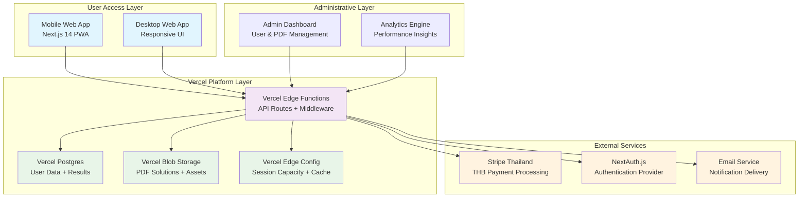

# Section 2: High Level Architecture

### System Overview

The TBAT Mock Exam Platform implements a **serverless-first architecture** with **frontend-first development strategy** leveraging Vercel's integrated ecosystem for optimal performance and cost efficiency at 20-user scale.

### Cost Analysis (Updated for 20 Users)

**Vercel Pro Plan - All-in-One Solution:**

- **Base Plan:** $20/month (฿720/month)
- **Postgres:** Included (100GB storage, 1M queries)
- **Blob Storage:** Included (100GB)
- **Edge Config:** Included
- **Functions:** Included (1M invocations)
- **Bandwidth:** Included (1TB)

**External Services:**

- **Stripe Thailand:** 3.65% + ฿11 per transaction
- **Email Service:** Free tier (Resend: 3,000 emails/month)

**Capacity Management Service:**
- Real-time capacity tracking for Free/Advanced packages
- Enforces 300 total / 150 free hard limits
- Provides availability status without exposing numbers
- Handles Advanced package priority logic
- Integrates with registration flow validation

**Total Monthly Cost:** ~฿710/month (20-user scale)
**Cost per User:** ~฿36/month (highly efficient at small scale)

### Development & Scalability Strategy

**Frontend-First Development Approach:**

- **Epic 1:** Complete frontend package selection experience with mock data and database foundation
- **Epic 2+:** Authentication integration and real backend API replacement
- **Benefits:** Early stakeholder validation, demo-ready platform, reduced Epic 2 dependencies

**Current Capacity:**

- **Registration:** 20 concurrent users during peak registration periods
- **Exam Participants:** 2 sessions × 300 students each (600 total on 27 กันยายน 2568)
- **Concurrent Load:** System optimized for 20 simultaneous registrations
- **Results Processing:** Real-time analytics generation
- **PDF Delivery:** Concurrent downloads supported

**Growth Path (Future 300 Users):**

- Vercel Pro scales automatically with usage-based pricing
- Database connection pooling via Prisma
- CDN distribution for PDF content
- Estimated cost: ฿2,500-3,000/month at 300-user scale
