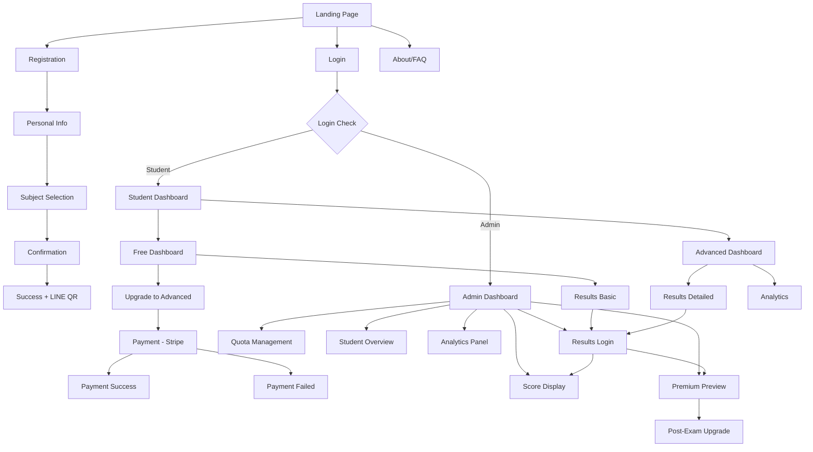
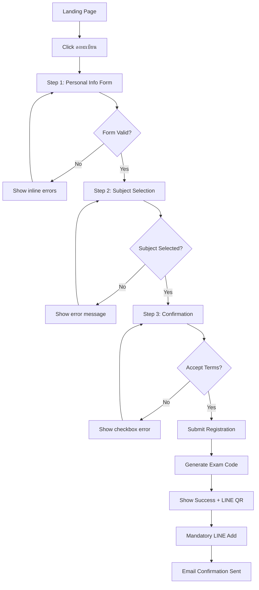
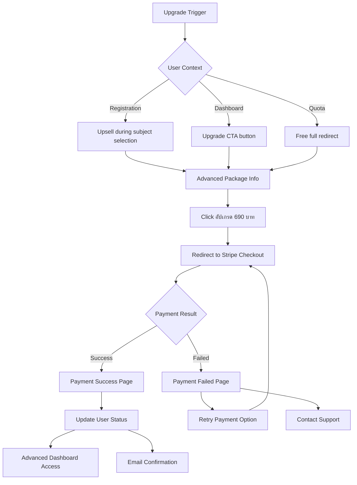
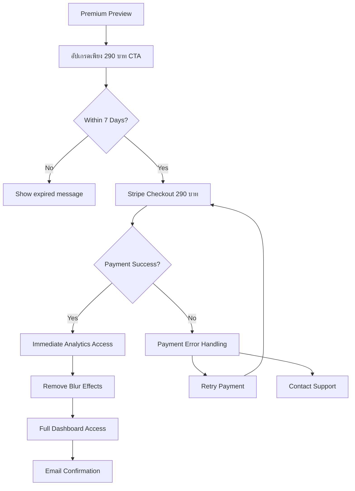
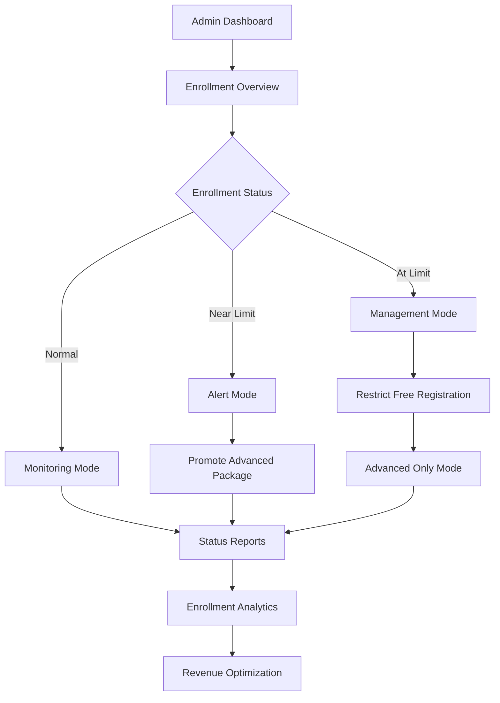
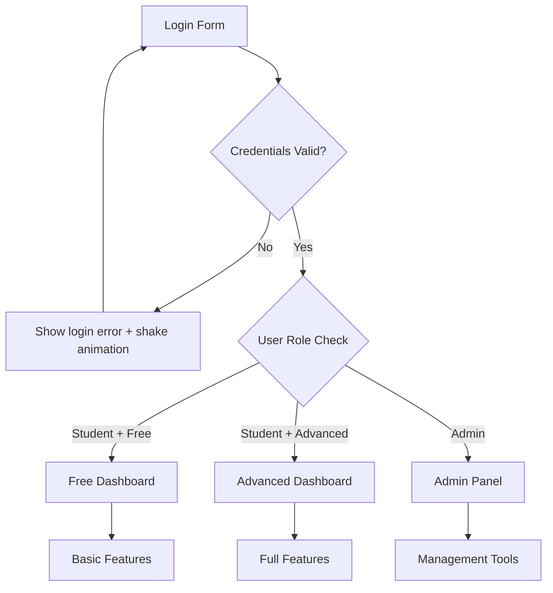
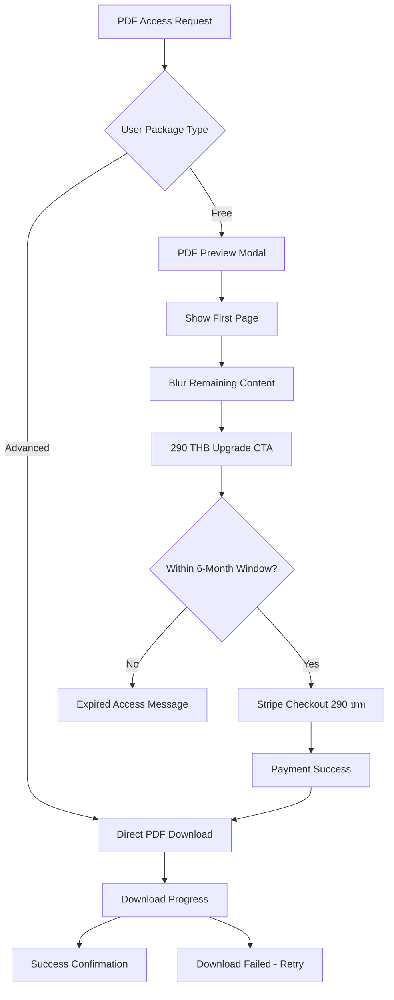
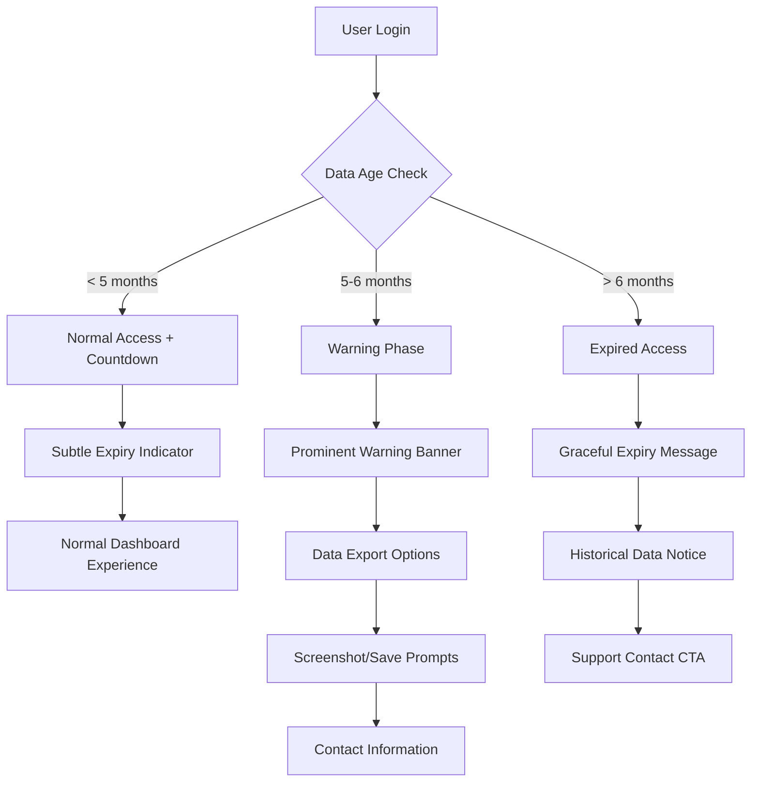
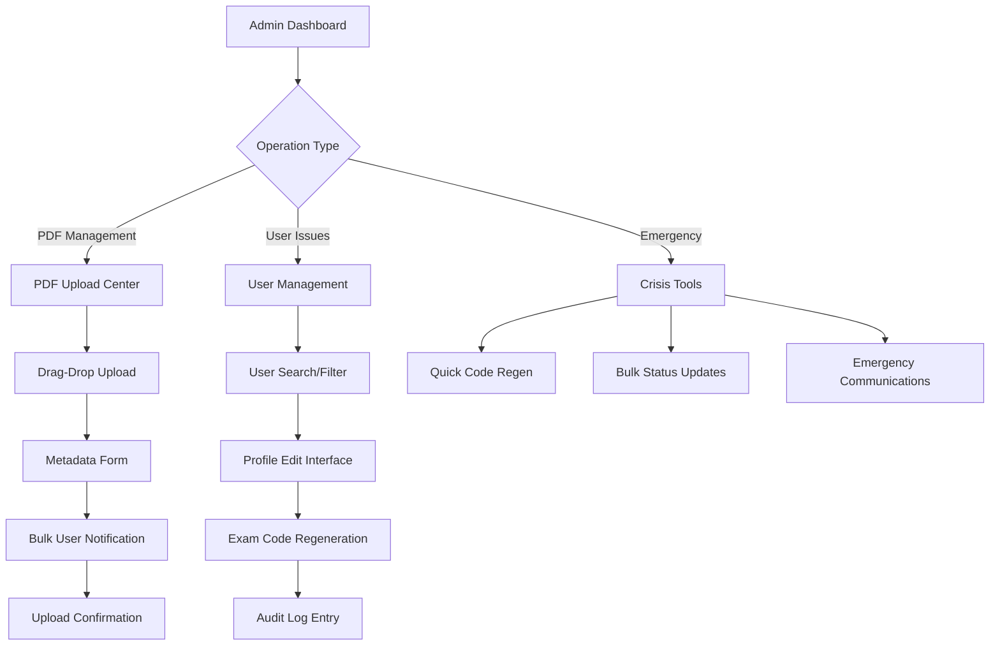

# TBAT Mock Exam Platform UI/UX Specification

This document defines the user experience goals, information architecture, user flows, and visual design specifications for TBAT Mock Exam Platform's user interface. It serves as the foundation for visual design and frontend development, ensuring a cohesive and user-centered experience.

## Table of Contents

- [Introduction](#introduction)
- [Information Architecture](#information-architecture-ia)
- [User Flows](#user-flows)
- [Component Library / Design System](#component-library--design-system)
- [Branding & Style Guide](#branding--style-guide)
- [Accessibility Requirements](#accessibility-requirements)
- [Responsiveness Strategy](#responsiveness-strategy)
- [Animation & Micro-interactions](#animation--micro-interactions)
- [Performance Considerations](#performance-considerations)
- [Next Steps](#next-steps)

## Introduction

### Overall UX Goals & Principles

#### Target User Personas

- **High School Students (Primary)**: ม.4-ม.6 students in Chiang Mai preparing for TBAT medical school entrance exams. Tech-savvy mobile-first users who need accessible, stress-free exam experiences.
- **Parents/Guardians (Secondary)**: Supportive parents who help coordinate exam registration and follow their children's progress. Prefer clear communication and reliable updates.
- **Tutoring Center Administrators (Tertiary)**: Professionals managing 200+ students during exam periods who need efficient oversight and real-time enrollment monitoring.

#### Usability Goals

- **Ease of learning**: New users can complete registration and understand the freemium model within 3 minutes
- **Efficiency of use**: Returning users can check results and upgrade packages within 30 seconds
- **Error prevention**: Clear validation and confirmation for all critical actions (payment, exam registration)
- **Memorability**: Infrequent users can return after weeks without relearning the interface
- **Mobile optimization**: 80%+ of interactions occur on mobile devices - seamless responsive experience

#### Design Principles

1. **Clarity over cleverness** - Prioritize clear communication over aesthetic innovation, especially for exam-critical information
2. **Progressive disclosure** - Show only what's needed, when it's needed. Hide advanced analytics behind upgrade walls
3. **Consistent patterns** - Use familiar Thai educational UI patterns throughout the application
4. **Immediate feedback** - Every action has clear, immediate response with toast notifications
5. **Accessible by default** - Design for all users from the start with proper Thai language support

#### Change Log

| Date       | Version | Description                                                                | Author            |
| ---------- | ------- | -------------------------------------------------------------------------- | ----------------- |
| 2025-09-06 | 1.0     | Initial UI/UX specification                                                | Claude Code       |
| 2025-09-06 | 1.1     | Updated UI terminology for professional tone                               | Claude Code       |
| 2025-09-06 | 1.2     | Added PDF solution management, data lifecycle, and enhanced admin features | Sally (UX Expert) |

## Information Architecture (IA)

### Site Map / Screen Inventory



### Navigation Structure

**Primary Navigation:**

- Landing: หน้าแรก | ลงทะเบียน | เข้าสู่ระบบ | เกี่ยวกับ
- Dashboard: หน้าแรก | ผลสอบ | อัปเกรด | ออกจากระบบ
- Admin: จัดการนักเรียน | ความจุ | Analytics | ออกจากระบบ

**Secondary Navigation:**

- Form steps (1. ข้อมูลส่วนตัว | 2. เลือกวิชา | 3. ยืนยันข้อมูล)
- Dashboard tabs (คะแนนรวม | แต่ละวิชา | เปรียบเทียบ | คำแนะนำ)

**Breadcrumb Strategy:**

- Simple path for multi-step processes
- Context-aware: "ลงทะเบียน > ข้อมูลส่วนตัว > เลือกวิชา"

## User Flows

### Flow 1: Registration & Free Package Selection

**User Goal:** Complete exam registration and receive exam code

**Entry Points:** Landing page CTA, direct URL, social media links

**Success Criteria:** User receives valid exam code and adds mandatory LINE Official Account



**Edge Cases & Error Handling:**

- Duplicate email registration: "อีเมลนี้ถูกใช้แล้ว กรุณาใช้อีเมลอื่น หรือเข้าสู่ระบบ"
- Free quota full: Redirect to Advanced payment, show "Free Package เต็มแล้ว"
- Network timeout during submission: Retry mechanism with clear feedback
- Invalid phone format: Real-time validation with Thai format (08X-XXX-XXXX)
- Missing LINE ID: Hard validation error - cannot proceed

**Notes:** LINE ID is mandatory for receiving exam updates and results notifications

### Flow 2: Advanced Package Payment

**User Goal:** Upgrade to Advanced package for full 3-subject access and detailed analytics

**Entry Points:** Registration upsell, dashboard upgrade CTA, enrollment limitations

**Success Criteria:** Successful payment and immediate access to Advanced features



**Edge Cases & Error Handling:**

- Payment timeout: Clear retry mechanism with preserved cart
- Card declined: Helpful error messages in Thai
- Network issues during payment: Payment status verification system
- Duplicate payment: Automatic refund detection
- Stripe webhook failures: Manual verification fallback

**Notes:** All payments redirect to Stripe Checkout - no custom payment UI in platform

### Flow 3: Results Viewing (Login-Based)

**User Goal:** Access exam results and performance analytics

**Entry Points:** Email notification, dashboard link, direct URL

**Success Criteria:** View appropriate results level based on package type

```mermaid
graph TD
    A[Results Access] --> B[Unified Login Page]
    B --> C{Login Valid?}
    C -->|No| D[Show login error]
    D --> B
    C -->|Yes| E{User Package Type}

    E -->|Free| F[Basic Results Display]
    E -->|Advanced| G[Detailed Analytics]

    F --> H[Score Overview]
    H --> I[Percentile Ranking]
    I --> J[Premium Preview (Blurred)]
    J --> K[Post-Exam Upgrade CTA]
    K --> L[Stripe Checkout 290 บาท]

    G --> M[Full Analytics Dashboard]
    M --> N[Subject Breakdowns]
    N --> O[Box Plot Comparisons]
    O --> P[Study Recommendations]
    P --> Q[PDF Solution Download]

    J --> R[PDF Preview (Free Users)]
    R --> S[290 THB Upgrade CTA]
    S --> T[Stripe Checkout]
    T --> U[PDF Access Granted]
```

**Edge Cases & Error Handling:**

- Results not ready: "ผลสอบจะประกาศภายใน 7 วัน"
- Login after exam period: Normal login flow, no exam codes
- Forgotten login credentials: Password reset via email/LINE
- Premium preview loading errors: Graceful degradation

**Notes:** No exam code input required - login-based access only

### Flow 4: Post-Exam Upgrade (290 บาท)

**User Goal:** Upgrade to view detailed analytics after taking free exam

**Entry Points:** Premium preview blur overlay, results dashboard CTA

**Success Criteria:** Access full analytics within 7-day upgrade window



**Edge Cases & Error Handling:**

- Expired upgrade window: Clear messaging about timeframe
- Already upgraded user: Skip payment, direct to analytics
- Payment processing delays: Status checking mechanism

### Flow 5: Admin Enrollment Management

**User Goal:** Monitor and manage exam enrollment quotas in real-time

**Entry Points:** Admin login, enrollment alerts, scheduled monitoring

**Success Criteria:** Maintain optimal enrollment distribution without exposing Free quota numbers to users



**Edge Cases & Error Handling:**

- System overload during peak registration: Queue management system
- Real-time sync failures: Manual override controls available
- Revenue optimization vs enrollment balancing: Configurable alert thresholds

**Notes:** Critical business rule - Free quota numbers must never be displayed to end users

### Flow 6: Unified Login with Role-Based Redirects

**User Goal:** Single login system that routes users appropriately based on role

**Entry Points:** Login button, protected page access, session expiry

**Success Criteria:** Correct dashboard access based on user role



**Edge Cases & Error Handling:**

- Role change during session: Force re-login
- Concurrent admin sessions: Session management
- Password reset: Email/LINE verification

**Notes:** Single login form serves all user types - role determined after authentication

### Flow 7: PDF Solution Access & Download

**User Goal:** Access and download exam solution PDFs based on package type

**Entry Points:** Results dashboard, email notification, direct PDF link

**Success Criteria:** Appropriate PDF access with upgrade conversion for Free users



**Edge Cases & Error Handling:**

- PDF corruption: Fallback download with admin notification
- Mobile PDF viewing: Progressive loading with scroll optimization
- Download interruption: Resume capability with progress persistence
- Expired access: Clear messaging with contact support option
- Concurrent downloads: Rate limiting with queue management

**Notes:** PDF access tied to 6-month data lifecycle policy

### Flow 8: Data Lifecycle & Expiry Management

**User Goal:** Understand and manage data accessibility within 6-month window

**Entry Points:** Login after extended period, countdown notifications, data export requests

**Success Criteria:** Clear awareness of expiry timeline with export options before access loss



**Edge Cases & Error Handling:**

- Timezone considerations: Server-side expiry calculation
- Grace period requests: Admin manual extension capability
- Data export failures: Multiple format options (PDF, Excel, images)
- Legal compliance: PDPA right to erasure vs business needs

**Notes:** Progressive disclosure of urgency - subtle to prominent warnings

### Flow 9: Enhanced Admin PDF & User Management

**User Goal:** Efficiently manage PDF solutions and handle user support issues

**Entry Points:** Admin dashboard, support ticket escalation, exam day operations

**Success Criteria:** Quick resolution of user issues with full audit trail



**Edge Cases & Error Handling:**

- PDF upload failures: Chunked upload with resume capability
- Concurrent admin sessions: Lock management for user edits
- Bulk operation failures: Partial success handling with rollback
- Exam day crisis: Mobile-optimized emergency tools

**Notes:** All admin actions logged for compliance and debugging

## Component Library / Design System

### Design System Approach

**Hybrid Approach:** Build upon shadcn/ui component library with TBAT-specific customizations. Utilize existing components where possible, create custom variants for exam-specific needs (score cards, package selection, premium previews).

### Core Components

#### Package Selection Cards

**Purpose:** Allow users to choose between Free and Advanced packages with clear value proposition

**Variants:**

- Free (available) - Green "เปิดรับสมัคร" status indicator
- Free (full) - Orange "ปิดรับสมัคร" status indicator, disabled state
- Advanced - Always available, prominent call-to-action

**States:** Default, Selected, Disabled, Hover

**Usage Guidelines:**

- Display enrollment status for Free package only
- Never expose actual quota numbers to users
- Use contrasting colors for clear visual distinction
- Mobile-first responsive design approach

```typescript
// Component Structure Example
<PackageCard
  type="free" | "advanced"
  status="available" | "full" | "disabled"
  selected={boolean}
  price={number}
  features={string[]}
  onSelect={function}
/>
```

#### Score Display Cards

**Purpose:** Present exam results in hierarchical, scannable format

**Variants:**

- Total Score (primary) - Large prominent display
- Percentile Ranking (secondary) - Comparative context
- Individual Subject (tertiary) - Subject breakdowns

**States:** Loading skeleton, Data loaded, Error state

**Usage Guidelines:**

- Use gradient backgrounds for visual hierarchy
- Include contextual information (e.g., "จาก 2,400 คะแนน")
- Progressive disclosure for subject details

#### Form Components with Validation

**Purpose:** Consistent form experience with Thai-language validation

**Variants:**

- Text Input (ชื่อ-นามสกุล, Line ID)
- Email Input (with Thai validation messages)
- Phone Input (with auto-formatting: 08X-XXX-XXXX)
- Select Dropdown (โรงเรียน, ระดับชั้น)
- Password Input (with strength requirements)

**States:**

- Default
- Focus (with transform and shadow)
- Error (red border + shake animation + error message)
- Success (green border)

**Usage Guidelines:**

- Error messages appear below inputs in small red text
- Mandatory Line ID field with clear messaging
- Real-time validation feedback
- Accessible error announcements

```typescript
// Validation Structure
<FormField>
  <Label>Email <RequiredIndicator /></Label>
  <Input
    type="email"
    onBlur={validateEmail}
    className={validationState}
  />
  <ErrorMessage role="alert" hidden={isValid}>
    กรุณากรอกอีเมลที่ถูกต้อง
  </ErrorMessage>
</FormField>
```

#### Premium Preview Overlay

**Purpose:** Encourage upgrades while showing value of premium content

**Variants:**

- Post-exam upgrade (290 บาท)
- Registration upsell (690 บาท)
- PDF preview with solution teaser

**States:** Default blur, Hover effects, Loading payment

**Usage Guidelines:**

- Use subtle blur effect on content
- Clear value proposition messaging
- Prominent upgrade CTA button
- Maintain content accessibility

#### PDF Download Components

**Purpose:** Secure PDF solution access with appropriate user experience

**Variants:**

- PDF Download Button (Advanced users) - Direct download with progress
- PDF Preview Modal (Free users) - First page visible + blur overlay
- PDF Viewer Embed (Mobile optimized) - Progressive loading for mobile

**States:** Available, Downloading, Complete, Failed, Expired, Restricted

**Usage Guidelines:**

- Download progress indicators with estimated time
- Mobile-first PDF viewing with pinch-to-zoom
- Offline download capability for app-like experience
- Security watermarks with user identification

```typescript
// PDF Component Structure
<PDFDownloadButton
  examCode={string}
  userType="free" | "advanced"
  expiryDate={Date}
  onUpgradeClick={function}
  downloadProgress={number}
  className={string}
/>

<PDFPreviewModal
  isOpen={boolean}
  pdfUrl={string}
  showPages={1} // First page only for free users
  blurPages={boolean}
  upgradePrice={290}
  onUpgrade={function}
/>
```

#### Data Expiry Components

**Purpose:** Manage 6-month data lifecycle with clear user communication

**Variants:**

- Countdown Timer (subtle indicator) - "เหลือเวลาเข้าถึงอีก X วัน"
- Warning Banner (prominent alert) - 30/7/1 day warnings
- Expired State (graceful failure) - Post-expiry access blocked message
- Export Prompt (data preservation) - Save before expiry options

**States:** Normal, Warning (30 days), Urgent (7 days), Critical (1 day), Expired

**Usage Guidelines:**

- Progressive urgency - subtle to prominent warnings
- Thai cultural context - respectful tone for limitations
- Export options before complete loss
- Contact support pathway for edge cases

```typescript
// Expiry Component Structure
<DataExpiryCountdown
  expiryDate={Date}
  urgencyLevel="normal" | "warning" | "urgent" | "critical"
  showExportOptions={boolean}
  onExportClick={function}
/>

<ExpiryWarningBanner
  daysRemaining={number}
  isDismissible={boolean}
  onExportData={function}
  onContactSupport={function}
/>
```

#### Enhanced Admin Components

**Purpose:** Efficient administrative operations with full audit trail

**Variants:**

- PDF Upload Center - Drag-drop with metadata form
- User Management Table - Search/filter with inline editing
- Emergency Tools Panel - Quick access crisis management
- Bulk Operations Modal - Mass updates with progress tracking

**States:** Loading, Processing, Success, Error, Confirmation Required

**Usage Guidelines:**

- Mobile-responsive for exam day tablet usage
- Confirmation dialogs for destructive operations
- Progress indicators for bulk operations
- Clear audit trail for all actions

```typescript
// Admin Component Structure
<PDFUploadCenter
  onFileUpload={function}
  acceptedFormats={".pdf"}
  maxFileSize={50} // MB
  uploadProgress={number}
  onMetadataSubmit={function}
/>

<UserManagementTable
  users={User[]}
  searchQuery={string}
  filters={FilterObject}
  onUserEdit={function}
  onExamCodeRegen={function}
  bulkActions={string[]}
/>

<EmergencyToolsPanel
  quickActions={ActionButton[]}
  onCodeRegenerate={function}
  onBulkUpdate={function}
  onEmergencyContact={function}
/>
```

#### Toast Notifications

**Purpose:** Provide immediate feedback for user actions

**Variants:**

- Success (green) - Registration complete, payment success
- Error (red) - Validation failures, payment errors
- Warning (orange) - Capacity alerts, time-sensitive notices

**States:** Slide-in animation, Auto-dismiss, Manual close

**Usage Guidelines:**

- Bottom-right positioning on desktop
- Full-width mobile presentation
- Clear, concise Thai messaging
- 5-second auto-dismiss timing

## Branding & Style Guide

### Visual Identity

**Brand Guidelines:** Medical education focus with trustworthy, professional aesthetic. Modern design that appeals to Gen Z students while maintaining parental confidence.

### Color Palette

| Color Type | Hex Code                  | Usage                            |
| ---------- | ------------------------- | -------------------------------- |
| Primary    | #0d7276                   | Main CTAs, headers, focus states |
| Secondary  | #529a9d                   | Hover states, secondary buttons  |
| Light      | #cae0e1                   | Backgrounds, subtle borders      |
| Accent     | #90bfc0                   | Highlights, progress indicators  |
| Success    | #10b981                   | Success states, confirmations    |
| Warning    | #f59e0b                   | Alerts, upgrade CTAs             |
| Error      | #ef4444                   | Errors, destructive actions      |
| Neutral    | #374151, #6b7280, #9ca3af | Text hierarchy, borders          |

### Typography

#### Font Families

- **Primary:** Prompt (Thai web font) - Excellent Thai language support
- **Secondary:** System fonts fallback for performance
- **Monospace:** Monaco, 'Courier New' for exam codes

#### Type Scale

| Element | Size            | Weight | Line Height |
| ------- | --------------- | ------ | ----------- |
| H1      | 2rem (32px)     | 600    | 1.2         |
| H2      | 1.5rem (24px)   | 500    | 1.3         |
| H3      | 1.25rem (20px)  | 500    | 1.4         |
| Body    | 1rem (16px)     | 400    | 1.6         |
| Small   | 0.875rem (14px) | 400    | 1.5         |

### Iconography

**Icon Library:** Lucide React icons with custom TBAT-specific icons for specialized features

**Usage Guidelines:**

- Consistent 24px default size
- Use outline style for better accessibility
- Thai cultural appropriateness for educational context

### Spacing & Layout

**Grid System:** CSS Grid and Flexbox with mobile-first approach

**Spacing Scale:** 4px base increment (4, 8, 12, 16, 24, 32, 48, 64px)

- Consistent vertical rhythm
- Generous touch targets (minimum 44px)
- Balanced whitespace for readability

## Accessibility Requirements

### Compliance Target

**Standard:** WCAG 2.1 AA compliance for educational accessibility

### Key Requirements

**Visual:**

- Color contrast ratios: 4.5:1 for normal text, 3:1 for large text
- Focus indicators: 2px solid primary color outline
- Text sizing: Scalable up to 200% without horizontal scrolling

**Interaction:**

- Keyboard navigation: Full site navigable without mouse
- Screen reader support: Proper ARIA labels and roles in Thai
- Touch targets: Minimum 44px tap targets for mobile

**Content:**

- Alternative text: Descriptive alt text for all images
- Heading structure: Proper H1-H6 hierarchy
- Form labels: Clear association with form controls

### Testing Strategy

- Automated testing with axe-core
- Manual keyboard navigation testing
- Screen reader testing with NVDA/JAWS
- Mobile accessibility testing on iOS/Android
- Color blindness simulation testing

## Responsiveness Strategy

### Breakpoints

| Breakpoint | Min Width | Max Width | Target Devices           |
| ---------- | --------- | --------- | ------------------------ |
| Mobile     | 320px     | 767px     | iPhone, Android phones   |
| Tablet     | 768px     | 1023px    | iPad, Android tablets    |
| Desktop    | 1024px    | 1439px    | Laptops, small desktops  |
| Wide       | 1440px    | -         | Large monitors, desktops |

### Adaptation Patterns

**Layout Changes:**

- Single column mobile, multi-column desktop
- Collapsible sidebar navigation
- Stacked form layouts on mobile

**Navigation Changes:**

- Hamburger menu for mobile
- Tab-based navigation adapts to horizontal scroll
- Bottom navigation bar for primary mobile actions

**Content Priority:**

- Hero messaging simplified for mobile
- Progressive disclosure of form sections
- Essential information prioritized above fold

**Interaction Changes:**

- Touch-friendly button sizes (minimum 44px)
- Swipe gestures for mobile navigation
- Hover states disabled on touch devices
- Pinch-to-zoom for PDF viewing on mobile
- Pull-to-refresh for admin dashboard updates

**Mobile-Specific PDF Features:**

- Progressive PDF loading for 3G connections
- Offline PDF caching for downloaded solutions
- Native share functionality for study groups
- Portrait-optimized PDF layout rendering

## Animation & Micro-interactions

### Motion Principles

**Subtle Enhancement:** Animations should enhance usability without being distracting. Focus on smooth transitions that provide feedback and guide user attention.

### Key Animations

- **Form validation shake:** 0.5s shake animation for error states (Duration: 500ms, Easing: ease-out)
- **Button hover lift:** Subtle translateY(-2px) transform (Duration: 150ms, Easing: ease-out)
- **Toast slide-in:** Slide from right for notifications (Duration: 300ms, Easing: ease-out)
- **Loading skeletons:** Smooth shimmer effect for content loading (Duration: 1.5s, Easing: linear, infinite)
- **Page transitions:** Fade in content on navigation (Duration: 200ms, Easing: ease-in-out)
- **Progress indicators:** Step completion animations (Duration: 500ms, Easing: ease-out)

### Reduced Motion Support

- Respect `prefers-reduced-motion` media query
- Disable all animations for users who prefer reduced motion
- Maintain functionality without animation dependence

## Performance Considerations

### Performance Goals

- **Page Load:** <2s for initial page load on 3G
- **Interaction Response:** <100ms for button clicks and form interactions
- **Animation FPS:** Maintain 60fps for all animations

### Design Strategies

**Optimization Techniques:**

- Lazy loading for non-critical images and components
- Progressive enhancement for advanced features
- Minimal JavaScript for core functionality
- Optimized Thai font loading with font-display: swap
- Efficient CSS with utility-first approach (Tailwind CSS)
- Image optimization with WebP format and responsive images

**Mobile Performance:**

- Minimize bundle size for mobile users
- Efficient touch event handling
- Reduced animation complexity on lower-end devices

## Next Steps

### Immediate Actions

1. **Stakeholder Review** - Present updated specification with PRD v1.2 features to TBAT team
2. **Create Visual Mockups** - Develop PDF management and admin interface designs in Figma
3. **Component Library Enhancement** - Add PDF, expiry, and admin components to shadcn/ui setup
4. **Mobile PDF Testing** - Validate PDF viewing experience across Thai mobile devices
5. **Admin Workflow Validation** - Test emergency tools with exam day simulation scenarios
6. **Development Handoff** - Prepare detailed specifications for Epic 5 & 6 enhancements

### Design Handoff Checklist

- [x] All user flows documented with edge cases
- [x] Component inventory complete with variants and states
- [x] Accessibility requirements defined with testing strategy
- [x] Responsive strategy clear with specific breakpoints
- [x] Brand guidelines incorporated with TBAT color system
- [x] Performance goals established with optimization strategies
- [x] PDF solution management UI flows specified
- [x] Data lifecycle/expiry countdown components defined
- [x] Enhanced admin interface requirements documented
- [x] Mobile PDF optimization specifications included
- [x] Freemium conversion psychology integrated for PDF features

### Technical Implementation Notes

- **Framework:** Next.js 14+ with App Router for optimal performance
- **Styling:** Tailwind CSS with shadcn/ui components
- **Fonts:** Prompt font family with proper Thai language support
- **Validation:** Zod schema validation with react-hook-form
- **Animations:** Framer Motion for complex interactions
- **Testing:** Playwright for E2E testing of critical user flows

---

**Document Status:** Complete and ready for development handoff
**Last Updated:** September 6, 2025
**Version:** 1.2 (Updated for PRD v1.2 - PDF Management & Enhanced Admin Features)

This specification provides comprehensive guidance for creating a cohesive, accessible, and performant user interface for the TBAT Mock Exam Platform with enhanced PDF solution management and administrative capabilities. All design decisions prioritize the unique needs of Thai high school students while maintaining professional standards expected by parents and educators.

### Key Enhancements in v1.2:

- **PDF Solution Management:** Complete download/preview system with freemium conversion
- **Data Lifecycle UI:** 6-month expiry management with progressive warnings
- **Enhanced Admin Tools:** Full CRUD operations with crisis management capabilities
- **Mobile PDF Optimization:** Touch-friendly PDF viewing with offline capability
- **Freemium Psychology:** Strategic PDF previews driving 290 THB upgrade conversions
