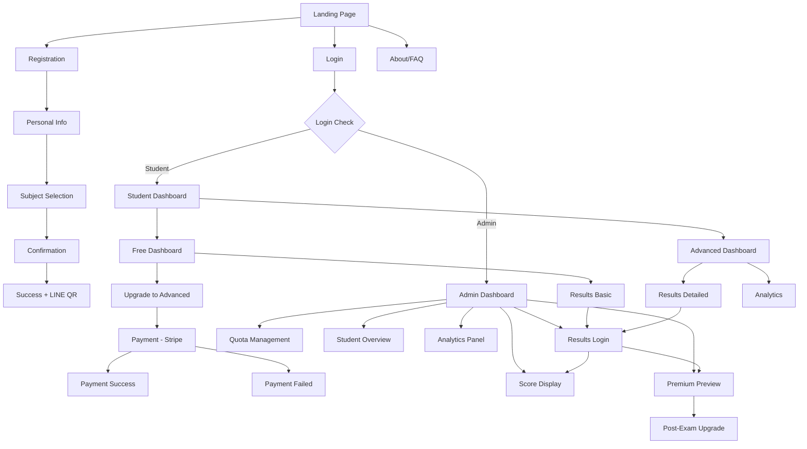

# Information Architecture (IA)

### Site Map / Screen Inventory

### Navigation Structure

**Primary Navigation:** 
- Landing: หน้าแรก | ลงทะเบียน | เข้าสู่ระบบ | เกี่ยวกับ
- Dashboard: หน้าแรก | ผลสอบ | อัปเกรด | ออกจากระบบ
- Admin: จัดการนักเรียน | ความจุ | Analytics | ออกจากระบบ

**Secondary Navigation:** 
- Form steps (1. ข้อมูลส่วนตัว | 2. เลือกวิชา | 3. ยืนยันข้อมูล)
- Dashboard tabs (คะแนนรวม | แต่ละวิชา | เปรียบเทียบ | คำแนะนำ)

**Breadcrumb Strategy:** 
- Simple path for multi-step processes
- Context-aware: "ลงทะเบียน > ข้อมูลส่วนตัว > เลือกวิชา"

