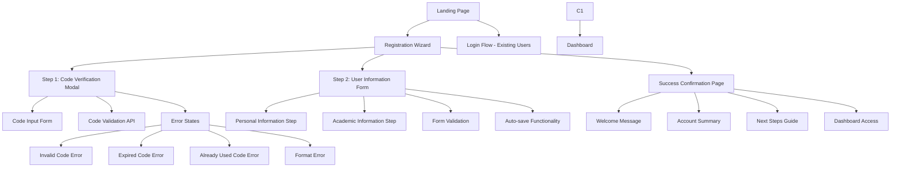

# Part 11: Registration Wizard Front-End Specification [DEPRECATED - See Part 12]

> ⚠️ **IMPORTANT:** This specification is for the legacy BoxSet model. 
> For the current Freemium implementation, please refer to:
> **[Part 12: Freemium Registration Front-End Specification](./part-12-freemium-registration-specification.md)**

## Overview

[LEGACY] This document defined the comprehensive front-end specification for the TBAT Mock Exam Platform Registration Wizard, implementing a secure code-first registration flow with Variant 6 design system for the BoxSet distribution model.

## Table of Contents

1. [UX Goals & Design Principles](#ux-goals-design-principles)
2. [Information Architecture](#information-architecture)
3. [User Flows](#user-flows)
4. [Component Library & Design System](#component-library-design-system)
5. [Wireframes & Mockups](#wireframes-mockups)
6. [Accessibility Requirements](#accessibility-requirements)
7. [Responsiveness Strategy](#responsiveness-strategy)
8. [Animation & Micro-interactions](#animation-micro-interactions)
9. [Performance Considerations](#performance-considerations)
10. [Implementation Guidelines](#implementation-guidelines)

---

## UX Goals & Design Principles

### Target User Personas

1. **นักเรียน ม.6 (Primary):** วัย 16-18 ปี กำลังเตรียมตัวสอบแพทย์
   - ต้องการความชัดเจนและง่ายต่อการใช้งาน
   - ใช้มือถือเป็นหลัก (80% ของการใช้งาน)
   - มีความเครียดและกังวลเรื่องการสอบ

2. **ผู้ปกครอง (Decision Maker):** คนที่ตัดสินใจซื้อ Box Set
   - ต้องการความน่าเชื่อถือและความปลอดภัย
   - เน้นคุณค่าที่ได้รับจากการลงทุน
   - ต้องการการสนับสนุนที่ครบถ้วน

3. **ครู/ติวเตอร์ (Facilitator):** ผู้ดูแลนักเรียน
   - ต้องการติดตามความก้าวหน้า
   - จัดการกลุ่มนักเรียนหลายคน
   - ต้องการข้อมูลวิเคราะห์ที่ชัดเจน

### Usability Goals

- **Code Validation ใน < 30 วินาที:** ผู้ใช้สามารถป้อนรหัสและได้รับผลภายใน 30 วินาที
- **Registration สำเร็จใน < 3 นาที:** กระบวนการลงทะเบียนทั้งหมดเสร็จใน 3 นาที
- **Error Recovery:** ข้อผิดพลาดมีคำแนะนำชัดเจนและแก้ไขได้ง่าย
- **Mobile-first:** ใช้งานได้ดีบนมือถือ (80% ของผู้ใช้)
- **Zero Learning Curve:** ไม่ต้องอ่านคำแนะนำก็ใช้งานได้

### Design Principles

1. **ความน่าเชื่อถือเหนือความสวยงาม** - สร้างความมั่นใจในระบบการศึกษา
2. **ชัดเจนก่อนครบครัน** - แสดงข้อมูลที่จำเป็นก่อน ซ่อนรายละเอียด
3. **ป้องกันข้อผิดพลาด** - Validation และ Confirmation ทุกขั้นตอนสำคัญ
4. **ความสอดคล้องทั้งระบบ** - ใช้ pattern เดียวกันทุก component
5. **การเข้าถึงแบบครอบคลุม** - ออกแบบสำหรับผู้ใช้ทุกประเภท

---

## Information Architecture

### Site Map / Screen Inventory



### Navigation Structure

**Primary Navigation:**
- ไม่มี navigation menu ใน Registration Wizard เพื่อลด distraction
- มีเฉพาะ progress indicator และ back button

**Secondary Navigation:**
- Progress steps indicator (Step 1 of 2, Step 2 of 2)
- Back button สำหรับกลับขั้นตอนก่อนหน้า (Step 2 only)
- Help/Support link ที่ footer

**Breadcrumb Strategy:**
- ไม่ใช้ breadcrumb แบบดั้งเดิม
- ใช้ Progress Stepper แทน (Code Verification → User Details → Complete)
- แสดง current step และ completed steps ด้วยสีและ icons

---

## User Flows

### Primary Registration Flow

**User Goal:** ตรวจสอบ Code จาก Box Set ผ่าน Modal จากนั้นลงทะเบียนเข้าใช้ระบบ

**Entry Points:**
- Homepage "ใส่รหัส Box Set" button
- Landing page "ตรวจสอบรหัส" CTA
- Direct link จาก marketing materials

**Success Criteria:**
- Code ผ่านการตรวจสอบก่อน
- ผู้ใช้ลงทะเบียนสมาชิกสำเร็จ
- เข้าสู่ระบบและเข้าถึง Dashboard ได้

### Flow Diagram

```mermaid
graph TD
    A[Landing Page] --> B[Click "ใส่รหัส Box Set"]
    B --> C[Code Verification Modal Opens]
    C --> D[Enter TBAT-XXXX-XXXX Code]
    D --> E[Validate Code via API - Debounce 500ms]
    E --> F{Code Status Check}
    
    F -->|Valid + Never Used| G[Modal Auto-close]
    G --> H[Navigate to Registration Form]
    H --> I[Step 1: Personal Information]
    I --> J[Step 2: Academic Information]
    J --> K[Submit Registration]
    K --> L{Validation Success?}
    
    L -->|Yes| M[Account Created + Code Activated]
    M --> N[Success Page with Celebration]
    N --> O[Auto-redirect to Dashboard - 10s]
    
    F -->|Valid + Used for Registration| P[Show "Code Used" Error]
    P --> Q[Display "กรุณาติดต่อ Admin" + Support Info]
    Q --> R[Modal Stay Open - Allow Different Code]
    
    F -->|Valid + Not Yet Registered| T[Modal Auto-close]
    T --> H
    
    F -->|Invalid/Expired/Not Found| U[Show Appropriate Error in Modal]
    U --> V[Stay in Modal for Retry]
    V --> D
    
    L -->|No| W[Show Form Validation Errors Inline]
    W --> I
    
    R --> X[User Can Try Different Code]
    X --> D
```

### Edge Cases & Error Handling

- **Network Error:** แสดงข้อความ "ไม่สามารถเชื่อมต่อได้" พร้อม retry button
- **Invalid Code Format:** Real-time validation แสดง "รูปแบบรหัสไม่ถูกต้อง (TBAT-XXXX-XXXX)"
- **Code Already Used:** แสดงข้อความพร้อมลิงค์ "ติดต่อ Admin" และช่องใส่รหัสใหม่
- **Server Timeout:** แสดง loading state และ retry mechanism
- **Form Validation Errors:** Inline validation พร้อมคำแนะนำแก้ไข
- **Back Navigation:** เมื่อ back จาก Step 2 ต้องยืนยันการละทิ้งข้อมูล
- **Browser Refresh:** Auto-save draft ทุก 30 วินาที

**Notes:**
- Code validation ทำ real-time เมื่อ user typing เสร็จ (debounce 500ms)
- Success state แสดงข้อมูล code (เช่น "Box Set: TBAT Premium 2025")
- ให้ใช้ Code ซ้ำได้ถ้ายังไม่ได้ register เสร็จ (UX ที่ดี)

---

## Component Library & Design System

### Design System Approach

**Framework:** shadcn/ui เป็นฐาน ร่วมกับ Variant 6 color palette เพื่อความเร็วในการพัฒนาและความสอดคล้อง

### Variant 6 Color System

```css
:root {
  /* Primary Colors */
  --tbat-primary: #0d7276;      /* เขียวเข้ม - Main CTAs, active states */
  --tbat-secondary: #529a94;    /* เขียวกลาง - Secondary actions */
  --tbat-accent: #90bfc0;       /* เขียวอ่อน - Backgrounds, highlights */
  --tbat-bg: #cae0e1;          /* เขียวอ่อนมาก - Section backgrounds */
  --tbat-light: #fdfefe;       /* ขาวแทบจะบริสุทธิ์ - Card backgrounds */
  
  /* Semantic Colors */
  --success: #22c55e;           /* Success states */
  --warning: #f59e0b;           /* Warning messages */
  --error: #ef4444;             /* Error states */
  --neutral-700: #374151;       /* Primary text */
  --neutral-500: #6b7280;       /* Secondary text */
  --neutral-200: #e5e7eb;       /* Borders */
}
```

### Core Components

#### 1. Modal Component (Dialog)

**Purpose:** Code verification popup modal

**shadcn/ui Base:** `Dialog` component

**Variants:**
- Default modal with backdrop
- Loading state with skeleton
- Error state with alert
- Success state with checkmark

**States:**
- Open/Closed with scale animation
- Loading (skeleton + spinner)
- Error (alert component + error colors)
- Success (checkmark + green colors)

**Implementation:**
```jsx
// Basic structure
<Dialog>
  <DialogContent className="sm:max-w-md">
    <DialogHeader>
      <DialogTitle>ตรวจสอบรหัส Box Set</DialogTitle>
    </DialogHeader>
    {/* Modal content states */}
  </DialogContent>
</Dialog>
```

#### 2. Progress Stepper

**Purpose:** แสดงความคืบหน้าใน multi-step form

**shadcn/ui Base:** Custom component using `Progress`

**Variants:**
- 2-step progress (Code → Registration)
- Linear progression with labels
- Mobile compact version

**States:**
- Active step (tbat-primary color)
- Completed step (success color + checkmark)
- Inactive step (neutral gray)
- Loading step (pulse animation)

#### 3. Form Input Components

**Purpose:** รับข้อมูลผู้ใช้พร้อม validation

**shadcn/ui Base:** `Input`, `Select`, `Label`

**Variants:**
- Text input with validation
- Email input with format checking
- Phone input with auto-formatting
- Date picker
- Select dropdown

**States:**
- Default (neutral border)
- Focused (tbat-primary border)
- Error (error color + message)
- Success (success color)
- Loading (skeleton)

#### 4. Loading States

**Purpose:** แสดง loading ระหว่าง API calls

**shadcn/ui Base:** `Skeleton`, custom spinners

**Variants:**
- Button loading (spinner + text)
- Skeleton loading (form fields)
- Progress loading (API calls)
- Success animation (bounce effect)

---

## Wireframes & Mockups

### Design Files Reference

**HTML Mockups Created:**
- `mockups/registration-modal-mockup.html` - Code verification modal
- `mockups/registration-form-mockup.html` - Multi-step registration form
- `mockups/registration-loading-states.html` - All loading states demo
- `mockups/registration-complete-mockup.html` - Success page

### Key Screen Layouts

#### 1. Landing Page with Code Entry Modal

**Purpose:** หน้าแรกที่มีปุ่มเปิด Modal สำหรับใส่ Code

**Key Elements:**
- CTA Button: "ใส่รหัส Box Set" (tbat-primary gradient)
- Hero Section with Variant 6 styling
- Modal overlay with backdrop blur

**Interaction Notes:**
- Click button → Modal slides up (mobile) / center fade (desktop)
- ESC หรือ click outside = close modal
- Focus trap ภายใน modal

#### 2. Code Verification Modal

**Purpose:** Modal สำหรับใส่และตรวจสอบ TBAT Code

**Key Elements:**
- Input field with pattern validation (TBAT-XXXX-XXXX)
- Real-time validation feedback (debounced 500ms)
- Error states with clear messages
- Loading spinner during validation
- Success state before auto-close

**Interaction Notes:**
- Auto-format input เป็น TBAT-XXXX-XXXX pattern
- Error animation: shake + border color change
- Success: 1-second delay → auto-close → navigate
- Accessibility: proper aria-labels and live regions

#### 3. Registration Form Page

**Purpose:** หน้า Registration Form หลังจาก Code validation ผ่าน

**Key Elements:**
- Progress indicator (Step 1 of 2, Step 2 of 2)
- Personal Information section (Step 1)
- Academic Information section (Step 2)
- Form validation with inline errors
- Auto-save indicator

**Step 1 Fields:**
- ชื่อ (required)
- นามสกุล (required)
- อีเมล (required, format validation)
- เบอร์โทรศัพท์ (required, auto-format)
- วันเกิด (required)

**Step 2 Fields:**
- โรงเรียน (required)
- ระดับชั้น (required, select)
- แผนการเรียน (optional, select)
- มหาวิทยาลัยเป้าหมาย (optional)
- เป้าหมายในการเรียน (checkboxes)

#### 4. Success/Welcome Page

**Purpose:** หน้าต้อนรับหลังลงทะเบียนสำเร็จ

**Key Elements:**
- Congratulations message with celebration
- Account summary card
- Next steps guide (3 steps)
- Quick stats preview
- "เข้าสู่ Dashboard" CTA button
- Auto-redirect countdown (10 seconds)

---

## Accessibility Requirements

### Compliance Target

**Standard:** WCAG 2.1 AA compliance

### Key Requirements

**Visual:**
- Color contrast ratios: 4.5:1 สำหรับ normal text, 3:1 สำหรับ large text
- Focus indicators: 2px solid border ด้วยสี tbat-primary
- Text sizing: รองรับการ zoom ถึง 200% โดยไม่เสีย layout

**Interaction:**
- Keyboard navigation: Tab, Shift+Tab, Enter, Space, Arrow keys
- Screen reader support: aria-labels, aria-describedby สำหรับทุก form elements
- Touch targets: ขนาดไม่น้อยกว่า 44x44px

**Content:**
- Alternative text: aria-labels สำหรับ icons และ loading elements
- Heading structure: h1 → h2 → h3 ตามลำดับ
- Form labels: associated labels สำหรับทุก input

### Registration Wizard Specific

**Modal Accessibility:**
- Focus trap ใน modal (focus ไม่หลุดออกนอก modal)
- ESC key สำหรับปิด modal
- Return focus กลับจุดเดิมเมื่อปิด modal
- aria-modal="true" และ role="dialog"

**Multi-step Form:**
- Progress indicator มี aria-label="ขั้นตอน 1 จาก 2"
- Error messages มี aria-live="polite"
- Step validation ก่อนไปขั้นต่อไป

**Loading States:**
- Loading spinners มี aria-label="กำลังโหลด"
- Success/Error states มี proper announcements
- aria-busy="true" ระหว่างกระบวนการ

---

## Responsiveness Strategy

### Breakpoints

| Breakpoint | Min Width | Max Width | Target Devices |
|------------|-----------|-----------|----------------|
| Mobile | 320px | 767px | iPhone, Android phones |
| Tablet | 768px | 1023px | iPad, Android tablets |
| Desktop | 1024px | 1439px | Laptops, monitors |
| Wide | 1440px | - | Large monitors |

### Adaptation Patterns

**Modal Behavior:**
- Mobile: Full-screen overlay, slide up animation
- Desktop: Centered modal, max-width 500px, fade animation

**Form Layout:**
- Mobile: Single column, full-width inputs
- Tablet: 2-column grid for name fields
- Desktop: Optimized spacing and grouping

**Progress Indicator:**
- Mobile: Compact horizontal stepper
- Desktop: Full labels with descriptions

**Touch Optimization:**
- Mobile: 48px minimum touch targets
- Larger buttons and form fields
- Improved spacing between interactive elements

---

## Animation & Micro-interactions

### Motion Principles

- **Purposeful Movement:** ทุก animation มีเหตุผลและช่วย UX
- **Natural Timing:** 200-400ms สำหรับ UI interactions
- **Performance First:** ใช้ transform และ opacity
- **Accessibility:** เคารพ prefers-reduced-motion

### Key Animations

**Modal Transitions:**
- Modal Open: `scale(0.95) → scale(1)` + backdrop fade (300ms, ease-out)
- Modal Close: `scale(1) → scale(0.95)` + backdrop fade (250ms, ease-in)

**Form Interactions:**
- Input Focus: border color + subtle scale (150ms)
- Button Hover: translateY(-1px) + shadow (200ms)
- Field Validation: shake animation for errors (400ms)

**Success States:**
- Code Valid: checkmark bounce animation (600ms)
- Registration Complete: confetti + success icon scale (1000ms)

**Loading States:**
- Spinner: smooth rotation (1000ms linear infinite)
- Skeleton: pulse animation (1500ms ease-in-out infinite)

### Performance Implementation

```css
/* Optimize for performance */
.animate-element {
  will-change: transform, opacity;
  transform: translateZ(0); /* Hardware acceleration */
}

/* Respect user preferences */
@media (prefers-reduced-motion: reduce) {
  *, *::before, *::after {
    animation-duration: 0.01ms !important;
    transition-duration: 0.01ms !important;
  }
}
```

---

## Performance Considerations

### Performance Goals

- **Page Load:** ≤ 2 seconds (First Contentful Paint)
- **Modal Open:** ≤ 200ms (จากคลิกถึงเห็น modal)
- **Code Validation:** ≤ 500ms (API response)
- **Step Transition:** ≤ 300ms (form step changes)
- **Animation FPS:** ≥ 60 FPS

### Optimization Strategies

**Bundle Optimization:**
- Code splitting: Registration Wizard เป็น separate chunk
- Tree shaking: เฉพาะ shadcn/ui components ที่ใช้
- Lazy loading: Non-critical components

**Network Optimization:**
- API debouncing: 500ms สำหรับ code validation
- Request caching: Cache validation results (short-term)
- Progressive loading: Critical resources first

**Mobile Performance:**
- Reduce animation complexity บน low-end devices
- Touch response ≤ 50ms
- Memory management สำหรับ Android devices

**Asset Optimization:**
- WebP images with fallbacks
- Font loading: `font-display: swap`
- SVG icons แทน icon fonts

---

## Implementation Guidelines

### Development Workflow

1. **Setup shadcn/ui** with Variant 6 theme configuration
2. **Implement Modal component** พร้อม accessibility features
3. **Create form components** with validation
4. **Add loading states** และ animations
5. **Implement responsive design** ตาม breakpoints
6. **Test accessibility** compliance
7. **Performance optimization** และ testing

### Code Standards

**Component Structure:**
```jsx
// Example Registration Modal structure
export function RegistrationModal() {
  return (
    <Dialog open={isOpen} onOpenChange={setIsOpen}>
      <DialogContent className="registration-modal">
        <DialogHeader>
          <DialogTitle>ตรวจสอบรหัส Box Set</DialogTitle>
        </DialogHeader>
        
        {/* State-based content rendering */}
        {isLoading && <LoadingState />}
        {error && <ErrorState error={error} />}
        {success && <SuccessState />}
        {!isLoading && !error && !success && <DefaultState />}
        
      </DialogContent>
    </Dialog>
  )
}
```

**Error Handling Pattern:**
```jsx
const handleCodeValidation = async (code) => {
  try {
    setIsLoading(true)
    const result = await validateCode(code)
    
    if (result.status === 'valid') {
      setSuccess(true)
      setTimeout(() => {
        onSuccess(result)
      }, 1000)
    } else {
      setError(result.error)
    }
  } catch (error) {
    setError('Network error occurred')
  } finally {
    setIsLoading(false)
  }
}
```

### Testing Strategy

**Unit Tests:**
- Form validation logic
- Code formatting functions
- Error state handling

**Integration Tests:**
- Complete registration flow
- API integration
- Error scenarios

**E2E Tests:**
- Happy path registration
- Error recovery flows
- Accessibility testing

**Performance Tests:**
- Load time measurements
- Animation frame rates
- Mobile performance

### Success Metrics

- **Registration Completion Rate:** ≥ 85%
- **Code Validation Success:** ≤ 30 seconds average
- **User Satisfaction:** ≥ 4.0/5.0 rating
- **Error Recovery Rate:** ≥ 70% after first error
- **Mobile Usability:** ≥ 90% task completion on mobile

---

## Conclusion

This specification provides a comprehensive guide for implementing the TBAT Mock Exam Registration Wizard with:

- **User-centered design** based on target personas
- **Code-first approach** to reduce user frustration
- **Accessible and responsive** implementation
- **Performance-optimized** experience
- **Comprehensive error handling** and recovery

The specification is ready for:
1. **PO Review** and approval
2. **Architect consultation** for technical feasibility
3. **Scrum Master** coordination for story creation
4. **Developer implementation** using provided guidelines

All referenced HTML mockups serve as implementation references and should be used alongside this specification for development.