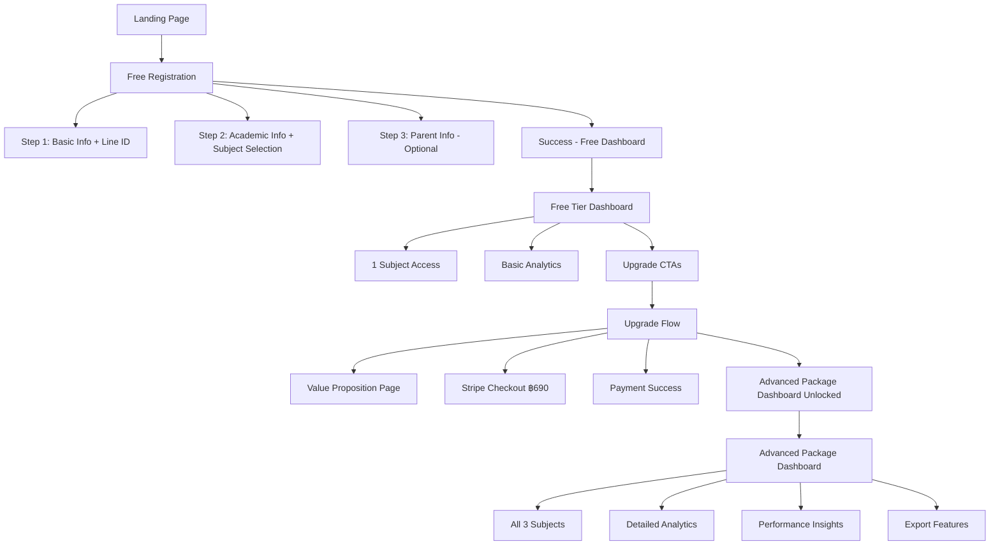

# Part 12: Freemium Registration Front-End Specification

## Overview

This document defines the comprehensive front-end specification for the TBAT Mock Exam Platform's **Freemium Registration Flow**, implementing a zero-friction free tier registration with strategic upgrade paths to Advanced Package tier (฿690).

## Change Context

**Previous Model:** BoxSet with physical code validation (TBAT-XXXX-XXXX)  
**New Model:** Freemium with instant free access and premium upgrade  
**Impact:** Complete redesign of registration flow and tier management UI

## Table of Contents

1. [UX Goals & Conversion Strategy](#ux-goals-conversion-strategy)
2. [Information Architecture](#information-architecture)
3. [User Flows](#user-flows)
4. [Component Library & Design System](#component-library-design-system)
5. [Wireframes & Key Screens](#wireframes-key-screens)
6. [Tier Management UI](#tier-management-ui)
7. [Payment Integration UI](#payment-integration-ui)
8. [Conversion Optimization Components](#conversion-optimization-components)
9. [Accessibility & Performance](#accessibility-performance)
10. [Implementation Guidelines](#implementation-guidelines)

---

## UX Goals & Conversion Strategy

### Updated Target User Personas

1. **นักเรียน ม.6 (Primary User - Free Tier Entry)**
   - ต้องการทดลองใช้งานก่อนตัดสินใจซื้อ
   - ไม่มี barrier ในการเริ่มใช้งาน
   - ตัดสินใจเร็วเมื่อเห็นคุณค่า
   - ใช้ Line เป็นหลัก (95% penetration)

2. **ผู้ปกครอง (Decision Maker - Advanced Package Purchaser)**
   - ต้องการเห็นผลลัพธ์ก่อนจ่ายเงิน
   - พิจารณาคุณค่าเทียบกับราคา ฿690
   - ต้องการติดตามความก้าวหน้าบุตรหลาน
   - ให้ความสำคัญกับความปลอดภัย

### Conversion Goals

- **Free Registration Rate:** ≥ 80% จาก landing page visitors
- **Registration Time:** < 90 วินาที (ลดจาก 3 นาที)
- **Free to Advanced Package Conversion:** 15% ภายใน 48 ชั่วโมง
- **Cart Abandonment:** < 30%
- **Mobile Completion:** ≥ 90%

### Freemium UX Principles

1. **Zero Friction Entry** - ไม่ต้องใส่ข้อมูลการชำระเงิน
2. **Value Before Payment** - ให้ลองสอบฟรี 1 วิชาก่อน
3. **Clear Upgrade Path** - แสดงสิ่งที่พลาดอย่างชัดเจน
4. **Social Proof** - แสดงจำนวนผู้ใช้ Advanced Package
5. **Urgency Without Pressure** - Limited time offers ที่ไม่ aggressive

---

## Information Architecture

### Updated Site Map - Freemium Model



### Navigation Changes

**Primary Navigation (Free Tier):**
- แถบบนแสดง "FREE" badge อย่างชัดเจน
- "อัพเกรดเป็น Advanced Package" button สีเขียว prominent
- Feature locks แสดงด้วย 🔒 icon

**Primary Navigation (Advanced Package Tier):**
- แถบบนแสดง "Advanced Package" badge สีทอง
- ไม่มี upgrade CTAs
- Full feature access indicators

---

## User Flows

### Primary Freemium Registration Flow

```mermaid
graph TD
    A[Landing Page] --> B["ทดลองใช้ฟรี" CTA Clicked]
    B --> C[Registration Form Opens]
    
    C --> D[Step 1: Basic Information]
    D --> D1[ชื่อ-นามสกุล]
    D --> D2[อีเมล]
    D --> D3[รหัสผ่าน]
    D --> D4[Line ID - Required]
    
    D --> E[Step 2: Academic Info]
    E --> E1[โรงเรียน]
    E --> E2[ระดับชั้น]
    E --> E3[เลือกวิชาฟรี 1 วิชา]
    E --> E4[Physics/Chemistry/Biology]
    
    E --> F{Want Parent Info?}
    F -->|Skip| G[Create Account]
    F -->|Yes| H[Step 3: Parent Details]
    H --> H1[ชื่อผู้ปกครอง]
    H --> H2[ความสัมพันธ์]
    H --> H3[เบอร์โทร]
    H --> H4[อีเมล - Optional]
    H --> G
    
    G --> I[Generate FREE-UUID-SUBJECT Code]
    I --> J[Account Created - Free Tier]
    J --> K[Welcome Email Sent]
    K --> L[Redirect to Free Dashboard]
    
    L --> M[First Exam Experience]
    M --> N{Complete Exam?}
    N -->|Yes| O[Show Limited Results]
    O --> P[Upgrade CTA - "ดูเฉลยละเอียด"]
    
    P --> Q{Click Upgrade?}
    Q -->|Yes| R[Upgrade Value Page]
    R --> S[Stripe Checkout ฿690]
    S --> T{Payment Success?}
    T -->|Yes| U[Generate Advanced Package Code]
    U --> V[Update Tier to Advanced Package]
    V --> W[Full Access Granted]
    
    T -->|No| X[Return to Free Dashboard]
    Q -->|No| Y[Stay on Free Dashboard]
```

### Critical Conversion Points

1. **After Registration:** Immediate value proposition video (30s)
2. **After First Exam:** Blurred premium insights with upgrade CTA
3. **24 Hours Later:** Email with performance teaser
4. **48 Hours Later:** Limited-time upgrade offer

---

## Component Library & Design System

### Freemium-Specific Components

#### 1. Tier Badge Component

**Purpose:** แสดงสถานะ tier ของผู้ใช้อย่างชัดเจน

**Variants:**
```jsx
<Badge variant="free" className="bg-gray-100 text-gray-700">
  FREE
</Badge>

<Badge variant="vvip" className="bg-gradient-to-r from-yellow-400 to-yellow-600 text-white">
  ⭐ Advanced Package
</Badge>
```

#### 2. Feature Lock Component

**Purpose:** แสดง features ที่ถูกล็อคสำหรับ free tier

```jsx
<Card className="relative opacity-75">
  <div className="absolute inset-0 bg-white/50 backdrop-blur-sm z-10">
    <div className="flex flex-col items-center justify-center h-full">
      <Lock className="w-8 h-8 text-gray-500 mb-2" />
      <p className="text-sm text-gray-600">สำหรับ Advanced Package</p>
      <Button size="sm" className="mt-2">
        อัพเกรดเพื่อปลดล็อค
      </Button>
    </div>
  </div>
  {/* Locked content */}
</Card>
```

#### 3. Upgrade CTA Component

**Purpose:** ปุ่ม call-to-action สำหรับ upgrade

**Variants:**
- Floating action button (mobile)
- Banner CTA (desktop)
- Inline feature CTA
- Modal prompt CTA

```jsx
<Button 
  className="bg-gradient-to-r from-tbat-primary to-tbat-secondary hover:shadow-lg transform hover:-translate-y-0.5 transition-all"
  size="lg"
>
  <Sparkles className="w-4 h-4 mr-2" />
  อัพเกรดเป็น Advanced Package - ฿690
</Button>
```

#### 4. Value Comparison Table

**Purpose:** แสดงเปรียบเทียบ FREE vs Advanced Package

```jsx
<Table>
  <TableHeader>
    <TableRow>
      <TableHead>Features</TableHead>
      <TableHead>FREE</TableHead>
      <TableHead className="bg-yellow-50">Advanced Package</TableHead>
    </TableRow>
  </TableHeader>
  <TableBody>
    <TableRow>
      <TableCell>จำนวนวิชา</TableCell>
      <TableCell>1 วิชา</TableCell>
      <TableCell className="bg-yellow-50 font-bold">3 วิชา</TableCell>
    </TableRow>
    {/* More rows */}
  </TableBody>
</Table>
```

#### 5. Line ID Input Component

**Purpose:** รับ Line ID พร้อม QR code option

```jsx
<div className="space-y-2">
  <Label>Line ID (สำหรับติดต่อและรับข่าวสาร)</Label>
  <div className="flex gap-2">
    <Input 
      placeholder="@yourlineid" 
      className="flex-1"
      pattern="^@?[a-zA-Z0-9_.-]+$"
    />
    <Button variant="outline" size="icon">
      <QrCode className="w-4 h-4" />
    </Button>
  </div>
  <p className="text-xs text-gray-500">
    หรือสแกน QR Code เพื่อเพิ่มเพื่อน
  </p>
</div>
```

---

## Wireframes & Key Screens

### 1. Freemium Landing Page

**Key Elements:**
- Hero: "ทดลองสอบฟรี 1 วิชา ก่อนตัดสินใจ"
- Social proof: "เข้าร่วมกับนักเรียน 10,000+ คน"
- Single CTA: "เริ่มทดลองใช้ฟรี"
- No mention of price initially
- Trust badges and testimonials

### 2. Simplified Registration Form

**Step 1: Essential Info Only**
- ชื่อ-นามสกุล (combined field)
- อีเมล
- รหัสผ่าน
- Line ID (with helper text about benefits)

**Step 2: Academic + Free Subject**
- โรงเรียน (autocomplete)
- ระดับชั้น (dropdown)
- "เลือกวิชาที่ต้องการทดลองฟรี" (radio buttons with icons)
  - 🧬 ชีววิทยา
  - ⚗️ เคมี
  - ⚛️ ฟิสิกส์

**Step 3: Parent Info (Optional)**
- Skip button prominent
- "ข้ามขั้นตอนนี้" with subtext "(เพิ่มข้อมูลได้ภายหลัง)"

### 3. Free Tier Dashboard

**Layout:**
```
┌─────────────────────────────────────┐
│ Header: Logo | FREE Badge | Upgrade │
├─────────────────────────────────────┤
│                                     │
│  Welcome Banner                    │
│  "ยินดีต้อนรับ! เริ่มสอบวิชาแรกได้เลย" │
│                                     │
├─────────────────────────────────────┤
│                                     │
│  [Active Subject Card]              │
│  ✅ Physics - Available             │
│                                     │
│  [Locked Subject Card] 🔒           │
│  Chemistry - Advanced Package Only  │
│                                     │
│  [Locked Subject Card] 🔒           │
│  Biology - Advanced Package Only    │
│                                     │
├─────────────────────────────────────┤
│  Upgrade Benefits Section           │
│  • ปลดล็อคทั้ง 3 วิชา                │
│  • ดูเฉลยละเอียด                    │
│  • วิเคราะห์จุดอ่อน                  │
│  [อัพเกรดเป็น Advanced Package ฿690] │
└─────────────────────────────────────┘
```

### 4. Strategic Upgrade Prompt

**After Exam Completion:**
```
┌─────────────────────────────────────┐
│         คะแนนของคุณ: 75/100         │
├─────────────────────────────────────┤
│                                     │
│  📊 ผลสอบพื้นฐาน (FREE)              │
│  • คะแนนรวม: 75%                   │
│  • เวลาที่ใช้: 45 นาที              │
│                                     │
│  🔒 การวิเคราะห์เชิงลึก (Advanced Package) │
│  ░░░░░░░░░░░░░░░░░░░░░░░░░         │
│  ░░░ เบลอเนื้อหา Premium ░░░        │
│  ░░░░░░░░░░░░░░░░░░░░░░░░░         │
│                                     │
│  [ปลดล็อคการวิเคราะห์เชิงลึก]        │
│  ฿690 - คุ้มค่าการลงทุน             │
│                                     │
│  "นักเรียน 85% ที่อัพเกรด            │
│   พัฒนาคะแนนได้เฉลี่ย +15%"         │
└─────────────────────────────────────┘
```

---

## Tier Management UI

### Dashboard Variations by Tier

#### Free Tier Dashboard Features
- 1 active subject card (selected during registration)
- 2 locked subject cards with blur effect
- Basic score display only
- Persistent upgrade banner (collapsible)
- Limited exam history (last 3)
- No export features

#### Advanced Package Tier Dashboard Features
- All 3 subjects unlocked
- Detailed analytics with charts
- Full exam history
- Export to PDF/Excel
- Performance predictions
- Weakness analysis
- Study recommendations

### Feature Gating Patterns

1. **Blur Pattern:** Premium content visible but blurred
2. **Lock Icon Pattern:** Clear lock icon with unlock CTA
3. **Limit Pattern:** Show "3 of 10" with "See all" locked
4. **Preview Pattern:** Show first paragraph, fade rest

---

## Payment Integration UI

### Stripe Checkout Flow

**Pre-Checkout Value Page:**
```jsx
<div className="max-w-2xl mx-auto p-6">
  <h1 className="text-3xl font-bold mb-4">
    ปลดล็อคศักยภาพเต็มที่ของคุณ
  </h1>
  
  <div className="grid grid-cols-2 gap-4 mb-6">
    <Card className="border-gray-300">
      <CardHeader>
        <Badge variant="outline">FREE</Badge>
        <CardTitle>ที่คุณมีตอนนี้</CardTitle>
      </CardHeader>
      <CardContent>
        <ul className="space-y-2 text-gray-600">
          <li>✓ 1 วิชา</li>
          <li>✓ คะแนนพื้นฐาน</li>
          <li>✗ เฉลยละเอียด</li>
          <li>✗ การวิเคราะห์</li>
        </ul>
      </CardContent>
    </Card>
    
    <Card className="border-green-500 shadow-lg">
      <CardHeader>
        <Badge className="bg-gradient-to-r from-yellow-400 to-yellow-600">
          Advanced Package
        </Badge>
        <CardTitle>สิ่งที่คุณจะได้</CardTitle>
      </CardHeader>
      <CardContent>
        <ul className="space-y-2 text-green-600 font-medium">
          <li>✓ ทั้ง 3 วิชา</li>
          <li>✓ คะแนนละเอียด</li>
          <li>✓ เฉลยพร้อมอธิบาย</li>
          <li>✓ วิเคราะห์จุดอ่อน</li>
        </ul>
      </CardContent>
    </Card>
  </div>
  
  <div className="bg-yellow-50 p-4 rounded-lg mb-6">
    <p className="text-sm text-yellow-800">
      🎯 นักเรียน 1,250+ คน อัพเกรดแล้ววันนี้
    </p>
  </div>
  
  <Button 
    size="lg" 
    className="w-full bg-gradient-to-r from-green-500 to-green-600"
    onClick={handleCheckout}
  >
    ดำเนินการชำระเงิน ฿690
    <ArrowRight className="ml-2" />
  </Button>
  
  <p className="text-center text-sm text-gray-500 mt-4">
    🔒 ชำระเงินปลอดภัยผ่าน Stripe
  </p>
</div>
```

### Payment Success Screen

```jsx
<div className="text-center py-12">
  <CheckCircle className="w-16 h-16 text-green-500 mx-auto mb-4" />
  <h1 className="text-2xl font-bold mb-2">
    ยินดีต้อนรับสู่ Advanced Package! 🎉
  </h1>
  <p className="text-gray-600 mb-6">
    รหัส Advanced Package ของคุณ: ADV-XXXX-XXXX
  </p>
  
  <Card className="max-w-md mx-auto mb-6">
    <CardContent className="pt-6">
      <h3 className="font-semibold mb-3">สิ่งที่ปลดล็อคแล้ว:</h3>
      <ul className="text-left space-y-2">
        <li>✅ เข้าถึงทั้ง 3 วิชา</li>
        <li>✅ เฉลยละเอียดทุกข้อ</li>
        <li>✅ การวิเคราะห์เชิงลึก</li>
        <li>✅ ส่งออกผลสอบ PDF</li>
      </ul>
    </CardContent>
  </Card>
  
  <Button size="lg" onClick={goToDashboard}>
    เริ่มใช้งาน Advanced Package Dashboard
  </Button>
</div>
```

---

## Conversion Optimization Components

### 1. Exit Intent Modal

**Trigger:** User attempts to leave after viewing locked content

```jsx
<Dialog open={showExitIntent}>
  <DialogContent>
    <DialogHeader>
      <DialogTitle>รอก่อน! มีข้อเสนอพิเศษ 🎁</DialogTitle>
    </DialogHeader>
    <div className="py-4">
      <p className="mb-4">
        อัพเกรดวันนี้ รับส่วนลด 10% 
        <span className="line-through text-gray-400">฿690</span>
        <span className="text-green-600 font-bold ml-2">฿621</span>
      </p>
      <p className="text-sm text-gray-600 mb-4">
        ข้อเสนอนี้หมดอายุใน: 
        <CountdownTimer minutes={15} />
      </p>
    </div>
    <DialogFooter>
      <Button variant="outline" onClick={dismissOffer}>
        ไม่ ขอบคุณ
      </Button>
      <Button onClick={acceptOffer}>
        รับข้อเสนอนี้
      </Button>
    </DialogFooter>
  </DialogContent>
</Dialog>
```

### 2. Progress-Based Upgrade Prompt

**Show after user completes 50% of free content**

```jsx
<Alert className="border-yellow-400 bg-yellow-50">
  <Trophy className="h-4 w-4" />
  <AlertTitle>คุณกำลังทำได้ดีมาก!</AlertTitle>
  <AlertDescription>
    คุณใช้งาน 50% ของ free content แล้ว
    อัพเกรดเพื่อปลดล็อคศักยภาพเต็มที่
    <Button size="sm" variant="link" className="ml-2">
      ดูรายละเอียด →
    </Button>
  </AlertDescription>
</Alert>
```

### 3. Social Proof Widget

```jsx
<div className="fixed bottom-4 left-4 bg-white shadow-lg rounded-lg p-3 max-w-xs">
  <div className="flex items-center gap-3">
    <Avatar className="h-8 w-8">
      <AvatarFallback>นร</AvatarFallback>
    </Avatar>
    <div className="text-sm">
      <p className="font-medium">นราธิป จากเชียงใหม่</p>
      <p className="text-gray-500">อัพเกรดเป็น Advanced Package เมื่อ 5 นาทีที่แล้ว</p>
    </div>
  </div>
</div>
```

---

## Accessibility & Performance

### Accessibility Updates

**Line ID Field:**
- Clear label: "Line ID สำหรับติดต่อ"
- Helper text explaining purpose
- Pattern validation with error messages
- Alternative QR code option

**Tier Indicators:**
- Screen reader announces: "คุณอยู่ในแพ็คเกจ FREE"
- Locked content has aria-label="ต้องอัพเกรดเพื่อเข้าถึง"
- Color not sole indicator (icons + text)

### Performance Optimizations

**Registration Flow:**
- Lazy load parent info step
- Debounce Line ID validation
- Progressive enhancement for QR scanner

**Dashboard:**
- Virtual scrolling for exam history
- Lazy load locked content cards
- Optimistic UI for tier upgrades

**Payment:**
- Stripe Elements lazy loaded
- Preload checkout on upgrade hover
- Cache pricing information

---

## Implementation Guidelines

### Development Priorities (21-Day Sprint)

**Week 1: Foundation**
1. Remove BoxSet code validation
2. Implement free registration flow
3. Add Line ID field with validation
4. Create auto-code generation (FREE-UUID-SUBJECT)

**Week 2: Payment & Tiers**
1. Integrate Stripe Checkout
2. Implement tier management system
3. Create feature gating components
4. Build upgrade CTAs

**Week 3: Optimization**
1. A/B test CTA placements
2. Implement conversion tracking
3. Add email notifications
4. Performance testing

### Component Implementation Order

1. `FreemiumRegistrationForm.tsx` - New registration flow
2. `TierBadge.tsx` - User tier indicator
3. `FeatureLock.tsx` - Locked content wrapper
4. `UpgradeCTA.tsx` - Conversion buttons
5. `PaymentFlow.tsx` - Stripe integration
6. `TierDashboard.tsx` - Tier-specific layouts

### Testing Checklist

**Functional:**
- [ ] Free registration without payment
- [ ] Line ID validation and storage
- [ ] Parent info can be skipped
- [ ] Auto-code generation works
- [ ] Stripe payment processes correctly
- [ ] Tier upgrades instantly
- [ ] Feature gating works properly

**UX/Conversion:**
- [ ] Registration < 90 seconds
- [ ] Clear value proposition
- [ ] Upgrade CTAs visible but not annoying
- [ ] Mobile experience smooth
- [ ] Exit intent triggers appropriately

**Technical:**
- [ ] Database migrations safe
- [ ] Rollback procedures work
- [ ] Load handling for free users
- [ ] Payment webhook security

---

## Success Metrics

### Launch Week KPIs
- Free registrations: 500+ users
- Registration completion: >85%
- Free to Advanced Package conversion: >15%
- Payment success rate: >95%
- Mobile completion: >90%

### Conversion Funnel Targets
1. Landing → Registration Start: 40%
2. Start → Complete Registration: 85%
3. Free User → View Upgrade Page: 60%
4. View Upgrade → Start Payment: 30%
5. Start Payment → Complete: 70%

### A/B Testing Plan
- CTA button colors (green vs orange)
- Upgrade prompt timing (immediate vs 24hr)
- Value prop messaging (save money vs gain features)
- Price display (฿690 vs ฿23/day)

---

## Conclusion

This Freemium Registration Specification transforms TBAT's business model with:

1. **Zero-friction entry** via free tier
2. **Strategic upgrade paths** at key moments
3. **Clear value differentiation** between tiers
4. **Optimized conversion components** 
5. **Thai market-specific features** (Line ID integration)

The specification is ready for immediate implementation as part of the 21-day sprint to launch the freemium model.

**Next Steps:**
1. Review with development team
2. Validate Stripe integration approach
3. Begin component development
4. Set up A/B testing framework
5. Prepare launch communications