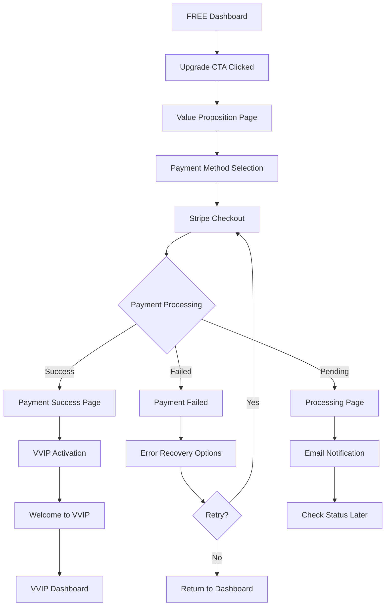

# Part 14: Payment Flow UI Specification

## Overview

This document specifies the complete payment flow UI for TBAT Mock Exam Platform's Stripe integration, focusing on conversion optimization, trust building, and seamless Thai user experience for the ฿690 VVIP upgrade.

## Executive Summary

The payment flow is the most critical conversion point where FREE users commit to VVIP. Every UI decision must:
- **Build trust** through secure payment indicators
- **Reduce friction** with minimal steps
- **Handle errors gracefully** to prevent abandonment
- **Confirm value** at every step

## Payment Flow Architecture

### Flow Diagram



## Screen Specifications

### 1. Value Proposition Page

**Purpose:** Final conversion push before payment

**URL:** `/upgrade`

**Layout:**

```
┌─────────────────────────────────────────────────────┐
│                    TBAT Mock Exam                   │
├─────────────────────────────────────────────────────┤
│                                                      │
│  ปลดล็อคศักยภาพเต็มที่กับ TBAT VVIP                  │
│  ─────────────────────────────────────               │
│                                                      │
│  ┌─────────────────────────────────────────────┐   │
│  │         คุณกำลังจะได้รับ                       │   │
│  │  ┌──────────────┐  ┌──────────────┐         │   │
│  │  │ ✅ 3 วิชา     │  │ ✅ เฉลยละเอียด │         │   │
│  │  │ ฟิสิกส์       │  │ ทุกข้อสอบ     │         │   │
│  │  │ เคมี         │  │ พร้อมวิธีคิด   │         │   │
│  │  │ ชีววิทยา     │  │              │         │   │
│  │  └──────────────┘  └──────────────┘         │   │
│  │  ┌──────────────┐  ┌──────────────┐         │   │
│  │  │ ✅ วิเคราะห์   │  │ ✅ ส่งออก PDF │         │   │
│  │  │ จุดอ่อน-แข็ง  │  │ ผลสอบและ     │         │   │
│  │  │ แบบละเอียด   │  │ การวิเคราะห์   │         │   │
│  │  └──────────────┘  └──────────────┘         │   │
│  └─────────────────────────────────────────────┘   │
│                                                      │
│  ┌─────────────────────────────────────────────┐   │
│  │       เปรียบเทียบแพ็คเกจ                       │   │
│  │  ┌────────────┐      ┌────────────┐         │   │
│  │  │   FREE     │  →   │   VVIP     │         │   │
│  │  │  1 วิชา     │      │  3 วิชา     │         │   │
│  │  │  คะแนนรวม   │      │  เฉลยละเอียด │         │   │
│  │  │     ✗      │      │     ✓      │         │   │
│  │  └────────────┘      └────────────┘         │   │
│  └─────────────────────────────────────────────┘   │
│                                                      │
│  ┌─────────────────────────────────────────────┐   │
│  │         ราคาพิเศษวันนี้                        │   │
│  │         ฿690 (ปกติ ฿990)                     │   │
│  │         ประหยัด 30%                          │   │
│  │                                              │   │
│  │  [ดำเนินการชำระเงิน →]                        │   │
│  └─────────────────────────────────────────────┘   │
│                                                      │
│  🔒 การชำระเงินปลอดภัยด้วย Stripe                     │
│  💳 รองรับบัตรเครดิต/เดบิตทุกประเภท                   │
│                                                      │
│  ⭐ "อัพเกรดแล้วคุ้มมาก เห็นผลชัดเจน"                 │
│     - นักเรียน VVIP 1,250+ คน                       │
└─────────────────────────────────────────────────────┘
```

**Component Implementation:**

```jsx
export function ValuePropositionPage() {
  const [isLoading, setIsLoading] = useState(false);
  const [promoCode, setPromoCode] = useState('');
  const router = useRouter();
  
  return (
    <div className="min-h-screen bg-gradient-to-b from-green-50 to-white">
      <div className="max-w-4xl mx-auto px-4 py-8">
        {/* Hero Section */}
        <div className="text-center mb-8">
          <h1 className="text-3xl font-bold mb-2">
            ปลดล็อคศักยภาพเต็มที่กับ TBAT VVIP
          </h1>
          <p className="text-gray-600">
            เข้าถึงทุกวิชา ทุกฟีเจอร์ พร้อมการวิเคราะห์เชิงลึก
          </p>
        </div>

        {/* Value Grid */}
        <div className="grid grid-cols-2 md:grid-cols-4 gap-4 mb-8">
          <ValueCard 
            icon={<Book />}
            title="3 วิชา"
            description="ฟิสิกส์ เคมี ชีววิทยา"
          />
          <ValueCard 
            icon={<FileText />}
            title="เฉลยละเอียด"
            description="ทุกข้อพร้อมวิธีคิด"
          />
          <ValueCard 
            icon={<TrendingUp />}
            title="วิเคราะห์ผล"
            description="จุดอ่อน-จุดแข็ง"
          />
          <ValueCard 
            icon={<Download />}
            title="ส่งออก PDF"
            description="ผลสอบและวิเคราะห์"
          />
        </div>

        {/* Comparison Table */}
        <ComparisonTable />

        {/* Pricing Card */}
        <Card className="mb-6 border-green-500 shadow-lg">
          <CardContent className="p-6">
            <div className="flex justify-between items-center mb-4">
              <div>
                <p className="text-sm text-gray-500">ราคาพิเศษวันนี้</p>
                <div className="flex items-baseline gap-2">
                  <span className="text-3xl font-bold">฿690</span>
                  <span className="text-gray-400 line-through">฿990</span>
                  <Badge variant="destructive">ประหยัด 30%</Badge>
                </div>
              </div>
              <div className="text-right">
                <p className="text-sm text-gray-600">รวม VAT แล้ว</p>
                <p className="text-xs text-gray-500">ใช้ได้ตลอดชีวิต</p>
              </div>
            </div>

            {/* Promo Code */}
            <div className="flex gap-2 mb-4">
              <Input 
                placeholder="รหัสส่วนลด (ถ้ามี)"
                value={promoCode}
                onChange={(e) => setPromoCode(e.target.value)}
              />
              <Button variant="outline">ใช้รหัส</Button>
            </div>

            {/* CTA Button */}
            <Button 
              className="w-full h-12 text-lg bg-gradient-to-r from-green-500 to-green-600 hover:from-green-600 hover:to-green-700"
              onClick={() => setIsLoading(true)}
              disabled={isLoading}
            >
              {isLoading ? (
                <Loader2 className="mr-2 h-5 w-5 animate-spin" />
              ) : (
                <CreditCard className="mr-2 h-5 w-5" />
              )}
              ดำเนินการชำระเงิน
            </Button>
          </CardContent>
        </Card>

        {/* Trust Badges */}
        <TrustBadges />

        {/* Testimonials */}
        <TestimonialCarousel />
      </div>
    </div>
  );
}
```

### 2. Payment Method Selection

**Purpose:** Choose payment method before Stripe

**Layout:**

```
┌─────────────────────────────────────────────────────┐
│              เลือกวิธีการชำระเงิน                      │
├─────────────────────────────────────────────────────┤
│                                                      │
│  ┌─────────────────────────────────────────────┐   │
│  │  💳 บัตรเครดิต/เดบิต                          │   │
│  │  Visa, Mastercard, JCB                       │   │
│  │  [เลือก] ✓                                   │   │
│  └─────────────────────────────────────────────┘   │
│                                                      │
│  ┌─────────────────────────────────────────────┐   │
│  │  📱 PromptPay (เร็วๆ นี้)                     │   │
│  │  สแกน QR Code ง่ายๆ                          │   │
│  │  [ไม่พร้อมใช้งาน]                              │   │
│  └─────────────────────────────────────────────┘   │
│                                                      │
│  ┌─────────────────────────────────────────────┐   │
│  │  🏦 Internet Banking (เร็วๆ นี้)              │   │
│  │  SCB, KBANK, BBL, KTB                        │   │
│  │  [ไม่พร้อมใช้งาน]                              │   │
│  └─────────────────────────────────────────────┘   │
│                                                      │
│  [ดำเนินการต่อ →]                                    │
└─────────────────────────────────────────────────────┘
```

### 3. Stripe Checkout Integration

**Purpose:** Secure payment processing

**Implementation:**

```jsx
export function StripeCheckoutForm() {
  const stripe = useStripe();
  const elements = useElements();
  const [error, setError] = useState(null);
  const [processing, setProcessing] = useState(false);
  const [billingDetails, setBillingDetails] = useState({
    name: '',
    email: '',
    phone: '',
  });

  const handleSubmit = async (event) => {
    event.preventDefault();
    
    if (!stripe || !elements) return;
    
    setProcessing(true);
    
    // Create payment intent
    const { clientSecret } = await createPaymentIntent({
      amount: 69000, // ฿690.00 in satang
      currency: 'thb',
      metadata: {
        userId: user.id,
        upgradeType: 'FREE_TO_VVIP',
      },
    });
    
    // Confirm payment
    const result = await stripe.confirmCardPayment(clientSecret, {
      payment_method: {
        card: elements.getElement(CardElement),
        billing_details: billingDetails,
      },
    });
    
    if (result.error) {
      setError(result.error.message);
      setProcessing(false);
    } else {
      // Payment successful
      await handlePaymentSuccess(result.paymentIntent);
    }
  };

  return (
    <form onSubmit={handleSubmit} className="max-w-md mx-auto">
      <Card>
        <CardHeader>
          <CardTitle>ชำระเงิน ฿690</CardTitle>
          <CardDescription>
            อัพเกรดเป็น VVIP - ใช้ได้ตลอดชีวิต
          </CardDescription>
        </CardHeader>
        <CardContent className="space-y-4">
          {/* Billing Details */}
          <div className="space-y-2">
            <Label>ชื่อผู้ชำระเงิน</Label>
            <Input 
              value={billingDetails.name}
              onChange={(e) => setBillingDetails({
                ...billingDetails,
                name: e.target.value
              })}
              required
            />
          </div>
          
          <div className="space-y-2">
            <Label>อีเมล</Label>
            <Input 
              type="email"
              value={billingDetails.email}
              onChange={(e) => setBillingDetails({
                ...billingDetails,
                email: e.target.value
              })}
              required
            />
          </div>
          
          <div className="space-y-2">
            <Label>เบอร์โทรศัพท์</Label>
            <Input 
              type="tel"
              value={billingDetails.phone}
              onChange={(e) => setBillingDetails({
                ...billingDetails,
                phone: e.target.value
              })}
              required
            />
          </div>

          {/* Card Element */}
          <div className="space-y-2">
            <Label>ข้อมูลบัตร</Label>
            <div className="p-3 border rounded-lg">
              <CardElement 
                options={{
                  style: {
                    base: {
                      fontSize: '16px',
                      color: '#424770',
                      '::placeholder': {
                        color: '#aab7c4',
                      },
                    },
                  },
                }}
              />
            </div>
          </div>

          {/* Security Note */}
          <Alert>
            <Lock className="h-4 w-4" />
            <AlertDescription>
              การชำระเงินของคุณได้รับการเข้ารหัสและปลอดภัย 100%
            </AlertDescription>
          </Alert>

          {/* Error Display */}
          {error && (
            <Alert variant="destructive">
              <AlertCircle className="h-4 w-4" />
              <AlertDescription>{error}</AlertDescription>
            </Alert>
          )}
        </CardContent>
        <CardFooter>
          <Button 
            type="submit"
            className="w-full"
            disabled={!stripe || processing}
          >
            {processing ? (
              <>
                <Loader2 className="mr-2 h-4 w-4 animate-spin" />
                กำลังดำเนินการ...
              </>
            ) : (
              <>
                <Lock className="mr-2 h-4 w-4" />
                ชำระเงิน ฿690
              </>
            )}
          </Button>
        </CardFooter>
      </Card>

      {/* Powered by Stripe */}
      <div className="text-center mt-4">
        <p className="text-sm text-gray-500">
          Powered by{' '}
          <span className="font-semibold text-[#635BFF]">Stripe</span>
        </p>
      </div>
    </form>
  );
}
```

### 4. Processing States

#### Loading State During Payment

```jsx
<div className="fixed inset-0 bg-black/50 flex items-center justify-center z-50">
  <Card className="w-96">
    <CardContent className="pt-6">
      <div className="text-center">
        <Loader2 className="h-12 w-12 animate-spin mx-auto mb-4 text-green-600" />
        <h3 className="text-lg font-semibold mb-2">
          กำลังดำเนินการชำระเงิน
        </h3>
        <p className="text-sm text-gray-600 mb-4">
          กรุณารอสักครู่...
        </p>
        <Progress value={progress} className="mb-2" />
        <p className="text-xs text-gray-500">
          กำลังตรวจสอบข้อมูลบัตร...
        </p>
      </div>
    </CardContent>
  </Card>
</div>
```

#### 3D Secure Authentication

```jsx
<Dialog open={show3DSecure}>
  <DialogContent className="max-w-lg">
    <DialogHeader>
      <DialogTitle>ยืนยันการชำระเงินกับธนาคาร</DialogTitle>
      <DialogDescription>
        ธนาคารของคุณต้องการยืนยันตัวตนเพิ่มเติม
      </DialogDescription>
    </DialogHeader>
    <div className="py-4">
      <iframe 
        src={threeDSecureUrl}
        className="w-full h-96 border rounded"
        title="3D Secure Authentication"
      />
    </div>
    <p className="text-xs text-gray-500 text-center">
      หน้านี้มาจากธนาคารของคุณโดยตรง
    </p>
  </DialogContent>
</Dialog>
```

### 5. Payment Success Page

**Purpose:** Confirm successful payment and activate VVIP

**Layout:**

```
┌─────────────────────────────────────────────────────┐
│                                                      │
│                    ✅                                │
│         การชำระเงินสำเร็จ!                           │
│                                                      │
│  ┌─────────────────────────────────────────────┐   │
│  │  ยินดีต้อนรับสู่ TBAT VVIP! 🎉                 │   │
│  │                                              │   │
│  │  รหัส VVIP ของคุณ:                           │   │
│  │  VVIP-XXXX-XXXX-XXXX                        │   │
│  │                                              │   │
│  │  ใบเสร็จ: #INV-2025-001234                   │   │
│  │  จำนวน: ฿690.00                              │   │
│  │  วันที่: 5 ม.ค. 2568 14:30                   │   │
│  └─────────────────────────────────────────────┘   │
│                                                      │
│  ✅ ทั้ง 3 วิชาปลดล็อคแล้ว                           │
│  ✅ เฉลยละเอียดพร้อมใช้งาน                           │
│  ✅ การวิเคราะห์เชิงลึกเปิดใช้งาน                      │
│  ✅ ส่งออก PDF ได้แล้ว                              │
│                                                      │
│  📧 ใบเสร็จถูกส่งไปที่ user@email.com                 │
│                                                      │
│  [เข้าสู่ VVIP Dashboard →]                          │
│                                                      │
│  กำลังเปลี่ยนเส้นทางใน 5 วินาที...                     │
└─────────────────────────────────────────────────────┘
```

**Component:**

```jsx
export function PaymentSuccessPage() {
  const [countdown, setCountdown] = useState(5);
  const router = useRouter();
  
  useEffect(() => {
    const timer = setInterval(() => {
      setCountdown((prev) => {
        if (prev <= 1) {
          router.push('/dashboard');
          return 0;
        }
        return prev - 1;
      });
    }, 1000);
    
    return () => clearInterval(timer);
  }, []);

  return (
    <div className="min-h-screen bg-gradient-to-b from-green-50 to-white flex items-center justify-center">
      <motion.div 
        initial={{ scale: 0.8, opacity: 0 }}
        animate={{ scale: 1, opacity: 1 }}
        className="max-w-2xl w-full px-4"
      >
        {/* Success Animation */}
        <motion.div 
          initial={{ scale: 0 }}
          animate={{ scale: 1 }}
          transition={{ type: "spring", delay: 0.2 }}
          className="text-center mb-6"
        >
          <CheckCircle className="w-24 h-24 text-green-500 mx-auto mb-4" />
          <h1 className="text-3xl font-bold mb-2">
            การชำระเงินสำเร็จ!
          </h1>
        </motion.div>

        {/* Receipt Card */}
        <Card className="mb-6">
          <CardHeader className="text-center bg-gradient-to-r from-yellow-400 to-yellow-600 text-white">
            <CardTitle className="text-xl">
              ยินดีต้อนรับสู่ TBAT VVIP! 🎉
            </CardTitle>
          </CardHeader>
          <CardContent className="pt-6">
            <div className="space-y-4">
              <div className="p-4 bg-gray-50 rounded-lg">
                <p className="text-sm text-gray-600 mb-1">รหัส VVIP ของคุณ</p>
                <code className="text-lg font-mono font-bold">
                  VVIP-{generateCode()}
                </code>
              </div>
              
              <Separator />
              
              <div className="space-y-2 text-sm">
                <div className="flex justify-between">
                  <span>ใบเสร็จ:</span>
                  <span className="font-medium">#{invoiceNumber}</span>
                </div>
                <div className="flex justify-between">
                  <span>จำนวน:</span>
                  <span className="font-medium">฿690.00</span>
                </div>
                <div className="flex justify-between">
                  <span>วันที่:</span>
                  <span className="font-medium">{formatDate(new Date())}</span>
                </div>
              </div>
            </div>
          </CardContent>
        </Card>

        {/* Features Unlocked */}
        <Card className="mb-6">
          <CardContent className="pt-6">
            <h3 className="font-semibold mb-3">สิ่งที่คุณได้รับ:</h3>
            <div className="grid grid-cols-2 gap-3">
              {unlockedFeatures.map((feature) => (
                <motion.div 
                  key={feature}
                  initial={{ x: -20, opacity: 0 }}
                  animate={{ x: 0, opacity: 1 }}
                  transition={{ delay: feature.delay }}
                  className="flex items-center gap-2"
                >
                  <CheckCircle className="w-5 h-5 text-green-500" />
                  <span className="text-sm">{feature.text}</span>
                </motion.div>
              ))}
            </div>
          </CardContent>
        </Card>

        {/* Email Confirmation */}
        <Alert className="mb-6">
          <Mail className="h-4 w-4" />
          <AlertDescription>
            ใบเสร็จถูกส่งไปที่ {user.email} แล้ว
          </AlertDescription>
        </Alert>

        {/* CTA Button */}
        <Button 
          size="lg"
          className="w-full bg-gradient-to-r from-green-500 to-green-600"
          onClick={() => router.push('/dashboard')}
        >
          เข้าสู่ VVIP Dashboard
          <ArrowRight className="ml-2 h-5 w-5" />
        </Button>

        {/* Auto Redirect */}
        <p className="text-center text-sm text-gray-500 mt-4">
          กำลังเปลี่ยนเส้นทางใน {countdown} วินาที...
        </p>
      </motion.div>
    </div>
  );
}
```

### 6. Payment Error Handling

#### Payment Failed Screen

```jsx
export function PaymentFailedPage({ error }) {
  const [retryLoading, setRetryLoading] = useState(false);
  
  const getErrorMessage = (error) => {
    switch (error.code) {
      case 'card_declined':
        return 'บัตรถูกปฏิเสธ กรุณาตรวจสอบวงเงินหรือใช้บัตรอื่น';
      case 'insufficient_funds':
        return 'ยอดเงินในบัตรไม่เพียงพอ';
      case 'incorrect_cvc':
        return 'รหัส CVV/CVC ไม่ถูกต้อง';
      case 'expired_card':
        return 'บัตรหมดอายุแล้ว';
      default:
        return 'เกิดข้อผิดพลาดในการชำระเงิน กรุณาลองใหม่';
    }
  };

  return (
    <div className="min-h-screen bg-gray-50 flex items-center justify-center px-4">
      <Card className="max-w-md w-full">
        <CardHeader className="text-center">
          <div className="mx-auto mb-4">
            <XCircle className="w-16 h-16 text-red-500" />
          </div>
          <CardTitle>การชำระเงินไม่สำเร็จ</CardTitle>
          <CardDescription>
            {getErrorMessage(error)}
          </CardDescription>
        </CardHeader>
        <CardContent>
          {/* Error Details */}
          <Alert variant="destructive" className="mb-4">
            <AlertCircle className="h-4 w-4" />
            <AlertDescription>
              รหัสข้อผิดพลาด: {error.code}
            </AlertDescription>
          </Alert>

          {/* Suggestions */}
          <div className="bg-gray-50 p-4 rounded-lg mb-4">
            <p className="font-medium mb-2">คำแนะนำ:</p>
            <ul className="text-sm text-gray-600 space-y-1">
              <li>• ตรวจสอบข้อมูลบัตรอีกครั้ง</li>
              <li>• ตรวจสอบวงเงินคงเหลือ</li>
              <li>• ลองใช้บัตรใบอื่น</li>
              <li>• ติดต่อธนาคารของคุณ</li>
            </ul>
          </div>

          {/* Actions */}
          <div className="space-y-2">
            <Button 
              className="w-full"
              onClick={() => setRetryLoading(true)}
              disabled={retryLoading}
            >
              {retryLoading ? (
                <Loader2 className="mr-2 h-4 w-4 animate-spin" />
              ) : (
                <RefreshCw className="mr-2 h-4 w-4" />
              )}
              ลองชำระเงินอีกครั้ง
            </Button>
            
            <Button 
              variant="outline"
              className="w-full"
              onClick={() => router.push('/dashboard')}
            >
              กลับสู่หน้าหลัก
            </Button>
          </div>
        </CardContent>
        <CardFooter>
          <p className="text-xs text-gray-500 text-center w-full">
            ต้องการความช่วยเหลือ?{' '}
            <Link href="/support" className="text-blue-600 hover:underline">
              ติดต่อฝ่ายสนับสนุน
            </Link>
          </p>
        </CardFooter>
      </Card>
    </div>
  );
}
```

## Mobile Optimizations

### Mobile Payment Flow

```jsx
// Mobile-optimized Stripe Elements
const MOBILE_ELEMENT_OPTIONS = {
  style: {
    base: {
      fontSize: '18px', // Larger for mobile
      lineHeight: '24px',
      '::placeholder': {
        color: '#aab7c4',
      },
    },
  },
  // Single-line input for mobile
  hidePostalCode: true,
};

// Mobile-specific layout
<div className="sm:hidden">
  {/* Full-screen mobile payment */}
  <div className="fixed inset-0 bg-white z-50">
    <div className="flex flex-col h-full">
      {/* Header */}
      <div className="flex items-center justify-between p-4 border-b">
        <button onClick={handleBack}>
          <ChevronLeft className="w-6 h-6" />
        </button>
        <span className="font-medium">ชำระเงิน ฿690</span>
        <div className="w-6" />
      </div>
      
      {/* Payment Form */}
      <div className="flex-1 overflow-y-auto p-4">
        <StripeCheckoutForm mobile={true} />
      </div>
      
      {/* Fixed Bottom CTA */}
      <div className="p-4 border-t bg-white">
        <Button className="w-full h-12 text-lg">
          ชำระเงิน
        </Button>
      </div>
    </div>
  </div>
</div>
```

### Apple Pay & Google Pay Integration

```jsx
const PaymentRequestButton = () => {
  const stripe = useStripe();
  const [paymentRequest, setPaymentRequest] = useState(null);

  useEffect(() => {
    if (!stripe) return;

    const pr = stripe.paymentRequest({
      country: 'TH',
      currency: 'thb',
      total: {
        label: 'TBAT VVIP Upgrade',
        amount: 69000, // ฿690.00
      },
      requestPayerName: true,
      requestPayerEmail: true,
      requestPayerPhone: true,
    });

    pr.canMakePayment().then(result => {
      if (result) {
        setPaymentRequest(pr);
      }
    });
  }, [stripe]);

  if (!paymentRequest) return null;

  return (
    <div className="mb-4">
      <PaymentRequestButtonElement 
        options={{ paymentRequest }}
        className="w-full"
      />
      <div className="relative my-4">
        <div className="absolute inset-0 flex items-center">
          <div className="w-full border-t border-gray-300" />
        </div>
        <div className="relative flex justify-center text-sm">
          <span className="px-2 bg-white text-gray-500">หรือ</span>
        </div>
      </div>
    </div>
  );
};
```

## Security & Trust Elements

### Security Indicators

```jsx
const SecurityBadges = () => (
  <div className="flex items-center justify-center gap-4 py-4">
    <div className="flex items-center gap-1 text-gray-600">
      <Lock className="w-4 h-4" />
      <span className="text-sm">SSL Encrypted</span>
    </div>
    <div className="flex items-center gap-1 text-gray-600">
      <Shield className="w-4 h-4" />
      <span className="text-sm">PCI Compliant</span>
    </div>
    <div className="flex items-center gap-1 text-gray-600">
      <CheckCircle className="w-4 h-4" />
      <span className="text-sm">Verified by Stripe</span>
    </div>
  </div>
);
```

### Trust Elements

```jsx
const TrustElements = () => (
  <div className="space-y-4">
    {/* Money-back Guarantee */}
    <Alert className="border-green-500">
      <Shield className="h-4 w-4" />
      <AlertTitle>รับประกันคืนเงิน 7 วัน</AlertTitle>
      <AlertDescription>
        ไม่พอใจ คืนเงินเต็มจำนวน ไม่มีเงื่อนไข
      </AlertDescription>
    </Alert>

    {/* Customer Count */}
    <div className="text-center p-4 bg-gray-50 rounded-lg">
      <p className="text-sm text-gray-600">เข้าร่วมกับ</p>
      <p className="text-2xl font-bold text-green-600">1,250+</p>
      <p className="text-sm text-gray-600">นักเรียน VVIP</p>
    </div>

    {/* Recent Activity */}
    <div className="space-y-2">
      <ActivityFeed />
    </div>
  </div>
);
```

## Webhook Integration

### Stripe Webhook Handler

```typescript
// /api/stripe/webhook
export async function POST(req: Request) {
  const body = await req.text();
  const signature = req.headers.get('stripe-signature');
  
  let event: Stripe.Event;
  
  try {
    event = stripe.webhooks.constructEvent(
      body,
      signature,
      process.env.STRIPE_WEBHOOK_SECRET
    );
  } catch (err) {
    return new Response('Webhook signature verification failed', { 
      status: 400 
    });
  }

  switch (event.type) {
    case 'payment_intent.succeeded':
      await handlePaymentSuccess(event.data.object);
      break;
      
    case 'payment_intent.payment_failed':
      await handlePaymentFailure(event.data.object);
      break;
      
    case 'checkout.session.completed':
      await handleCheckoutComplete(event.data.object);
      break;
      
    default:
      console.log(`Unhandled event type: ${event.type}`);
  }

  return new Response('Success', { status: 200 });
}

async function handlePaymentSuccess(paymentIntent: Stripe.PaymentIntent) {
  const { userId } = paymentIntent.metadata;
  
  // 1. Generate VVIP code
  const vvipCode = generateVVIPCode();
  
  // 2. Update user tier
  await prisma.user.update({
    where: { id: userId },
    data: { 
      tier: 'VVIP',
      upgradedAt: new Date(),
    }
  });
  
  // 3. Update code status
  await prisma.code.update({
    where: { userId },
    data: {
      status: 'UPGRADED',
      upgradedAt: new Date(),
    }
  });
  
  // 4. Create new VVIP code
  await prisma.code.create({
    data: {
      code: vvipCode,
      type: 'VVIP',
      status: 'ACTIVE',
      userId,
      validUntil: new Date('2099-12-31'),
    }
  });
  
  // 5. Send confirmation email
  await sendUpgradeConfirmationEmail(userId, vvipCode);
  
  // 6. Track conversion
  await trackConversion(userId, 'FREE_TO_VVIP', 690);
}
```

## Testing Scenarios

### Test Card Numbers

```typescript
const TEST_CARDS = {
  success: '4242 4242 4242 4242',
  declined: '4000 0000 0000 0002',
  insufficient: '4000 0000 0000 9995',
  expired: '4000 0000 0000 0069',
  incorrect_cvc: '4000 0000 0000 0127',
  processing_error: '4000 0000 0000 0119',
  requires_auth: '4000 0025 0000 3155', // 3D Secure
};
```

### E2E Test Cases

```typescript
describe('Payment Flow', () => {
  test('Successful upgrade from FREE to VVIP', async () => {
    // 1. Start from FREE dashboard
    // 2. Click upgrade CTA
    // 3. View value proposition
    // 4. Enter payment details
    // 5. Complete payment
    // 6. Verify VVIP activation
    // 7. Check email receipt
  });

  test('Handle declined card gracefully', async () => {
    // 1. Use declined test card
    // 2. Verify error message
    // 3. Allow retry
    // 4. Switch to valid card
    // 5. Complete successfully
  });

  test('3D Secure authentication flow', async () => {
    // 1. Use 3DS test card
    // 2. Handle authentication
    // 3. Complete payment
    // 4. Verify success
  });
});
```

## Performance Optimizations

### Lazy Loading Stripe

```javascript
// Only load Stripe when needed
const loadStripe = async () => {
  if (!window.Stripe) {
    const script = document.createElement('script');
    script.src = 'https://js.stripe.com/v3/';
    script.async = true;
    document.body.appendChild(script);
    
    await new Promise((resolve) => {
      script.onload = resolve;
    });
  }
  
  return window.Stripe(process.env.NEXT_PUBLIC_STRIPE_KEY);
};
```

### Optimistic Updates

```typescript
const handleUpgradeOptimistic = async () => {
  // 1. Show success immediately
  setUserTier('VVIP');
  showSuccessAnimation();
  
  // 2. Verify in background
  try {
    await verifyUpgradeStatus();
  } catch (error) {
    // Rollback if verification fails
    setUserTier('FREE');
    showError('Upgrade verification failed');
  }
};
```

## Monitoring & Analytics

### Payment Analytics Events

```typescript
const PAYMENT_EVENTS = {
  // Funnel events
  VIEW_UPGRADE_PAGE: 'view_upgrade_page',
  START_CHECKOUT: 'start_checkout',
  ENTER_PAYMENT_INFO: 'enter_payment_info',
  SUBMIT_PAYMENT: 'submit_payment',
  PAYMENT_SUCCESS: 'payment_success',
  PAYMENT_FAILED: 'payment_failed',
  
  // Error events
  CARD_DECLINED: 'card_declined',
  VALIDATION_ERROR: 'validation_error',
  NETWORK_ERROR: 'network_error',
  
  // Recovery events
  RETRY_PAYMENT: 'retry_payment',
  CHANGE_PAYMENT_METHOD: 'change_payment_method',
  CONTACT_SUPPORT: 'contact_support',
};
```

## Conclusion

This payment flow specification delivers:

1. **Trust-building UI** with security indicators
2. **Minimal friction** with optimized forms
3. **Graceful error handling** with clear recovery paths
4. **Mobile optimization** for 80% of users
5. **Comprehensive testing** scenarios

The implementation prioritizes conversion while maintaining security and Thai user preferences, ready for the 21-day sprint implementation.

## Post-Exam Upgrade Flow (290 THB)

### Overview

This specification defines the post-exam upgrade flow that allows users to purchase detailed answer key access for 290 THB with 6-month access duration. This is a separate monetization path from the main Advanced Package upgrade.

### Flow Trigger

The post-exam upgrade flow is triggered when:
- User completes an exam (free or paid tier)
- User views basic results (score only)
- System detects user interest in detailed explanations

### Value Proposition

```jsx
<PostExamUpgradeModal
  examType="Physics"
  userScore={75}
  totalQuestions={100}
  price={290}
  accessDuration="6 เดือน"
/>
```

### UI Specifications

#### Upgrade Offer Modal

```jsx
<Dialog open={showPostExamUpgrade}>
  <DialogContent className="max-w-lg">
    <div className="text-center py-4">
      <Trophy className="w-16 h-16 mx-auto mb-4 text-yellow-500" />
      <DialogTitle className="text-2xl mb-2">
        ยอดเยี่ยม! คะแนน {userScore}/{totalQuestions}
      </DialogTitle>
      
      <div className="bg-gradient-to-r from-blue-50 to-indigo-50 p-4 rounded-lg mb-6">
        <h3 className="font-bold mb-3">อยากรู้ว่าข้อไหนผิด?</h3>
        <div className="space-y-2 text-sm text-left">
          <div className="flex items-center gap-2">
            <Check className="w-4 h-4 text-green-500" />
            <span>เฉลยละเอียดทุกข้อ พร้อมวิธีคิด</span>
          </div>
          <div className="flex items-center gap-2">
            <Check className="w-4 h-4 text-green-500" />
            <span>เข้าถึงได้ 6 เดือน</span>
          </div>
          <div className="flex items-center gap-2">
            <Check className="w-4 h-4 text-green-500" />
            <span>วิเคราะห์จุดผิดพลาดของคุณ</span>
          </div>
        </div>
      </div>
      
      <div className="flex items-center justify-center gap-3 mb-6">
        <span className="text-3xl font-bold text-green-600">฿290</span>
        <span className="text-sm text-gray-500">(ปกติ ฿48/เดือน)</span>
      </div>
      
      <div className="flex gap-3">
        <Button 
          variant="outline" 
          onClick={dismissUpgrade} 
          className="flex-1"
        >
          ไว้ทีหลัง
        </Button>
        <Button 
          onClick={proceedToCheckout} 
          className="flex-1 bg-gradient-to-r from-green-500 to-green-600"
        >
          ซื้อเฉลยเลย
        </Button>
      </div>
      
      <p className="text-xs text-gray-500 mt-4">
        มีนักเรียน 890+ คน ซื้อเฉลยแล้ว
      </p>
    </div>
  </DialogContent>
</Dialog>
```

### Payment Flow

1. **Trigger:** After exam completion, before showing detailed results
2. **Value Pitch:** Focus on "see where you went wrong" angle
3. **Pricing:** 290 THB (positioned as affordable, ~48 THB/month)
4. **Duration:** 6 months access to detailed explanations
5. **Checkout:** Simplified Stripe checkout for single purchase

### Access Management

```typescript
interface PostExamUpgrade {
  userId: string;
  examId: string;
  purchaseDate: Date;
  expiryDate: Date; // +6 months
  accessType: 'DETAILED_ANSWERS';
  price: 290;
  status: 'ACTIVE' | 'EXPIRED';
}
```

### User Experience Considerations

- **Timing:** Show immediately after exam completion (high engagement moment)
- **Scarcity:** "Limited time offer" for this specific exam
- **Value:** Emphasize learning from mistakes, not just seeing answers
- **Duration:** 6 months provides long-term value perception
- **Price Point:** 290 THB is accessible for most students

### Success Metrics

- **Conversion Rate:** Target 25% of exam completers
- **Payment Success:** >90% checkout completion
- **Usage:** >70% access detailed answers within 24 hours
- **Satisfaction:** >85% find value in detailed explanations

### Implementation Notes

- Track upgrade offers separately from main Advanced Package conversion
- Allow multiple post-exam upgrades (per exam)
- Integrate with existing payment infrastructure
- Add to user dashboard as "Purchased Explanations" section
- Email confirmation with access instructions