# Part 15: Freemium Student-Facing Application Specification

## Overview

This document specifies the updated student-facing application with comprehensive feature gating for the freemium model, transforming the exam experience based on FREE vs VVIP tier access.

## Executive Summary

The student app must deliver value to FREE users while clearly demonstrating the premium benefits of VVIP, driving the 15% conversion target through strategic feature limitations and upgrade prompts.

## Updated User Flows

### Flow A: First-Time FREE User Journey

```mermaid
graph TD
    A[Homepage] --> B[Click 'ทดลองใช้ฟรี']
    B --> C[Registration - No Code Required]
    C --> D[Select 1 Free Subject]
    D --> E[Welcome to FREE Dashboard]
    E --> F[Start Exam - Selected Subject]
    F --> G[Submit Answers]
    G --> H[View Basic Results]
    H --> I[See Locked Premium Features]
    I --> J[Upgrade CTA - 'ดูเฉลยละเอียด']
```



### Flow B: VVIP User Journey


### Flow C: FREE to VVIP Upgrade Journey


## Screen Specifications with Feature Gating

### 1. Homepage (Freemium-Optimized)

```
┌─────────────────────────────────────────────────────┐
│                   TBAT Mock Exam                    │
│  ┌─────────────────────────────────────────────┐   │
│  │     ทดลองสอบ TBAT ฟรี 1 วิชา                 │   │
│  │     ก่อนตัดสินใจอัพเกรด                       │   │
│  │                                              │   │
│  │  [ทดลองใช้ฟรี - ไม่ต้องใส่บัตร]               │   │
│  │                                              │   │
│  │  มีบัญชีแล้ว? [เข้าสู่ระบบ]                    │   │
│  └─────────────────────────────────────────────┘   │
│                                                      │
│  ✓ ไม่ต้องใส่รหัส Box Set                           │
│  ✓ ทดลองสอบฟรี 1 วิชา                              │
│  ✓ ดูคะแนนและการวิเคราะห์พื้นฐาน                      │
│  ✓ อัพเกรดเป็น VVIP เมื่อพร้อม                       │
│                                                      │
│  ⭐ เข้าร่วมกับนักเรียน 10,000+ คน                    │
└─────────────────────────────────────────────────────┘
```

### 2. Exam Selection Page (Tier-Based)

#### FREE User View:

```jsx
export function ExamSelectionFree({ selectedSubject }) {
  return (
    <div className="grid grid-cols-1 md:grid-cols-3 gap-4">
      {/* Active Free Subject */}
      <Card className="border-green-500 shadow-lg">
        <CardHeader>
          <Badge className="bg-green-100 text-green-700 w-fit">FREE</Badge>
          <CardTitle className="flex items-center gap-2">
            {getSubjectIcon(selectedSubject)}
            {getSubjectName(selectedSubject)}
          </CardTitle>
        </CardHeader>
        <CardContent>
          <p className="text-sm text-gray-600 mb-4">
            วิชาฟรีที่คุณเลือก - สอบได้ไม่จำกัด
          </p>
          <Button className="w-full" size="lg">
            เริ่มสอบ
          </Button>
        </CardContent>
      </Card>

      {/* Locked Subjects */}
      {otherSubjects.map(subject => (
        <Card key={subject} className="relative opacity-75">
          <div className="absolute inset-0 bg-white/90 backdrop-blur-sm z-10 rounded-lg">
            <div className="flex flex-col items-center justify-center h-full">
              <Lock className="w-10 h-10 text-gray-400 mb-3" />
              <p className="font-medium text-gray-700">สำหรับ VVIP</p>
              <Button 
                size="sm" 
                variant="outline" 
                className="mt-2"
                onClick={() => showUpgradeModal(subject)}
              >
                อัพเกรดเพื่อปลดล็อค
              </Button>
            </div>
          </div>
          <CardHeader>
            <CardTitle className="text-gray-400">
              {getSubjectIcon(subject)}
              {getSubjectName(subject)}
            </CardTitle>
          </CardHeader>
          <CardContent>
            <p className="text-sm text-gray-400">
              {getQuestionCount(subject)} ข้อสอบพร้อมเฉลย
            </p>
          </CardContent>
        </Card>
      ))}
    </div>
  );
}
```

#### VVIP User View:

```jsx
export function ExamSelectionVVIP() {
  return (
    <div className="grid grid-cols-1 md:grid-cols-3 gap-4">
      {allSubjects.map(subject => (
        <Card key={subject} className="hover:shadow-lg transition-shadow">
          <CardHeader>
            <Badge className="bg-gradient-to-r from-yellow-400 to-yellow-600 text-white w-fit">
              VVIP
            </Badge>
            <CardTitle className="flex items-center gap-2">
              {getSubjectIcon(subject)}
              {getSubjectName(subject)}
            </CardTitle>
          </CardHeader>
          <CardContent>
            <div className="space-y-2 mb-4">
              <div className="flex justify-between text-sm">
                <span>จำนวนข้อสอบ</span>
                <span className="font-medium">{getQuestionCount(subject)}</span>
              </div>
              <div className="flex justify-between text-sm">
                <span>สอบไปแล้ว</span>
                <span className="font-medium">{getAttemptCount(subject)} ครั้ง</span>
              </div>
              <div className="flex justify-between text-sm">
                <span>คะแนนสูงสุด</span>
                <span className="font-medium text-green-600">
                  {getHighScore(subject)}%
                </span>
              </div>
            </div>
            <Button className="w-full" size="lg">
              เริ่มสอบ
            </Button>
          </CardContent>
        </Card>
      ))}
    </div>
  );
}
```

### 3. Exam Taking Interface (Same for Both Tiers)

```jsx
export function ExamInterface({ subject, questions, tier }) {
  const [answers, setAnswers] = useState({});
  const [timeLeft, setTimeLeft] = useState(5400); // 90 minutes
  
  return (
    <div className="min-h-screen bg-gray-50">
      {/* Sticky Header */}
      <div className="sticky top-0 z-40 bg-white shadow-sm">
        <div className="max-w-7xl mx-auto px-4 py-3">
          <div className="flex justify-between items-center">
            <div className="flex items-center gap-4">
              <h2 className="font-semibold">{subject}</h2>
              <Badge variant={tier === 'VVIP' ? 'default' : 'outline'}>
                {tier}
              </Badge>
            </div>
            <div className="flex items-center gap-4">
              <Timer timeLeft={timeLeft} />
              <QuestionProgress 
                answered={Object.keys(answers).length}
                total={questions.length}
              />
            </div>
          </div>
        </div>
      </div>

      {/* Question Area */}
      <div className="max-w-4xl mx-auto px-4 py-8">
        {questions.map((question, index) => (
          <QuestionCard
            key={question.id}
            number={index + 1}
            question={question}
            selectedAnswer={answers[question.id]}
            onAnswerChange={(answer) => 
              setAnswers({...answers, [question.id]: answer})
            }
          />
        ))}
      </div>

      {/* Sticky Submit Button */}
      <div className="sticky bottom-0 bg-white border-t p-4">
        <div className="max-w-4xl mx-auto">
          <Button 
            size="lg"
            className="w-full"
            onClick={handleSubmit}
          >
            ส่งคำตอบ ({Object.keys(answers).length}/{questions.length})
          </Button>
        </div>
      </div>
    </div>
  );
}
```

### 4. Results Page (Tier-Differentiated)

#### FREE User Results:

```jsx
export function ResultsPageFree({ exam, score, answers }) {
  return (
    <div className="max-w-6xl mx-auto px-4 py-8">
      {/* Basic Score Display */}
      <Card className="mb-6">
        <CardHeader>
          <CardTitle>ผลสอบของคุณ</CardTitle>
        </CardHeader>
        <CardContent>
          <div className="text-center py-8">
            <div className="text-5xl font-bold text-green-600 mb-2">
              {score.correct}/{score.total}
            </div>
            <p className="text-gray-600">
              คะแนน {score.percentage}%
            </p>
          </div>

          {/* Basic Stats */}
          <div className="grid grid-cols-3 gap-4 mt-6">
            <div className="text-center">
              <p className="text-2xl font-bold text-green-500">
                {score.correct}
              </p>
              <p className="text-sm text-gray-600">ตอบถูก</p>
            </div>
            <div className="text-center">
              <p className="text-2xl font-bold text-red-500">
                {score.incorrect}
              </p>
              <p className="text-sm text-gray-600">ตอบผิด</p>
            </div>
            <div className="text-center">
              <p className="text-2xl font-bold text-gray-500">
                {score.unanswered}
              </p>
              <p className="text-sm text-gray-600">ไม่ได้ตอบ</p>
            </div>
          </div>
        </CardContent>
      </Card>

      {/* Locked Premium Analysis */}
      <Card className="mb-6 relative overflow-hidden">
        <div className="absolute inset-0 bg-gradient-to-t from-white via-white/95 to-transparent z-10 flex items-center justify-center">
          <div className="text-center p-6 bg-white rounded-lg shadow-lg">
            <Lock className="w-12 h-12 mx-auto mb-3 text-gray-400" />
            <h3 className="text-lg font-semibold mb-2">
              การวิเคราะห์เชิงลึก (VVIP Only)
            </h3>
            <p className="text-sm text-gray-600 mb-4">
              ดูจุดแข็ง-จุดอ่อน และคำแนะนำการพัฒนา
            </p>
            <Button 
              className="bg-gradient-to-r from-green-500 to-green-600"
              onClick={showUpgradeModal}
            >
              อัพเกรดเพื่อดูการวิเคราะห์
            </Button>
          </div>
        </div>
        <CardContent className="blur-sm">
          {/* Blurred content preview */}
          <div className="h-64">
            <p>จุดแข็ง: ...</p>
            <p>จุดอ่อน: ...</p>
            <p>คำแนะนำ: ...</p>
          </div>
        </CardContent>
      </Card>

      {/* Answer Review - LIMITED */}
      <Card>
        <CardHeader>
          <CardTitle>ตรวจคำตอบ</CardTitle>
          <CardDescription>
            FREE: ดูได้เฉพาะถูก/ผิด | VVIP: ดูเฉลยละเอียด
          </CardDescription>
        </CardHeader>
        <CardContent>
          <div className="space-y-2">
            {answers.slice(0, 5).map((answer, index) => (
              <div 
                key={index}
                className="flex items-center justify-between p-3 border rounded-lg"
              >
                <div className="flex items-center gap-3">
                  <span className="font-medium">ข้อ {index + 1}</span>
                  {answer.correct ? (
                    <CheckCircle className="w-5 h-5 text-green-500" />
                  ) : (
                    <XCircle className="w-5 h-5 text-red-500" />
                  )}
                </div>
                <Button
                  size="sm"
                  variant="outline"
                  onClick={() => showLockedExplanation()}
                >
                  <Lock className="w-4 h-4 mr-1" />
                  ดูเฉลย
                </Button>
              </div>
            ))}
          </div>

          {/* Show more locked */}
          <Alert className="mt-4 border-yellow-400 bg-yellow-50">
            <Sparkles className="h-4 w-4" />
            <AlertDescription>
              อัพเกรดเป็น VVIP เพื่อดูเฉลยละเอียดทั้งหมด พร้อมวิธีคิดและคำอธิบาย
            </AlertDescription>
          </Alert>
        </CardContent>
      </Card>
    </div>
  );
}
```

#### VVIP User Results:

```jsx
export function ResultsPageVVIP({ exam, score, answers, analysis }) {
  return (
    <div className="max-w-6xl mx-auto px-4 py-8">
      {/* Enhanced Score Display */}
      <Card className="mb-6 border-gold-500">
        <CardHeader className="bg-gradient-to-r from-yellow-50 to-orange-50">
          <div className="flex justify-between items-center">
            <CardTitle>ผลสอบของคุณ</CardTitle>
            <Badge className="bg-gradient-to-r from-yellow-400 to-yellow-600">
              VVIP
            </Badge>
          </div>
        </CardHeader>
        <CardContent className="pt-6">
          {/* Score with percentile */}
          <div className="text-center py-8">
            <div className="text-5xl font-bold text-green-600 mb-2">
              {score.correct}/{score.total}
            </div>
            <p className="text-gray-600">
              คะแนน {score.percentage}% (อันดับที่ {score.percentile})
            </p>
          </div>

          {/* Detailed Stats */}
          <div className="grid grid-cols-4 gap-4 mt-6">
            <StatCard label="ตอบถูก" value={score.correct} color="green" />
            <StatCard label="ตอบผิด" value={score.incorrect} color="red" />
            <StatCard label="ไม่ได้ตอบ" value={score.unanswered} color="gray" />
            <StatCard label="เวลาที่ใช้" value={formatTime(score.timeUsed)} color="blue" />
          </div>
        </CardContent>
      </Card>

      {/* Full Analysis */}
      <Card className="mb-6">
        <CardHeader>
          <CardTitle>การวิเคราะห์เชิงลึก</CardTitle>
          <div className="flex gap-2">
            <Button size="sm" variant="outline">
              <Download className="w-4 h-4 mr-1" />
              PDF
            </Button>
            <Button size="sm" variant="outline">
              <Share2 className="w-4 h-4 mr-1" />
              แชร์
            </Button>
          </div>
        </CardHeader>
        <CardContent>
          {/* Topic Performance Chart */}
          <div className="mb-6">
            <h4 className="font-medium mb-3">ประสิทธิภาพรายหัวข้อ</h4>
            <TopicPerformanceChart data={analysis.topicScores} />
          </div>

          {/* Strengths & Weaknesses */}
          <div className="grid grid-cols-1 md:grid-cols-2 gap-4 mb-6">
            <div className="bg-green-50 p-4 rounded-lg">
              <h4 className="font-medium text-green-700 mb-2">
                💪 จุดแข็งของคุณ
              </h4>
              <ul className="space-y-1">
                {analysis.strengths.map(topic => (
                  <li key={topic.id} className="text-sm">
                    • {topic.name} ({topic.score}%)
                  </li>
                ))}
              </ul>
            </div>
            <div className="bg-red-50 p-4 rounded-lg">
              <h4 className="font-medium text-red-700 mb-2">
                📚 ควรทบทวนเพิ่ม
              </h4>
              <ul className="space-y-1">
                {analysis.weaknesses.map(topic => (
                  <li key={topic.id} className="text-sm">
                    • {topic.name} ({topic.score}%)
                  </li>
                ))}
              </ul>
            </div>
          </div>

          {/* Personalized Recommendations */}
          <Alert className="border-purple-400 bg-purple-50">
            <Lightbulb className="h-4 w-4" />
            <AlertTitle>คำแนะนำเฉพาะสำหรับคุณ</AlertTitle>
            <AlertDescription>
              {analysis.recommendation}
            </AlertDescription>
          </Alert>
        </CardContent>
      </Card>

      {/* Full Answer Review with Explanations */}
      <Card>
        <CardHeader>
          <CardTitle>เฉลยละเอียด</CardTitle>
        </CardHeader>
        <CardContent>
          <Accordion type="single" collapsible>
            {answers.map((answer, index) => (
              <AccordionItem key={index} value={`item-${index}`}>
                <AccordionTrigger>
                  <div className="flex items-center gap-3 w-full">
                    <span className="font-medium">ข้อ {index + 1}</span>
                    {answer.correct ? (
                      <CheckCircle className="w-5 h-5 text-green-500" />
                    ) : (
                      <XCircle className="w-5 h-5 text-red-500" />
                    )}
                    <span className="text-sm text-gray-600 flex-1 text-left">
                      {answer.topic}
                    </span>
                  </div>
                </AccordionTrigger>
                <AccordionContent>
                  <div className="space-y-4 p-4">
                    {/* Question */}
                    <div>
                      <p className="font-medium mb-2">คำถาม:</p>
                      <p className="text-gray-700">{answer.questionText}</p>
                      {answer.questionImage && (
                        
                      )}
                    </div>

                    {/* Your Answer vs Correct Answer */}
                    <div className="grid grid-cols-2 gap-4">
                      <div className={answer.correct ? 'text-green-600' : 'text-red-600'}>
                        <p className="font-medium">คำตอบของคุณ:</p>
                        <p>{answer.userAnswer}</p>
                      </div>
                      <div className="text-green-600">
                        <p className="font-medium">คำตอบที่ถูก:</p>
                        <p>{answer.correctAnswer}</p>
                      </div>
                    </div>

                    {/* Thinking Process */}
                    <div className="bg-blue-50 p-4 rounded-lg">
                      <p className="font-medium mb-2">💡 วิธีคิด:</p>
                      <div className="text-sm space-y-1">
                        {answer.thinkingProcess.map((step, i) => (
                          <p key={i}>{i + 1}. {step}</p>
                        ))}
                      </div>
                    </div>

                    {/* Explanation */}
                    <div className="bg-gray-50 p-4 rounded-lg">
                      <p className="font-medium mb-2">📖 คำอธิบาย:</p>
                      <p className="text-sm">{answer.explanation}</p>
                    </div>

                    {/* If Wrong - Show Why */}
                    {!answer.correct && (
                      <Alert variant="destructive">
                        <AlertCircle className="h-4 w-4" />
                        <AlertTitle>ทำไมคำตอบของคุณผิด</AlertTitle>
                        <AlertDescription>
                          {answer.whyWrong}
                        </AlertDescription>
                      </Alert>
                    )}
                  </div>
                </AccordionContent>
              </AccordionItem>
            ))}
          </Accordion>
        </CardContent>
      </Card>
    </div>
  );
}
```

### 5. Progress Tracking (Tier-Based)

#### FREE User Progress:

```jsx
export function ProgressTrackerFree({ examHistory }) {
  return (
    <Card>
      <CardHeader>
        <CardTitle>ประวัติการสอบ</CardTitle>
        <CardDescription>
          แสดง 3 ครั้งล่าสุด | VVIP: ดูทั้งหมด
        </CardDescription>
      </CardHeader>
      <CardContent>
        <div className="space-y-3">
          {examHistory.slice(0, 3).map((exam) => (
            <div key={exam.id} className="border rounded-lg p-3">
              <div className="flex justify-between items-center">
                <div>
                  <p className="font-medium">{exam.subject}</p>
                  <p className="text-sm text-gray-600">
                    {formatDate(exam.date)}
                  </p>
                </div>
                <div className="text-right">
                  <p className="text-lg font-bold">{exam.score}%</p>
                  <Button size="sm" variant="ghost">
                    ดูผล
                  </Button>
                </div>
              </div>
            </div>
          ))}
        </div>

        {examHistory.length > 3 && (
          <Alert className="mt-4 border-yellow-400">
            <Lock className="h-4 w-4" />
            <AlertDescription>
              มีประวัติอีก {examHistory.length - 3} รายการ
              <Button 
                variant="link" 
                className="ml-2 p-0 h-auto"
                onClick={showUpgradeModal}
              >
                อัพเกรดเพื่อดูทั้งหมด
              </Button>
            </AlertDescription>
          </Alert>
        )}
      </CardContent>
    </Card>
  );
}
```

## Mobile-Specific Optimizations

### Mobile Exam Interface

```jsx
export function MobileExamInterface() {
  return (
    <div className="min-h-screen bg-gray-50">
      {/* Fixed Header */}
      <div className="fixed top-0 left-0 right-0 bg-white shadow-sm z-50">
        <div className="flex justify-between items-center p-3">
          <span className="font-medium text-sm">
            ข้อ {currentQuestion}/{totalQuestions}
          </span>
          <Timer compact />
        </div>
        {/* Progress Bar */}
        <Progress 
          value={(currentQuestion / totalQuestions) * 100} 
          className="h-1"
        />
      </div>

      {/* Question Content */}
      <div className="pt-16 pb-20 px-4">
        <SwipeableViews
          index={currentQuestion - 1}
          onChangeIndex={handleQuestionChange}
        >
          {questions.map((question, index) => (
            <div key={index} className="py-4">
              <QuestionCard
                question={question}
                number={index + 1}
                mobile
              />
            </div>
          ))}
        </SwipeableViews>
      </div>

      {/* Fixed Bottom Navigation */}
      <div className="fixed bottom-0 left-0 right-0 bg-white border-t p-3">
        <div className="flex gap-2">
          <Button
            variant="outline"
            size="sm"
            onClick={previousQuestion}
            disabled={currentQuestion === 1}
          >
            <ChevronLeft className="w-4 h-4" />
          </Button>
          <Button
            variant="outline"
            size="sm"
            className="flex-1"
            onClick={showQuestionGrid}
          >
            ดูทั้งหมด
          </Button>
          <Button
            variant="outline"
            size="sm"
            onClick={nextQuestion}
            disabled={currentQuestion === totalQuestions}
          >
            <ChevronRight className="w-4 h-4" />
          </Button>
        </div>
      </div>
    </div>
  );
}
```

### Mobile Results View

```jsx
export function MobileResultsView({ tier }) {
  return (
    <div className="min-h-screen bg-gray-50">
      {/* Score Card */}
      <div className="bg-gradient-to-b from-green-500 to-green-600 text-white p-6">
        <div className="text-center">
          <div className="text-5xl font-bold mb-2">
            {score.percentage}%
          </div>
          <p className="text-green-100">
            {score.correct}/{score.total} ข้อ
          </p>
        </div>
      </div>

      {/* Quick Stats */}
      <div className="flex justify-around py-4 bg-white shadow-sm">
        <div className="text-center">
          <p className="text-2xl font-bold text-green-500">
            {score.correct}
          </p>
          <p className="text-xs text-gray-600">ถูก</p>
        </div>
        <div className="text-center">
          <p className="text-2xl font-bold text-red-500">
            {score.incorrect}
          </p>
          <p className="text-xs text-gray-600">ผิด</p>
        </div>
        <div className="text-center">
          <p className="text-2xl font-bold text-gray-500">
            {score.unanswered}
          </p>
          <p className="text-xs text-gray-600">ไม่ตอบ</p>
        </div>
      </div>

      {/* Tier-based content */}
      {tier === 'FREE' ? (
        <div className="p-4">
          <Card className="mb-4">
            <CardContent className="pt-4">
              <div className="text-center py-6">
                <Lock className="w-12 h-12 mx-auto mb-3 text-gray-400" />
                <p className="font-medium mb-2">
                  ปลดล็อคการวิเคราะห์เชิงลึก
                </p>
                <Button 
                  className="w-full"
                  onClick={showUpgradeModal}
                >
                  อัพเกรด ฿690
                </Button>
              </div>
            </CardContent>
          </Card>
        </div>
      ) : (
        <div className="p-4">
          {/* Full VVIP content */}
          <VVIPAnalysisMobile />
        </div>
      )}

      {/* Fixed CTA for FREE users */}
      {tier === 'FREE' && (
        <div className="fixed bottom-0 left-0 right-0 p-4 bg-white border-t">
          <Button 
            className="w-full bg-gradient-to-r from-green-500 to-green-600"
            size="lg"
          >
            ดูเฉลยละเอียด - อัพเกรด VVIP
          </Button>
        </div>
      )}
    </div>
  );
}
```

## Conversion Optimization Components

### Strategic Upgrade Prompts

```jsx
// 1. After completing FREE exam
const PostExamUpgradePrompt = () => (
  <Dialog open={true}>
    <DialogContent>
      <DialogHeader>
        <DialogTitle>🎉 ยอดเยี่ยม!</DialogTitle>
      </DialogHeader>
      <div className="py-4">
        <p className="mb-4">
          คุณทำข้อสอบเสร็จแล้ว แต่ยังมีอะไรรออยู่อีกมาก...
        </p>
        <div className="space-y-2 mb-4">
          <div className="flex items-center gap-2">
            <X className="w-4 h-4 text-red-500" />
            <span>เฉลยละเอียดพร้อมวิธีคิด</span>
          </div>
          <div className="flex items-center gap-2">
            <X className="w-4 h-4 text-red-500" />
            <span>การวิเคราะห์จุดอ่อน-จุดแข็ง</span>
          </div>
          <div className="flex items-center gap-2">
            <X className="w-4 h-4 text-red-500" />
            <span>อีก 2 วิชาที่ยังไม่ได้ลอง</span>
          </div>
        </div>
        <Button className="w-full" onClick={goToUpgrade}>
          ปลดล็อคทั้งหมด ฿690
        </Button>
      </div>
    </DialogContent>
  </Dialog>
);

// 2. When trying to access locked feature
const LockedFeaturePrompt = ({ feature }) => (
  <Alert className="border-yellow-400 bg-yellow-50">
    <Lock className="h-4 w-4" />
    <AlertTitle>ฟีเจอร์ VVIP</AlertTitle>
    <AlertDescription>
      {feature} พร้อมใช้งานสำหรับสมาชิก VVIP
      <Button 
        variant="link" 
        className="ml-2 p-0"
        onClick={showUpgradeDetails}
      >
        ดูรายละเอียด →
      </Button>
    </AlertDescription>
  </Alert>
);

// 3. Progress milestone prompt
const MilestonePrompt = () => (
  <Card className="border-green-500 bg-green-50">
    <CardContent className="pt-4">
      <div className="flex items-center gap-3">
        <Trophy className="w-8 h-8 text-green-600" />
        <div className="flex-1">
          <p className="font-medium">สอบครบ 3 ครั้งแล้ว!</p>
          <p className="text-sm text-gray-600">
            อัพเกรดเพื่อดูการพัฒนาของคุณ
          </p>
        </div>
        <Button size="sm">อัพเกรด</Button>
      </div>
    </CardContent>
  </Card>
);
```

## Implementation Guidelines

### Feature Flag System

```typescript
// Feature availability by tier
const FEATURES = {
  FREE: {
    subjects: 1, // Selected during registration
    examAttempts: Infinity,
    viewBasicScore: true,
    viewCorrectWrong: true,
    viewDetailedExplanations: false,
    viewAnalysis: false,
    exportResults: false,
    viewFullHistory: false,
    maxHistoryItems: 3,
  },
  VVIP: {
    subjects: 3, // All subjects
    examAttempts: Infinity,
    viewBasicScore: true,
    viewCorrectWrong: true,
    viewDetailedExplanations: true,
    viewAnalysis: true,
    exportResults: true,
    viewFullHistory: true,
    maxHistoryItems: Infinity,
  }
};

// Feature gate helper
export function canAccessFeature(
  feature: keyof typeof FEATURES.FREE,
  userTier: 'FREE' | 'VVIP'
): boolean {
  return FEATURES[userTier][feature];
}
```

### Upgrade Tracking

```typescript
// Track all upgrade touch points
export const trackUpgradeInteraction = (
  location: string,
  trigger: string,
  userContext: UserContext
) => {
  analytics.track('upgrade_interaction', {
    location, // 'results_page', 'dashboard', 'exam_selection'
    trigger, // 'locked_feature', 'cta_click', 'prompt_view'
    user_tier: userContext.tier,
    exams_taken: userContext.examCount,
    time_since_registration: userContext.accountAge,
    selected_free_subject: userContext.freeSubject,
  });
};
```

## Success Metrics

### Engagement Metrics
- FREE user exam completion rate: >80%
- Feature lock interaction rate: >40%
- Upgrade page view rate: >30%
- Mobile completion rate: >85%

### Conversion Metrics
- FREE to upgrade page: >25%
- Upgrade page to payment: >40%
- Payment completion: >70%
- Overall FREE to VVIP: 15%

## Conclusion

This specification transforms the student-facing application into a conversion-optimized freemium platform that:

1. **Delivers immediate value** through free exam access
2. **Creates desire** by showing locked premium features
3. **Reduces friction** with streamlined mobile UX
4. **Drives conversion** through strategic prompts
5. **Rewards upgraders** with comprehensive VVIP features

Ready for implementation in the 21-day freemium sprint.