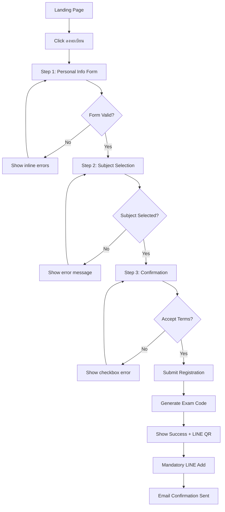
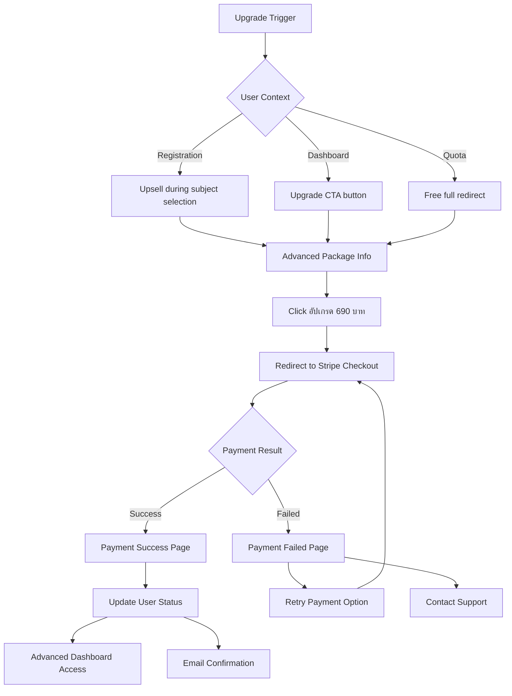
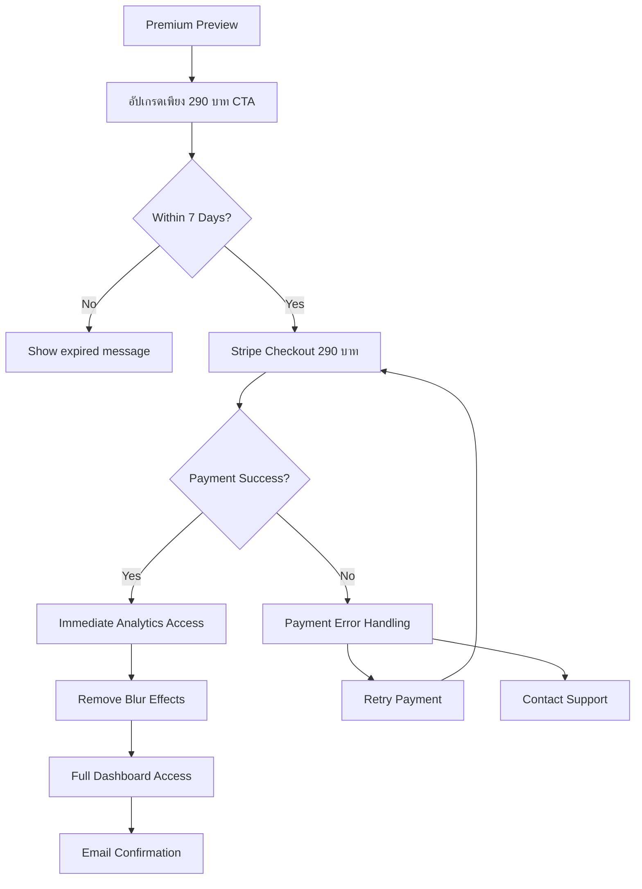
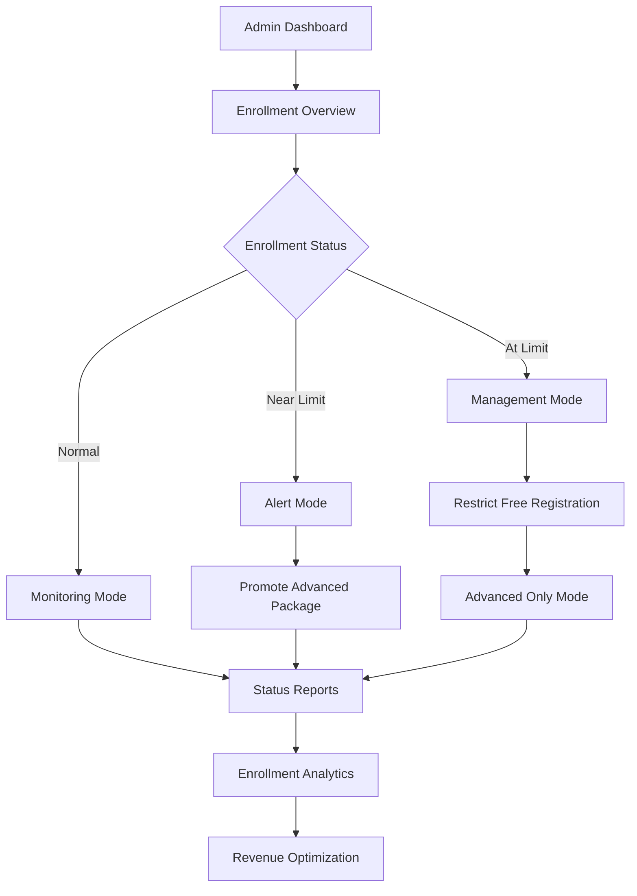
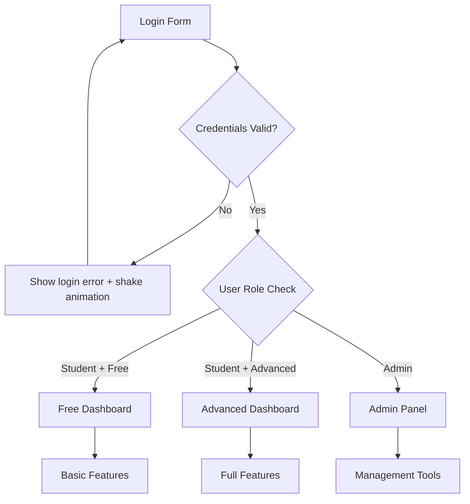
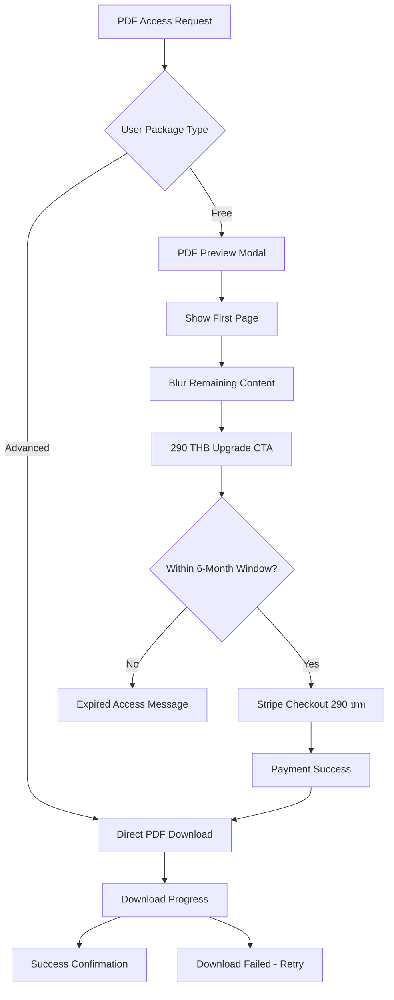
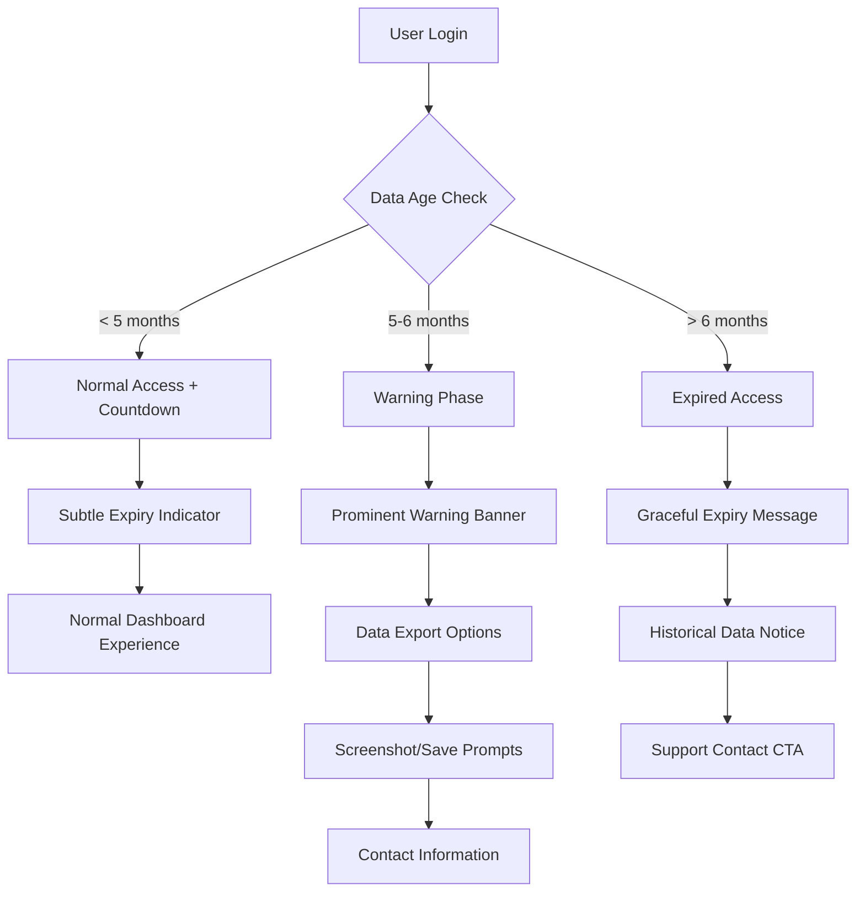
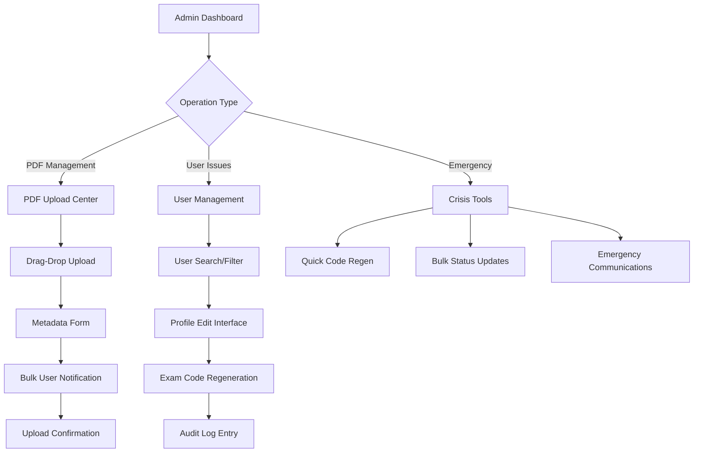

# User Flows

### Flow 1: Registration & Free Package Selection

**User Goal:** Complete exam registration and receive exam code

**Entry Points:** Landing page CTA, direct URL, social media links

**Success Criteria:** User receives valid exam code and adds mandatory LINE Official Account



**Edge Cases & Error Handling:**
- Duplicate email registration: "อีเมลนี้ถูกใช้แล้ว กรุณาใช้อีเมลอื่น หรือเข้าสู่ระบบ"
- Free quota full: Redirect to Advanced payment, show "Free Package เต็มแล้ว"
- Network timeout during submission: Retry mechanism with clear feedback
- Invalid phone format: Real-time validation with Thai format (08X-XXX-XXXX)
- Missing LINE ID: Hard validation error - cannot proceed

**Notes:** LINE ID is mandatory for receiving exam updates and results notifications

### Flow 2: Advanced Package Payment

**User Goal:** Upgrade to Advanced package for full 3-subject access and detailed analytics

**Entry Points:** Registration upsell, dashboard upgrade CTA, enrollment limitations

**Success Criteria:** Successful payment and immediate access to Advanced features



**Edge Cases & Error Handling:**
- Payment timeout: Clear retry mechanism with preserved cart
- Card declined: Helpful error messages in Thai
- Network issues during payment: Payment status verification system
- Duplicate payment: Automatic refund detection
- Stripe webhook failures: Manual verification fallback

**Notes:** All payments redirect to Stripe Checkout - no custom payment UI in platform

### Flow 3: Results Viewing (Login-Based)

**User Goal:** Access exam results and performance analytics

**Entry Points:** Email notification, dashboard link, direct URL

**Success Criteria:** View appropriate results level based on package type

```mermaid
graph TD
    A[Results Access] --> B[Unified Login Page]
    B --> C{Login Valid?}
    C -->|No| D[Show login error]
    D --> B
    C -->|Yes| E{User Package Type}
    
    E -->|Free| F[Basic Results Display]
    E -->|Advanced| G[Detailed Analytics]
    
    F --> H[Score Overview]
    H --> I[Percentile Ranking]
    I --> J[Premium Preview (Blurred)]
    J --> K[Post-Exam Upgrade CTA]
    K --> L[Stripe Checkout 290 บาท]
    
    G --> M[Full Analytics Dashboard]
    M --> N[Subject Breakdowns]
    N --> O[Box Plot Comparisons]
    O --> P[Study Recommendations]
    P --> Q[PDF Solution Download]
    
    J --> R[PDF Preview (Free Users)]
    R --> S[290 THB Upgrade CTA]
    S --> T[Stripe Checkout]
    T --> U[PDF Access Granted]
```

**Edge Cases & Error Handling:**
- Results not ready: "ผลสอบจะประกาศภายใน 7 วัน"
- Login after exam period: Normal login flow, no exam codes
- Forgotten login credentials: Password reset via email/LINE
- Premium preview loading errors: Graceful degradation

**Notes:** No exam code input required - login-based access only

### Flow 4: Post-Exam Upgrade (290 บาท)

**User Goal:** Upgrade to view detailed analytics after taking free exam

**Entry Points:** Premium preview blur overlay, results dashboard CTA

**Success Criteria:** Access full analytics within 7-day upgrade window



**Edge Cases & Error Handling:**
- Expired upgrade window: Clear messaging about timeframe
- Already upgraded user: Skip payment, direct to analytics
- Payment processing delays: Status checking mechanism

### Flow 5: Admin Enrollment Management

**User Goal:** Monitor and manage exam enrollment quotas in real-time

**Entry Points:** Admin login, enrollment alerts, scheduled monitoring

**Success Criteria:** Maintain optimal enrollment distribution without exposing Free quota numbers to users



**Edge Cases & Error Handling:**
- System overload during peak registration: Queue management system
- Real-time sync failures: Manual override controls available
- Revenue optimization vs enrollment balancing: Configurable alert thresholds

**Notes:** Critical business rule - Free quota numbers must never be displayed to end users

### Flow 6: Unified Login with Role-Based Redirects

**User Goal:** Single login system that routes users appropriately based on role

**Entry Points:** Login button, protected page access, session expiry

**Success Criteria:** Correct dashboard access based on user role



**Edge Cases & Error Handling:**
- Role change during session: Force re-login
- Concurrent admin sessions: Session management
- Password reset: Email/LINE verification

**Notes:** Single login form serves all user types - role determined after authentication

### Flow 7: PDF Solution Access & Download

**User Goal:** Access and download exam solution PDFs based on package type

**Entry Points:** Results dashboard, email notification, direct PDF link

**Success Criteria:** Appropriate PDF access with upgrade conversion for Free users



**Edge Cases & Error Handling:**
- PDF corruption: Fallback download with admin notification
- Mobile PDF viewing: Progressive loading with scroll optimization
- Download interruption: Resume capability with progress persistence
- Expired access: Clear messaging with contact support option
- Concurrent downloads: Rate limiting with queue management

**Notes:** PDF access tied to 6-month data lifecycle policy

### Flow 8: Data Lifecycle & Expiry Management

**User Goal:** Understand and manage data accessibility within 6-month window

**Entry Points:** Login after extended period, countdown notifications, data export requests

**Success Criteria:** Clear awareness of expiry timeline with export options before access loss



**Edge Cases & Error Handling:**
- Timezone considerations: Server-side expiry calculation
- Grace period requests: Admin manual extension capability
- Data export failures: Multiple format options (PDF, Excel, images)
- Legal compliance: PDPA right to erasure vs business needs

**Notes:** Progressive disclosure of urgency - subtle to prominent warnings

### Flow 9: Enhanced Admin PDF & User Management

**User Goal:** Efficiently manage PDF solutions and handle user support issues

**Entry Points:** Admin dashboard, support ticket escalation, exam day operations

**Success Criteria:** Quick resolution of user issues with full audit trail



**Edge Cases & Error Handling:**
- PDF upload failures: Chunked upload with resume capability
- Concurrent admin sessions: Lock management for user edits
- Bulk operation failures: Partial success handling with rollback
- Exam day crisis: Mobile-optimized emergency tools

**Notes:** All admin actions logged for compliance and debugging

