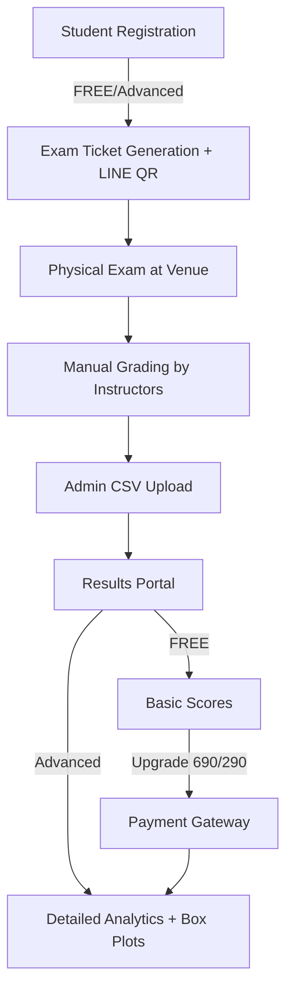

# 12. Freemium Technical Architecture (v6.0)

## System Overview

The TBAT Mock Exam platform is a **registration and results portal** for physical, paper-based exams. Students register online, take exams at physical venues, and access results online with tier-based features.

## Core System Flow



## Database Schema (Freemium Model)

### Users Table
```sql
CREATE TABLE users (
  id UUID PRIMARY KEY DEFAULT gen_random_uuid(),
  email VARCHAR(255) UNIQUE NOT NULL,
  password_hash VARCHAR(255) NOT NULL,
  name VARCHAR(100) NOT NULL,
  school VARCHAR(100) NOT NULL,
  grade VARCHAR(20) NOT NULL,
  line_id VARCHAR(50) NOT NULL,
  tier ENUM('FREE', 'ADVANCED') DEFAULT 'FREE',
  post_exam_upgrade BOOLEAN DEFAULT FALSE,
  upgrade_expires_at TIMESTAMP,
  line_group_joined BOOLEAN DEFAULT FALSE,
  free_subject VARCHAR(20), -- Physics/Chemistry/Biology
  parent_name VARCHAR(100),
  parent_relation VARCHAR(20),
  parent_phone VARCHAR(15),
  parent_email VARCHAR(100),
  created_at TIMESTAMP DEFAULT NOW(),
  updated_at TIMESTAMP DEFAULT NOW()
);
```

### Registrations Table
```sql
CREATE TABLE registrations (
  id UUID PRIMARY KEY DEFAULT gen_random_uuid(),
  user_id UUID REFERENCES users(id),
  exam_session_id UUID REFERENCES exam_sessions(id),
  exam_ticket VARCHAR(50) UNIQUE NOT NULL,
  tier ENUM('FREE', 'ADVANCED') NOT NULL,
  subjects JSON NOT NULL, -- ["Physics"] or ["Physics","Chemistry","Biology"]
  status ENUM('REGISTERED', 'ATTENDED', 'ABSENT') DEFAULT 'REGISTERED',
  created_at TIMESTAMP DEFAULT NOW()
);
```

### Exam Sessions Table
```sql
CREATE TABLE exam_sessions (
  id UUID PRIMARY KEY DEFAULT gen_random_uuid(),
  exam_date DATE NOT NULL,
  exam_time TIME NOT NULL,
  venue VARCHAR(255) NOT NULL,
  venue_address TEXT NOT NULL,
  capacity INTEGER NOT NULL,
  status ENUM('UPCOMING', 'IN_PROGRESS', 'COMPLETED', 'GRADING') DEFAULT 'UPCOMING',
  created_at TIMESTAMP DEFAULT NOW()
);
```

### Results Table
```sql
CREATE TABLE results (
  id UUID PRIMARY KEY DEFAULT gen_random_uuid(),
  registration_id UUID REFERENCES registrations(id),
  subject VARCHAR(20) NOT NULL,
  score DECIMAL(5,2) NOT NULL,
  percentile INTEGER,
  answers JSON, -- Advanced Package only
  tbat_score DECIMAL(6,2), -- Total TBAT score (2400 max)
  physics_score DECIMAL(5,2), -- Physics component (800 max)
  chemistry_score DECIMAL(5,2), -- Chemistry component (800 max)
  biology_score DECIMAL(5,2), -- Biology component (800 max)
  graded_at TIMESTAMP,
  published BOOLEAN DEFAULT FALSE,
  created_at TIMESTAMP DEFAULT NOW()
);
```

### Payments Table
```sql
CREATE TABLE payments (
  id UUID PRIMARY KEY DEFAULT gen_random_uuid(),
  user_id UUID REFERENCES users(id),
  stripe_payment_intent_id VARCHAR(255) UNIQUE,
  amount DECIMAL(10,2) NOT NULL, -- 690.00 or 290.00
  status ENUM('PENDING', 'SUCCESS', 'FAILED', 'REFUNDED') DEFAULT 'PENDING',
  upgrade_type ENUM('PRE_EXAM', 'POST_RESULTS', 'POST_EXAM_ANSWER') NOT NULL,
  created_at TIMESTAMP DEFAULT NOW()
);
```

## API Endpoints

### Registration & Authentication
- `POST /api/auth/register` - Free registration with subject selection
- `POST /api/auth/login` - Modal authentication with role-based routing
- `POST /api/auth/reset-password` - Password reset flow
- `GET /api/auth/me` - Get current user with tier status
- `POST /api/auth/verify-role` - Verify user role for protected routes

### Exam Registration
- `GET /api/exams/sessions` - List upcoming exam sessions
- `POST /api/exams/register` - Register for physical exam
- `GET /api/exams/my-registration` - View registration details
- `GET /api/exams/ticket/:id` - Download exam ticket

### Payment & Upgrades
- `POST /api/payment/create-checkout` - Initiate Stripe payment (690/290 THB)
- `POST /api/payment/post-exam-upgrade` - Post-exam answer key upgrade (290 THB)
- `POST /api/payment/webhook` - Stripe webhook handler
- `GET /api/payment/history` - User payment history

### Results Access
- `GET /api/results/my-results` - Get results with TBAT scoring (tier-based)
- `GET /api/results/box-plot/:subject` - Box plot data for score distribution
- `GET /api/results/answer-key` - Download answer key PDF (Advanced/Upgraded only)
- `GET /api/results/export` - Export PDF (Advanced Package only)

### Admin APIs
- `POST /api/admin/sessions/create` - Create exam session
- `POST /api/admin/results/upload` - Upload CSV with TBAT score calculation
- `POST /api/admin/answer-key/upload` - Upload answer key PDF
- `GET /api/admin/registrations` - View all registrations
- `GET /api/admin/analytics` - Dashboard metrics
- `PUT /api/admin/users/:id/upgrade` - Manual tier upgrade

### Gallery & Social
- `GET /api/gallery/dentorium` - Fetch Dentorium Camp photos
- `GET /api/social/line-qr` - Get LINE group QR code

## Technology Stack

### Frontend
- **Framework:** Next.js 14+ (App Router)
- **UI Components:** shadcn/ui with Radix UI
- **Styling:** Tailwind CSS
- **State Management:** React Context + Zustand
- **Forms:** React Hook Form + Zod validation
- **Charts:** Recharts for analytics (Box Plots, Score Distribution)

### Backend
- **Runtime:** Node.js with Next.js API Routes
- **Database:** PostgreSQL (Neon serverless)
- **ORM:** Prisma with type safety
- **Authentication:** NextAuth.js v5
- **Payment:** Stripe Checkout & Webhooks
- **Email:** Resend.com for transactional emails

### Infrastructure
- **Hosting:** Vercel (auto-scaling)
- **Database:** Neon (serverless PostgreSQL)
- **File Storage:** Vercel Blob (exam tickets, CSVs)
- **CDN:** Vercel Edge Network
- **Monitoring:** Vercel Analytics + Sentry

## Registration & Exam Flow

### FREE Tier Registration
1. Student visits registration page
2. Fills form with personal info and selects 1 subject
3. System generates unique exam ticket
4. Email confirmation sent with exam details
5. Student attends physical exam with ticket
6. After grading, views basic scores online
7. Option to upgrade for detailed analysis

### Advanced Package Registration
1. Student selects Advanced Package during registration
2. Redirected to Stripe checkout (฿690)
3. Upon successful payment, registers for all 3 subjects
4. Receives premium exam ticket with LINE QR code
5. Joins mandatory LINE group for communication
6. Attends physical exam for all subjects
7. After grading, accesses full analytics with box plots and answer keys

### Post-Exam Upgrade Flow
1. FREE tier student completes exam
2. Views basic results with upgrade prompt
3. Chooses post-exam upgrade (฿290) for answer keys
4. Payment via Stripe for 6-month access
5. Immediate access to detailed answer keys

## Security Considerations

### Authentication & Authorization
- JWT-based session management with modal authentication
- Role-based access control with protected routes
- Role hierarchy: Student, Admin, Super Admin
- Secure password hashing (bcrypt)
- Rate limiting on auth endpoints
- Automatic role-based routing after login

### Payment Security
- PCI compliance via Stripe
- Webhook signature validation
- Idempotency keys for payment operations
- Secure storage of payment records

### Data Protection
- HTTPS everywhere
- Environment variables for secrets
- Input validation and sanitization
- SQL injection prevention via Prisma
- XSS protection headers

## Deployment Strategy

### Development Workflow
```bash
# Local development
npm run dev

# Type checking
npm run type-check

# Testing
npm run test

# Build
npm run build

# Deploy to staging
vercel --env=preview

# Deploy to production
vercel --prod
```

### Environment Variables
```env
# Database
DATABASE_URL="postgresql://..."

# Authentication
NEXTAUTH_URL="https://tbat.example.com"
NEXTAUTH_SECRET="..."

# Stripe
STRIPE_SECRET_KEY="sk_live_..."
STRIPE_WEBHOOK_SECRET="whsec_..."
STRIPE_PUBLISHABLE_KEY="pk_live_..."

# Email
RESEND_API_KEY="re_..."

# Admin
ADMIN_SECRET="..."
```

## Performance Targets

### Frontend Performance
- First Contentful Paint: <1.5s
- Time to Interactive: <3s
- Cumulative Layout Shift: <0.1
- Bundle size: <250KB gzipped

### Backend Performance
- API response time: <500ms p95
- Database query time: <100ms p95
- CSV upload processing: <30s for 1000 records
- Concurrent users: 500+ during registration

## Scaling Considerations

### Phase 1 (Launch - 500 users)
- Single Vercel deployment
- Neon free tier database
- Basic email service

### Phase 2 (Growth - 2,000 users)
- Vercel Pro with increased limits
- Neon Pro database
- Email service upgrade
- Redis caching layer

### Phase 3 (Scale - 10,000+ users)
- Multi-region deployment
- Read replicas for database
- Queue system for CSV processing
- Advanced monitoring and alerting