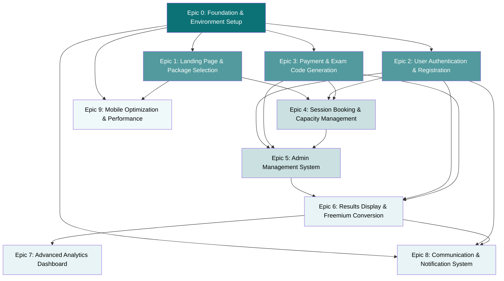

# Epic Dependency Matrix

## Visual Dependency Flow



## Dependency Analysis

### **Foundation Tier (Epic 0)**
**Must Complete First - Blocks Everything**
- Next.js project scaffolding
- Database schema with Prisma
- NextAuth.js authentication
- Stripe payment service
- Docker development environment

**Dependencies:** None  
**Blocks:** All other epics

---

### **Core Features Tier (Epics 1-3)**
**Can Run in Parallel After Epic 0**

#### **Epic 1: Landing Page & Package Selection**
**Dependencies:** Epic 0 (UI framework, database)  
**Enables:** Epic 4, Epic 9  
**Critical Path:** User acquisition funnel entry point

#### **Epic 2: User Authentication & Registration** 
**Dependencies:** Epic 0 (NextAuth.js, database)  
**Enables:** Epic 4, Epic 5, Epic 6, Epic 8  
**Critical Path:** Required for all authenticated features

#### **Epic 3: Payment & Exam Code Generation**
**Dependencies:** Epic 0 (Stripe service, database)  
**Enables:** Epic 4, Epic 5, Epic 6  
**Critical Path:** Revenue generation core

---

### **Integration Tier (Epics 4-5)**
**Requires Multiple Core Features**

#### **Epic 4: Session Booking & Capacity Management**
**Dependencies:** Epic 1 (package selection), Epic 2 (authentication), Epic 3 (payment verification)  
**Enables:** Epic 5  
**Critical Path:** Exam logistics hub

#### **Epic 5: Admin Management System**
**Dependencies:** Epic 2 (admin authentication), Epic 3 (payment data), Epic 4 (session data)  
**Enables:** Epic 6  
**Critical Path:** Operational control center

---

### **Value Delivery Tier (Epics 6-7)**
**Final User Value Creation**

#### **Epic 6: Results Display & Freemium Conversion**
**Dependencies:** Epic 2 (user accounts), Epic 3 (package verification), Epic 5 (admin score upload)  
**Enables:** Epic 7, Epic 8  
**Critical Path:** Primary revenue conversion point

#### **Epic 7: Advanced Analytics Dashboard**
**Dependencies:** Epic 6 (results data)  
**Enables:** None  
**Critical Path:** Premium value differentiation

---

### **Support Tier (Epics 8-9)**
**Enhancement & Operational Excellence**

#### **Epic 8: Communication & Notification System**
**Dependencies:** Epic 0 (email service), Epic 2 (user data), Epic 6 (results data)  
**Enables:** None  
**Critical Path:** User experience enhancement

#### **Epic 9: Mobile Optimization & Performance**
**Dependencies:** Epic 0 (infrastructure), Epic 1 (UI components)  
**Enables:** None  
**Critical Path:** 80% mobile traffic optimization

## Critical Path Analysis

### **Minimum Viable Product Path**
```
Epic 0 → Epic 1 → Epic 2 → Epic 3 → Epic 4 → Epic 5 → Epic 6
```
**Duration:** Core MVP functionality  
**Revenue Impact:** Full freemium conversion capability

### **Enhanced User Experience Path**
```
Core MVP + Epic 7 + Epic 8 + Epic 9
```
**Duration:** Complete platform  
**Revenue Impact:** Premium differentiation and retention

## Parallel Development Opportunities

### **Phase 1: Foundation** (Week 1)
- Epic 0 only (sequential, blocks everything)

### **Phase 2: Core Features** (Weeks 2-3)
**Parallel Development:**
- Epic 1 (Frontend team)
- Epic 2 (Auth team) 
- Epic 3 (Payment team)

### **Phase 3: Integration** (Weeks 4-5)
**Sequential Development:**
- Epic 4 (requires Epics 1-3)
- Epic 5 (requires Epics 2-4)

### **Phase 4: Value Delivery** (Weeks 6-7)
**Sequential Development:**
- Epic 6 (requires Epic 5 for admin score upload)
- Epic 7 (requires Epic 6 for data)

### **Phase 5: Enhancement** (Week 8)
**Parallel Development:**
- Epic 8 (notifications)
- Epic 9 (mobile optimization)

## Risk Assessment

### **High Risk Dependencies**
1. **Epic 0 Delays** → Blocks entire project
2. **Epic 2 Issues** → Blocks 4 downstream epics
3. **Epic 5 Problems** → Blocks results functionality

### **Medium Risk Dependencies**
1. **Epic 3 Payment Issues** → Affects revenue but not core functionality
2. **Epic 6 Delays** → Affects conversion but platform functional

### **Low Risk Dependencies**
1. **Epic 7-9 Delays** → Enhancement features only

## Success Metrics

### **Dependency Completion Tracking**
- **Epic 0**: 100% before any other epic starts
- **Epics 1-3**: 100% before Epic 4 starts
- **Epic 5**: 100% before Epic 6 starts
- **Epic 6**: 100% before Epic 7 starts

### **Integration Points Validation**
- Authentication flow: Epic 0 → Epic 2 → Epic 4
- Payment flow: Epic 0 → Epic 3 → Epic 6
- Results flow: Epic 5 → Epic 6 → Epic 7
- Notification flow: Epic 0 → Epic 8 → Epic 6

---

**Last Updated:** 2025-09-12  
**Version:** 1.0  
**Author:** PO Sarah